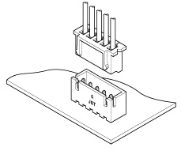

# Connector: Basics

There's a huge number of connectors out there; quite easily thousands of
different designs made by hundreds of manufacturers. What I want to do
here is start with the basic parts of a connector and then dive into
specific types of connectors that are good to be familiar with.

Let's call it the taxonomy of connectors, or at least a weak start of
one. To give you a rough idea of how enormous the connector field is,
here's just the top-level categories (and counts) for
[Digikey](https://www.digikey.com/en/products/category/connectors-interconnects/20): 

As you can see, they catalog over 2.4M circular connectors alone. In
other parts of this section, we'll look at the kinds that I think are
most useful, and a few just super interesting ones.

## Housing or Shell

{: width=200 align=right }

The housing is the thing that holds the entire connector. In many ways
it basically defined what _kind_ of connector you're working with. They
housings break down into two major groups: rectangular and circular. I'd
estimate that 60-70% of all the connectors fall into the rectangular
category. 

In the schematic to the right, you can see a [JST
XH](https://www.jst.com/products/crimp-style-connectors-wire-to-board-type/xh-connector/)
connector. There's two pieces to the overall connector housing, which
will talk about later under [gender](#gender). The housing has a few
things that make it distinctive above and beyond the basic size. On the
front, you can see keys that help ensure that 1) the connectors mate
together correctly, and 2) you don't reverse the polarity of the
connector. Not every connector has keying to prevent polarity reversal,
but you should use them whenever you can as they reduce the likelihood
of damage to a circuit.

NOTE: **About JST Connectors** You'll often hear JST used as a generic
connector term, and many of the designs are made by hundreds of
companies. However, the original JST connectors refer to Japan
Solderless Terminal, the company. They still make the best versions of
their connectors.

The housing can be one of many formulations of plastic or metal in many
higher-end connectors.

## Contacts

{: width=200 align=right }

Contacts are the part connector where all the business of moving
electricity happens. They are the metal
parts which touch each other, forming an connection. This can also be
where problems occur: the contacts can become oxidizer, or even they can
accumulate dirt. Finally, due to the nature of the material of the
contact, the spring that is used ot hold them together may reduce with
time, and you will get weaker and weaker connections exhibiting problems
such as intermittent connections, or even
[shorts](../protecting-circuits.md#short-circuit--ground-faults). 

Many times, the connectors are made of [phosphor
bronze](https://en.wikipedia.org/wiki/Phosphor_bronze) and plated with
tin, silver, or gold. You will also find things like [beryllium
copper](https://en.wikipedia.org/wiki/Beryllium_copper). Sadly, some
very cheap (and low reliability) connectors might skimp and use steel or
aluminum. Neither of those are desirable in most circumstances.

## Durability

When we talk about the durability of the connector, we are mostly
talking about the contacts. The housing is generally, baring any damage,
going to last approximately forever.  When we talk about the durability
of the contact, we are typically talking about insertion (mating)
cycles. This is one insertion and removal of the connector. For
high-durability connectors, this number will be specified, but often it
is difficult information to get. If you don't see it, you should assume
a lifetime of (approximately) dozens to small number of hundreds
insertion cycles.  Connectors designed for constant use, like USB-C,
have much higher numbers. For example, USB-C's standard requires a
minimum of 10,000 insertion cycles on a connector, and most can sustain
many more.

## Gender

WARNING: **Topic** Yeah, I know. This is just the way the industry has
historically been and is what you'll see on nearly every datasheet you
find. I'll try to use a few different terms that are common. If you want
to dive into more detail,
[Wikipedia](https://en.wikipedia.org/wiki/Gender_of_connectors_and_fasteners)
has a deeper article exploring all the terminology.

In most circumstances, connectors come in two parts. A part that has
exposed pins, and a part that doesn't. The part that has exposed pins is
typically called "male", but you'll also see "plug" and "pin". The part
that doesn't have exposed pins is typically called "female", but you'll
also see "receptacle", "jack", and "socket". 

For threaded connectors (see [locking](#lockingnon-locking) below), the
gender refers also to the standard polarity configuration of the
threads. A male/plug connector will have threading on the inside of the
housing, whereas a female/jack will have the threading on the outside of
the housing. If this is flipped, they are called _reverse polarity_
connectors.

## Locking/Non-Locking

Some connector designs have locking mechanisms designed into them. These
are intended to ensure that the connector doesn't accidentally come
free and, depending on the design, they may be able to endure quite a
lot of force before releasing or breaking. 

=== "Snap/tab"
    {: height=200 align=left }
    
    The first kind of connector is one that uses a tab or snap piece to hold
    it in place. A great example of this is the Ethernet connector shown,
    where a small plastic tab is used to hold the plug into the jack.

    The tab can come in a lot of different formats, but this is the weakest
    of all the connection locking mechanisms.

=== "Bayonet" 
    {: height=200 align=left }

    The BNC connector is a great example of a bayonet style connector. 
    With these styles of connectors, you push the connector, then twist 
    a partial rotation to lock the connector in place.

=== "Push-pull"
    {: height=200 align=left }

    The push-pull connector insert into one another with multiple small 
    tabs inside the housing to hold it together. The differences from the 
    "snap/tab" connector are that 1) there are multiple tabs (3 typically)
    that are required to mate, and 2) the push/pull means there's a ring 
    or other mechanism to release that has to be pulled back.

=== "Screw"
    {: height=200 align=left }
    
    Screw connectors are the most secure, and come in a ton of different
    forms, metal and plastic. They require multiple rotations of the outer
    housing to lock the connector in place, but once secured, they are 
    able to endure quite a lot of force on them.

## Mount Type

This can be confusing, as the term mount is used to refer to several
things: what the connector is mounted to (PCB, panel, cable), the angle
of the connector relative to what it's mounted to (right-angle,
straight, or other) mount, free-hanging, board mount), what the angle of
the connector is relative to its attachment (straight or right-angle),
or even how the individual conductors are attached (through hole, SMD,
solder tab, or solder cup). 

## Pitch
## Polarity
## Strain Relief