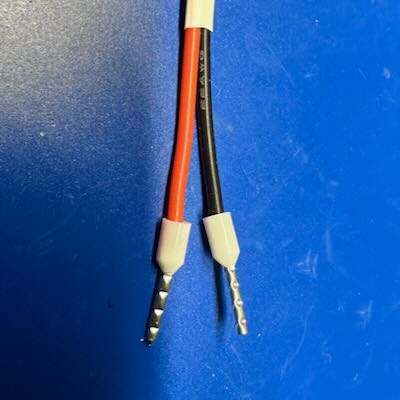
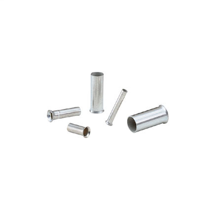

---
tags:
  - connector
  - termination
  - wire
---
# Wire Ferrules

{: width=200 align=right }

Wire ferrules, shown here, are a simple way to terminate bare stranded
wire such that all the strands stay together, and you can achieve a
secure electrical and mechanical connection. They are commonly used when
a wire may need to be inserted and removed from another connector, which
would typically cause damage to a stranded wire.

Ferrules are not used on solid core wire.

## What They Are

{: width=200 align=right }

There are two primary types of wire ferrules: insulated and
non-insulated. The non-insulated (shown to the right) are the simplest,
and are simply a (typically) a small tube of tin-plated copper.
Insulated ferrules, shown at the beginning of this page, combine that
tube with a small cone of plastic insulation. For my money, I always use
insulated ferrules if at all possible. There are situations, such as
with very large wires, where it either not available or not feasible.

## When to Use

NOTE: **Legal Requirements** The use of ferrules is required in Europe
for electrical equipment to receive a CE marking. Ferrules are  not
required in the US. That being said, it’s possible to find high quality
US-built machinery where these connectors are applied. 

My general rule is that if the termination joint isn't soldered, or
specifically designed for some other kind of connector, I use a ferrule
on the wire. They're super cheap, and ensure that the wire can easily be
removed and reinserted into another connector of some sort without any
major issue. 

Unfortunately, there are some things, like very small terminal blocks,
which cannot handle the additional girth of the ferrule, and so may not
be feasible to use them with.

## How to Use

<!--
TODO: Add a video showing how to use.
-->