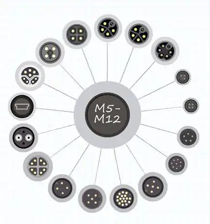

# M Series

Perhaps the most well-recognized type of circular connector is the M-style standard utilized for connecting sensors and actuators in industrial network applications. "M" simply calls out the size of the metric thread on the coupling nuts and mating receptacles, which gives us the common M5 (5 mm diameter fasteners), M8 (8 mm), and M12 (12 mm) connector types. M12 circular connectors and cables are arguably the most common type found as they are a global standard for the automotive industry.

## Application Categories

As a whole, M-style connectors are further divided into several categories that define the keying and shape of the contact body to ensure properly mated connections. These designations and codes are defined as follows (Figure 3):

| Category | Usage                                                                                                                    |
| -------- | ------------------------------------------------------------------------------------------------------------------------ |
| A        | Connectors for sensors, DC power and 1G Ethernet                                                                     |
| B        | Connectors for [Fieldbus](https://en.wikipedia.org/wiki/Fieldbus) and [Profibus](https://en.wikipedia.org/wiki/Profibus) |
| C        | Connectors with a dual keyway for added security, used for AC power for sensors and actuators.                           |
| D        | Connectors for 100M Ethernet or similar bandwidth                                                                    |
| S        | Updated connectors for AC power, replacing the C category                                                                |
| T        | Updated connector for DC power, replacing the A category                                                                 |
| X        | Connectors for 10G Ethernet high speed applications as well as power over Ethernet                                   |

You can see a bunch of the variety available in this diagram from [CUI
Devices](https://www.cuidevices.com):

