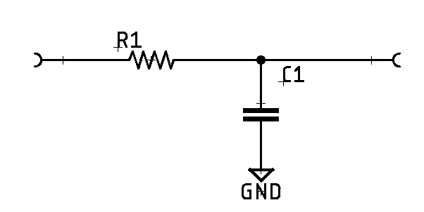
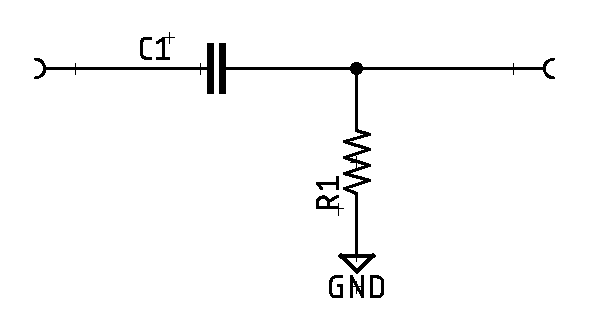
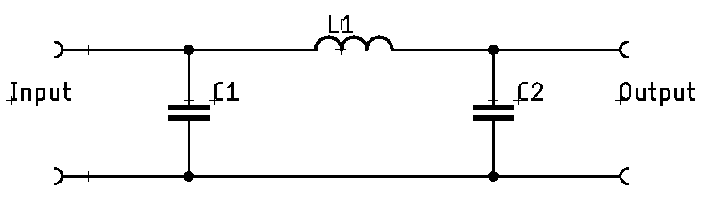
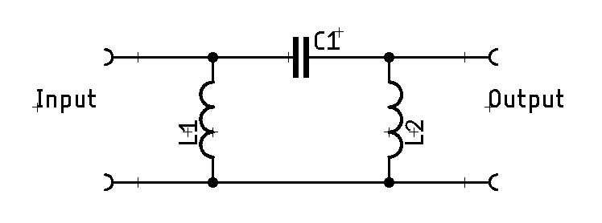

# Filters

<!-- TODO:
* LC filters (tank circuits)
-->

## RC Filters

RC filters, so named because they use a resistor (R) and capacitor (C) are a
super easy way to construct a filter. They don't necessarily have the best
performance under all circumstances, but they're often a great starting point
when working through an idea.

### Low-Pass

For a low-pass filter, where we only allow frequencies _below_ the design point,
we can construct it like this:

We can then calculate the cutoff frequency ($f_c$), which is a -3 dB or 70.7% reduction for the filter:

$$f_c = {1\over{2\pi RC}}$$

But if you know the frequency ($f_c$) you want to achieve, then you can use
either of these two to figure out the capacitor ($C$) or resistor ($R$) you
need:

$$\begin{aligned}
C &= {1\over{2\pi R f_c}} \\[5pt]
R &= {1\over{2\pi C f_c}}
\end{aligned}
$$

### High-Pass

For a high-pass version of the RC filter, we simply flip the arrangement of the
resistor and capacitor, and can use the same equations to calculate the $f_c$
cutoff frequency.

## Pi Filters

A Pi filter is a type of filter constructed with 3 elements rather than the
traditional two-element passive filter. Since the constructed arrangement of all
the components creates something that looks like the Greek letter Pi ($\pi$),
the name Pi filter is used. Pi filters are pretty easy to calculate and design,
and if needed, you can often buy off-the-shelf pre-configured ones for very
cheap.

Pi filters have a few advantages over simpler LC filters:

1. Can handle very high voltage across the filter, which makes it suitable for
   high voltage DC applications.
2. Low ripple. When used in a DC filtration purpose, it's very effective and
   leaves very little ripple behind in the output.
3. Easy to use for high-frequency applications.

Their disadvantages are mostly around cost:

1. High wattage inductors are required in power situations. High wattage
   inductors are pricey.
2. High value input capacitor. This can create space constraints and also
   increase cost.
3. Poor voltage regulation in situations where the load is fluctuating constantly

### Low-Pass

A low-pass filter only allows frequencies _below_ its design point to pass. The
design of a low-pass Pi filter is pretty simple. The circuit consists of two
capacitors connected in parallel with an inductor in series which forms the Pi
shape as shown below:

We can find the -3dB point of a low-pass filter using this equation:

$$f_c = {1\over{2\pi\sqrt{LC}}}$$

### High Pass

Reversed from a low-pass filter, a high-pass filter only allows frequencies
_above_ its design point to pass. A high-pass filter has just a flipped design
with the the inductors in parallel and the capacitor in series:

It's -3dB point can be calculated exactly the same.

$$f_c = {1\over{2\pi\sqrt{LC}}}$$

## 3rd Party Material

* [Application Note 779 A Basic Introduction to Filters - Active, Passive,and
Switched Capacitor](https://www.ti.com/lit/an/snoa224a/snoa224a.pdf) (PDF)