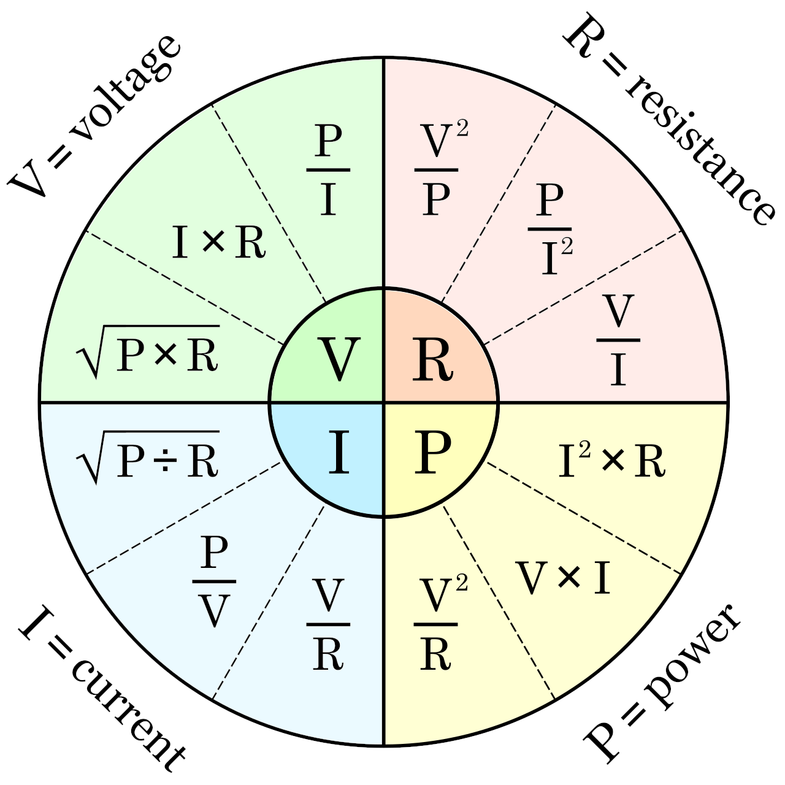
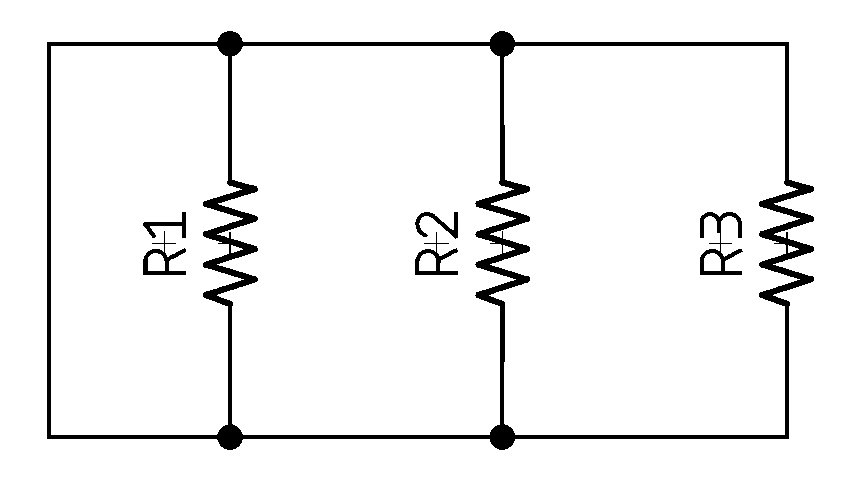
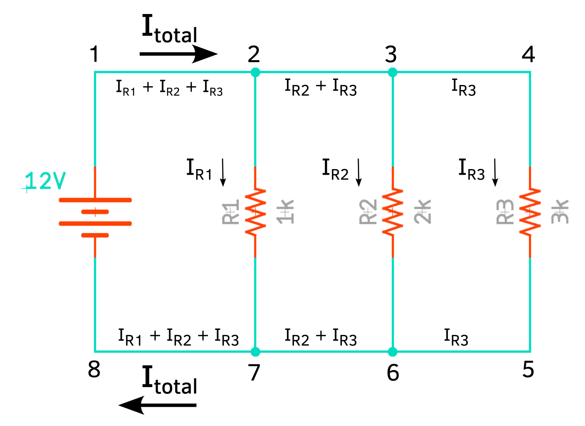
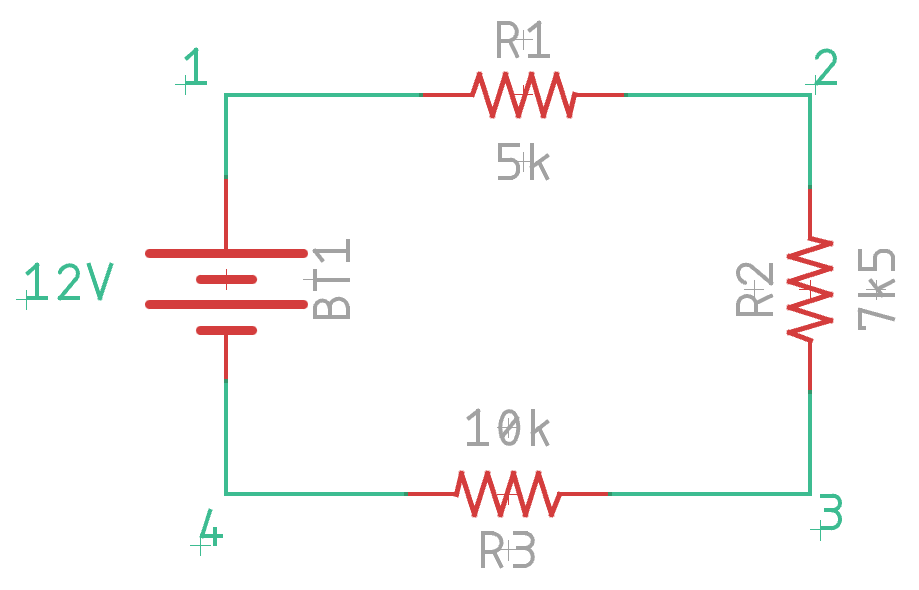

# Fundamentals

None of this is unique, original, or otherwise only found here, but I thought it
might be useful to collect things that people should probably know about.

## Current, Voltage, and Power (oh my!)

Before we jump into anything else, we should get some basics out of the
way. For a long time, I found the difference between voltage and current
to be confusing, not least because people seemed obsessed with voltage,
when current is _the thing_ under it all. So let's start with current.

NOTE: **Non-intuitive Stuff to Think About** Elsewhere, I talk about the
[non-intuitive idea of electron flow](non-intuitive-topics.md), but for
the purposes of this and most use cases, it doesn't matter. Only if you
want to be [technically
correct](https://www.youtube.com/watch?v=hou0lU8WMgo). 

### Current (volume)

_Current_ is, fundamentally, flow. It is the rate at which electrons
flow past a specific point in a complete electrical circuit. A circuit
is considered complete if there is a path for all electrons to flow in a
"loop". Any component that converts electrical energy into some other
form of energy (rotation, heat, light, even "processing") uses current.

We measure current in ampere, or more often shortened to just amp. It
expresses the quantity of electrons (aka electrical charge) flowing past
a point in a circuit over a give time. A current of 1 amp can be
translated as 1 coulomb of electrons, or 6.24 x 10^18^ electrons moving
past a single point in _one second_. It is traditional to compare
electricity to water, and in this case, you'd talk about how many
liters pass a single point in a hose in 1 minute (liter per minute). We
use a few measurements regularly:

* _A_. Amperes (amps) for _large_ amounts of current. You will typically
  only see a small number of these in most applications, but in things
  like electric cars, you might see hundreds of amps. High currents can
  be _very dangerous_.
* _mA_. Milliampere (milliamp) is a typical unit in electronic circuits
  that you'll work with. This is 0.001 ampere.
* _&micro;A_. Microampere (microamps), or a millionth of an amp
  (0.000001).

There are smaller units, like picoamps, but outside of a very few
specialized applications, you'll never see them, and you likely can't
afford a device that can reliably even measure them. You can, if needed,
construct a circuit to sneak up on the value, though.

You will also see current referred to as I in things like Ohm's law
(below). For the longest time, I had no idea why "I" was used, but it
refers to the "intensity". For current to flow, two things must be true:

1. A circuit that forms a closed conducting loop. This provides a loop
   through which electrons can flow, and therefore providing energy
   (electrons) to components along the loop. You can think of a loop
   (circuit) as closed when you flip a light switch to the on position.
2. The circuit must include a source of energy, such as a battery, that
   produces voltage. Without voltage, electrons move randomly and evenly
   within a wire, and therefore no current is flowing (think of still
   pond water). When voltage creates pressure that will drive the
   electrons in a single direction, like a stream.

Current comes in two forms: direct current (DC) and alternating current
(AC). DC is what most electronics work with, and AC is what your house
runs on. DC flows in a single direction, and therefore we can often talk
about positive and negative connections. AC, as the name implies,
alternates back and forth (a sine wave, technically) on a regular
interval (60Hz in the United States, for example), and so we don't talk
about positive and negative, but typically (at least in the US) "hot",
"neutral", and "ground". Yes, it is not particularly obvious at first.
[This article might
help](https://en.wikipedia.org/wiki/Electrical_wiring_in_North_America),
but typically, you won't be dealing with a lot of AC outside pre-built
power supplies.

WARNING: **Wire Gauge and Current** Many things are sized based on the
current with a much broader voltage range. For example, if we use the
[AWG wire
standard](https://www.engineeringtoolbox.com/wire-gauges-d_419.html), we
can see that while 16 gauge solid core wire can carry a maximum of 15A,
a 24 gauge 7-strand wire can only handle 1.4A. Typically, wire smaller
than 24 gauge (i.e., with a larger gauge number) is treated as "signal
wire", and only designed to carry tiny amounts of signal voltage
(&micro;A). This is also why on a PCB, we often need to use a [trace
width calculator](PCB-design.md#trace-width-and-current-capacity).

{: width=400 align=right }

We measure current with a
[multimeter](../tools/test-and-measurement.md#multimeter) most of the
time. If we look at my trusty BK 2709B, we can see two different things.
First, there are two different sections for measuring current, one for
AC and another for DC. Second, while this multimeter is technically
auto-ranging, you do have to tell it what magnitude of current to
expect. This is for internal safety protections, and at least on my BK,
while &micro;A and mA use the same connector, the 10A measurement uses a
different connector completely (and has different protection mechanisms
inside). 

### Voltage (pressure)

If current is the volume of electrons passing a point in a circuit,
voltage is the pressure. To continue the water analogy, if current is
the liters per minute, voltage is the pressure behind it where we
measure water in (typically) either pounds per square inch (psi) or
Pascals (Pa). We measure the voltage pressure in volts (V), which is
named after [Alessandro
Volta](https://en.wikipedia.org/wiki/Alessandro_Volta), who invented the
early precursor of the battery. You might occasionally hear voltage
termed as electromotive force (EMF), which is why you'll sometimes see
voltage expressed as the variable E. Mostly, the term comes up in
discussions of [back EMF](protecting-circuits.md#snubber-diode).

We often use the term voltage and _potential difference_
interchangeably. Volts is the unit we use to express the potential
energy difference between two points in a circuit. Potential energy is
the potential to move electrons from one point to another, and because
of that _voltage exists only relatively_. You cannot measure voltage at
a point. You can only measure voltage _between two points_. This took me
a long time to grasp because it's not super intuitive. The greater the
voltage, the greater the ability to "push" more electrons and do more
work.

Like current, voltage comes in both direct and alternating forms. While
this actually refers to the nature of the current that the voltage is
moving, when measuring voltage, we need to deal with DC voltage (VDC)
and AC voltage (VAC) differently, and if you look at the multimeter dial
above, you can see there are similar settings for AC and DC voltage
measurement. 

### Power

In addition to the two fundamental measurements, voltage and current, we
often talk about _power_ (P). Power is the rate of energy transfer and is
measured in joules/second. We also call them Watts (W). As you can see
in Ohm's Law below, $P=V\cdot I$, which means it's just voltage times
current.

That leads us into the magic that is Ohm's law...

## Ohm's Law

TIP: **Everything** When I say that _everything_ in electronics comes
back to Ohm's Law, I mean it. While many things, don't actually follow
Ohm's Law, it is ever-present in the basic flow of electricity in a
circuit. Over all the years, it has been the single most important
equation/law that I've ever learned. Over and over, it gets used in one
form or another, so please read this a few times to make sure you
understand the elegant simplicity.

This is where it always begins, right? Ohm's law states that the current ($I$)
through a conductor between two points is directly proportional to the voltage
($V$) across the two points. This is represented in the following equation:

$$I = {V\over R}$$

The voltage ($V$) is always measured _across_ a conductor; it simply doesn't
exist without that context. $R$ is the resistance of the conductor. Ohm's law
states that $R$ is a constant, independent of the current. 

> NOTE: **Knowing Things** We talk about knowing things a lot, but what exactly
> do we mean by "know". Knowledge can come from two potential sources:
>
> * Extrinsically controlled (or fixed). If we have a voltage source which
>   always outputs 7.3 Volts, then the voltage is known because it is being
>   controlled and set to a specific value.
> * Measured. We can measure a voltage of 7.3 Volts across the output of a
>   regulator. This is known because it is measured, rather than fixed by some process.

The great thing about this is you can, through the magic of mathematics, flip it
all over and around depending on what you know. You can get the voltage with
$V=IR$, or the resistance ($R$) through $R={V\over I}$. Or you can organize it
into a pretty wheel to solve for all sorts of things depending on what you have
(note $P$ is power in watts):

For example, if you need to understand the current ($I$), and you only have
power ($P$) and resistance ($R$), you can use $\sqrt{P/R}$.

This one simple thing will carry you _very far_ in electronics.

### Resistivity in Ohmic Materials

NOTE: **Ohmic Material** Materials which obey Ohm's Law are called
_ohmic material_. This includes wires, resistors, and other things. Not
everything follows Ohm's Law, and in this case the current is not
proportional to the voltage. These are called non-linear or non-ohmic
materials/components. Diodes, semiconductors, and even the lowly
fluorescent lamp, are non-ohmic components.

Resistance is a property of the materials being used, as well as their physical
dimensions. You can calculate the resistance as:

$$R = \rho{L\over A}$$

where $A$ is the cross-sectional area (in meters), and $L$ is the length (also
in meters). $\rho$ is the intrinsic  resistive property of the material,
although it does change with temperature. 

For example, here's a [few different
materials](https://www.thoughtco.com/table-of-electrical-resistivity-conductivity-608499)
and their $\rho$ values:

| Material  | $\rho$ at 20C                       |
| --------- | ----------------------------------- |
| Copper    | $1.68\times 10^{-8}$                |
| Aluminum  | $2.82\times 10^{-8}$                |
| Iron      | $1.0\times 10^{-7}$                 |
| Sea water | $2.0\times 10^{-1}$                 |
| Air       | $2.3\times 10^{16}$ (approximately) |

### Limits of Linearity

While Ohm’s Law states that resistance is a linear function, this rule is not
universal and is in fact empirical. It is actually a linearized model of
trillions or more of atomic (and quantum) scale interactions within a material,
and it turns out that on average, the aggregated behavior looks roughly linear.
This is a recurring theme, but you can also completely ignore this nearly all
the time.

## Series and Parallel Circuits

The two fundamental arrangements of components in circuits is _series_
and _parallel_. These are composed to form more complex circuits, but
fundamentally, these are the two to understand. To start, we're going to
just talk about resistance circuits, but after, I'll discuss how
resistance, capacitance and inductance are calculated for similar
patterns.

Let's start with a _series circuit_. This is just a bunch of components
in a line:

A series circuit’s defining characteristic is that all components in a
series circuit have the same current flowing through them, which is why
it is sometimes called a "current-coupled" circuit.  Current can only
flow in a single direction.

A _parallel circuit_ is different:

This can also be called a "voltage-coupled" circuit because there are
multiple paths for current to flow, but the voltage will be the same
across all paths.

So, how do you calculate the effective resistance, or capacitance, or
... well, it's pretty simple:

| Component  | Series                                                     | Parallel                                                   |
| ---------- | ---------------------------------------------------------- | ---------------------------------------------------------- |
| Resistors  | $R_1 + R_2 + \cdots+ R_n$                                  | $1\over{{1\over{R_1}}+{1\over{R_2}}+\cdots+{1\over{R_n}}}$ |
| Capacitors | $1\over{{1\over{C_1}}+{1\over{C_2}}+\cdots+{1\over{C_n}}}$ | $C_1 + C_2 +\cdots+ C_n$                                   |
| Inductors  | $L_1 + L_2 +\cdots+ L_n$                                   | $1\over{{1\over{L_1}}+{1\over{L_2}}+\cdots+{1\over{L_n}}}$ |

Note that one of the most common situations is to use 2 resistors, and
so the equation can be simplified to:

$$R = {{R_1 R_2}\over{R_1+R_2}}$$

This, of course, works for 2 capacitors as well when they're in series.
Also, if two inductors are located within one another's magnetic fields,
mutual inductance changes this calculation. See [this
article](https://en.wikipedia.org/wiki/Series_and_parallel_circuits#Inductors_2)
for more information.

NOTE: **Curious Similarities** It's worth thinking about 1) why
resistors and capacitors's behaviors are reversed; 2) why resistors and
inductors aren't.

## Kirchoff's Laws

Kirchoff, smirshoff, am I right? 

Seriously, though, there are two laws from [Gustav
Kirchhoff](https://en.wikipedia.org/wiki/Gustav_Kirchhoff) (around
1845), which, on the surface, seem 100% totally boring and predictable,
but it's worth thinking a bit more deeply about them. Kirchhoff used
Georg Ohm ‘s work as a foundation to create Kirchhoff’s current law
(KCL) and Kirchhoff’s voltage law (KVL) in 1845. These can be derived
from Maxwell’s Equations, which came 16-17 years later. Before we do
that, though, we should briefly discuss, in a radically simplified form,
the [lumped-element
model](https://en.wikipedia.org/wiki/Lumped-element_model). 

The model allows us to simplify a circuit into a series of nodes and
connections (think graph theory) which we can simplify and down to a series of
nodes that exhibit idealized attributes (resistance, capacitance, inductance,
etc.). These nodes are joined by perfectly conductive wires.  That's all, at its
core, the model is. There's a lot of math, and proofs, and such, but you don't
need to care almost ever.

> NOTE: **When You Might Care** There are a few times where things might not be
> as simple as explained above. A good example is that a [wire-wound
> resistor](https://eepower.com/resistor-guide/resistor-materials/wirewound-resistor/)
> exhibits not just idealized resistance, but also inductance. In the lumped
> element model, we can represent that as a resistor and inductor in series.
>
> Another example is when you're dealing AC circuits, though typically only
> high-frequency ones. In addition, it can fall apart when you have an
> electrical field between two distinct parts/nodes. For example, if you have
> two wires closely placed, they can become capacitively coupled.

### Kirchhoff's Current Law

> The algebraic sum of all currents entering and exiting a node must be equal.

Kirschhoff wrote this as:

$$I_{\mathit{entering}} + (-1(I_{\mathit{exiting}})) = 0$$

or more simply:

$$I_\mathit{entering} = I_\mathit{exiting}$$

Or $\sum_{n}{I_n}$ if you want to be ffancy.

This was the first law that he proposed and describes how a charge enters and
leaves a junction point or node. Take, for example, this circuit:

Here I'm showing that the total current (I~total~) is is present both 
between 1-2 and 7-8, but I~R1~ passes through R1, leaving only I~R2~ + 
I~R3~ passing between 2-3 and 7-6, etc. On the surface, this seems super 
obvious, and that's true, but it can help you analyze a circuit to
understand current flows. For example, if we want to look at what's
happening at node 6 in the diagram above.

First, we know that it is composed of I~R2~ + I~R3~, so we can solve:

$$I_{R2} + I_{R3} + I = 0$$

Now, we can use Ohm's Law to figure out what I~R2~ and I~R3~ are:

$$\begin{aligned}
I_{R2} &= {V\over R}\\[5pt]
&= {12\over 2000}\\[5pt]
&= 0.006 = 6\mathrm{mA}\\[10pt]

I_{R3} &= {12\over 3000}\\[5pt]
&= 0.004 = 4\mathrm{mA}
\end{aligned}$$

Finally, we can solve for I:

$$\begin{aligned}
I_{R2} + I_{R3} + I &= 0\\[5pt]
0.006 + 0.004 + I &= 0\\[5pt]
\textrm{Solving for I\ldots}\\[5pt]
I &= -0.006 - 0.004\\[5pt]
I &= -0.010
\end{aligned}
$$

The negative sign on the -0.010 tells us that the current is exiting
that node, rather than entering.

### Kirchhoff's Voltage Law

> The algebraic sum of all voltages in a loop must equal zero.

You can get _fancy_ and write this as $\sum_{n}{V_n}$, but you get the
idea.

Like Kirchhoff's current law, this seems very simple on the surface, but
it's also very powerful to use in analyzing a circuit. We are going to
take a look at a simplified series circuit and see how this works.

If we were to use a multimeter to check the voltage between points 4 and
1, putting the positive lead on 1 and the negative on 4, we would read
12V. We can use that as $E_{1-4}=+12$. This is a good time to remind you
that voltage is always relative. It is measured _across_ something. So
in the case of $E_{1-4}$ we are talking about the voltage at 1 in
_relation_ to 4. If we continue around the circuit doing similar
measurements we find:

| Measurement Location | Value               |
| -------------------- | ------------------- |
| 1-2                  | $-2.\overline{666}$ |
| 2-3                  | $-4.0$              |
| 3-4                  | $-5.\overline{333}$ |
| 4-1                  | $+12.0$             |

If we sum these together:

$$(-2.\overline{666}) + (-4.0) + (-5.\overline{333}) + (+12.0) = 0$$

Ta'da! 

### Voltage Divider Rule

An outgrowth of Kirchhoff's voltage law is the voltage divider rule.
This means that in a series connection, the current is the same through
each component. Thus, the voltage drops in a series connection must be
proportional to the size of the resistances. The larger the resistor,
the larger its voltage, and the larger its share of the total voltage.
Thus, the voltage across any resistor must equal the net supplied
voltage times the ratio of the resistor of interest ($R_x$) to the total
resistance:

$$V_{Rx} = V{{R_x}\over{R_{total}}}$$

This is just a combination of two Ohm's law calculations into a single
simplified formula. The resistor of interest ($R_x$) doesn't have to be
a single resistor. It can easily be the sum of multiple resistors in
series. The VDR is not required for any particular analysis. However, it
it saves some time because it skips over dealing with current, and
second, it demonstrates the ideal of a proportionality of voltage in a
series connection. For example, if there are two resistors in series and
one of them is twice the size of the other, then the larger resistor
sees twice the voltage of the smaller resistor.

## 3rd Party Material

* [LibreText University Physics II: Kirchhoff's Rules](https://phys.libretexts.org/Bookshelves/University_Physics/Book%3A_University_Physics_(OpenStax)/Book%3A_University_Physics_II_-_Thermodynamics_Electricity_and_Magnetism_(OpenStax)/10%3A_Direct-Current_Circuits/10.04%3A_Kirchhoff's_Rules)
* [Khan Academy basic electrical quantities](https://www.khanacademy.org/science/physics/circuits-topic/circuits-resistance/a/ee-voltage-and-current)