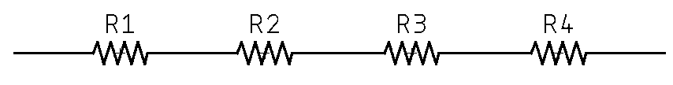
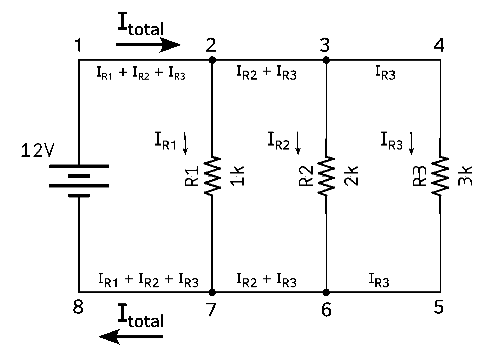
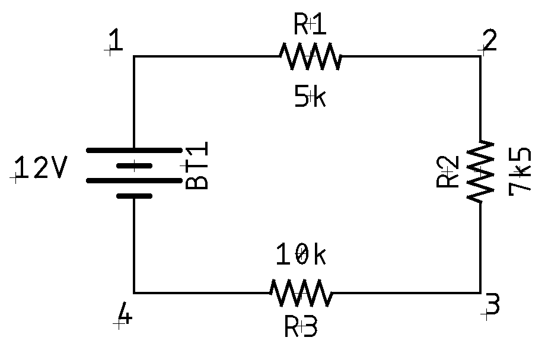

# Fundamentals

None of this is unique, original, or otherwise only found here, but I thought it
might be useful to collect things that people should probably know about.

## Ohm's Law

This is where it always begins, right? Ohm's law states that the current ($I$)
through aconductor between two points is directly proportional to the voltage
($V$) across the two points. This is represented in the following equation:

$$I = {V\over R}$$

The voltage ($V$) is always measured _across_ a conductor; it simply doesn't
exist without that context. $R$ is the resistance of the conductor. Ohm's law
states that $R$ is a constant, independent of the current. 

> NOTE: **Knowing Things** We talk about knowing things a lot, but what exactly
> do we mean by "know". Knowledge can come from two potential sources:
>
> * Extrinsically controlled (or fixed). If we have a voltage source which
>   always outputs 7.3 Volts, then the voltage is known because it is being
>   controlled and set to a specific value.
> * Measured. We can measure a voltage of 7.3 Volts across the output of a
>   regulator. This is known because it is measured, rather than fixed by some process.

The great thing about this is you can, through the magic of mathematics, flip it
all over and around depending on what you know. You can get the voltage with
$V=IR$, or the resistance ($R$) through $R={V\over I}$. Or you can organize it
into a pretty wheel to solve for all sorts of things depending on what you have
(note $P$ is power in watts):

For example, if you need to understand the current ($I$), and you only have
power ($P$) and resistance ($R$), you can use $\sqrt{P/R}$.

This one simple thing will carry you _very far_ in electronics.

### Resistivity in Ohmic Materials

Resistance is a property of the materials being used, as well as their physical
dimensions. You can calculate the resistance as:

$$R = \rho{L\over A}$$

where $A$ is the cross-sectional area (in meters), and $L$ is the length (also
in meters). $\rho$ is the intrinsic  resistive property of the material,
although it does change with temperature. 

For example, here's a [few different
materials](https://www.thoughtco.com/table-of-electrical-resistivity-conductivity-608499)
and their $\rho$ values:

| Material  | $\rho$ at 20C        |
| --------- | -------------------- |
| Copper    | $1.68\times 10^{-8}$ |
| Aluminum  | $2.82\times 10^{-8}$ |
| Iron      | $1.0\times 10^{-7}$  |
| Sea water | $2.0\times 10^{-1}$  |
| Air       | $2.3\times 10^{16}$ (approximately) |

### Limits of Linearity

While Ohm’s Law states that resistance is a linear function, this rule is not
universal and is in fact empirical. It is actually a linearized model of
trillions or more of atomic (and quantum) scale interactions within a material,
and it turns out that on average, the aggregated behavior looks roughly linear.
This is a recurring theme, but you can also completely ignore this nearly all
the time.

## Series and Parallel Circuits

The two fundamental arrangements of components in circuits is _series_
and _parallel_. These are composed to form more complex circuits, but
fundamentally, these are the two to understand. To start, we're going to
just talk about resistance circuits, but after, I'll discuss how
resistance, capacitance and inductance are calculated for similar
patterns.

Let's start with a _series circuit_. This is just a bunch of components
in a line:

A series circuit’s defining characteristic is that all components in a
series circuit have the same current flowing through them, which is why
it is sometimes called a "current-coupled" circuit.  Current can only
flow in a single direction.

A _parallel circuit_ is different:

This can also be called a "voltage-coupled" circuit because there are
multiple paths for current to flow, but the voltage will be the same
across all paths.

So, how do you calculate the effective resistance, or capacitance, or
... well, it's pretty simple:

| Component  | Series                                                     | Parallel                                                   |
| ---------- | ---------------------------------------------------------- | ---------------------------------------------------------- |
| Resistors  | $R_1 + R_2 + \cdots+ R_n$                                  | $1\over{{1\over{R_1}}+{1\over{R_2}}+\cdots+{1\over{R_n}}}$ |
| Capacitors | $1\over{{1\over{C_1}}+{1\over{C_2}}+\cdots+{1\over{C_n}}}$ | $C_1 + C_2 +\cdots+ C_n$                                   |
| Inductors  | $L_1 + L_2 +\cdots+ L_n$                                   | $1\over{{1\over{L_1}}+{1\over{L_2}}+\cdots+{1\over{L_n}}}$ |

Note that one of the most common situations is to use 2 resistors, and
so the equation can be simplified to:

$$R = {{R_1 R_2}\over{R_1+R_2}}$$

This, of course, works for 2 capacitors as well when they're in series.
Also, if two inductors are located within one another's magnetic fields,
mutual inductance changes this calculation. See [this
article](https://en.wikipedia.org/wiki/Series_and_parallel_circuits#Inductors_2)
for more information.

NOTE: **Curious Similarities** It's worth thinking about 1) why
resistors and capacitors's behaviors are reversed; 2) why resistors and
inductors aren't.

## Kirchoff's Laws

Kirchoff, smirshoff, am I right? 

Seriously, though, there are two laws from [Gustav
Kirchhoff](https://en.wikipedia.org/wiki/Gustav_Kirchhoff) (around
1845), which, on the surface, seem 100% totally boring and predictable,
but it's worth thinking a bit more deeply about them. Kirchhoff used
Georg Ohm ‘s work as a foundation to create Kirchhoff’s current law
(KCL) and Kirchhoff’s voltage law (KVL) in 1845. These can be derived
from Maxwell’s Equations, which came 16-17 years later. Before we do
that, though, we should briefly discuss, in a radically simplified form,
the [lumped-element
model](https://en.wikipedia.org/wiki/Lumped-element_model). 

The model allows us to simplify a circuit into a series of nodes and
connections (think graph theory) which we can simplify and down to a series of
nodes that exhibit idealized attributes (resistance, capacitance, inductance,
etc.). These nodes are joined by perfectly conductive wires.  That's all, at its
core, the model is. There's a lot of math, and proofs, and such, but you don't
need to care almost ever.

> NOTE: **When You Might Care** There are a few times where things might not be
> as simple as explained above. A good example is that a [wire-wound
> resistor](https://eepower.com/resistor-guide/resistor-materials/wirewound-resistor/)
> exhibits not just idealized resistance, but also inductance. In the lumped
> element model, we can represent that as a resistor and inductor in series.
>
> Another example is when you're dealing AC circuits, though typically only
> high-frequency ones. In addition, it can fall apart when you have an
> electrical field between two distinct parts/nodes. For example, if you have
> two wires closely placed, they can become capacitively coupled.

### Kirchhoff's Current Law

> The algebraic sum of all currents entering and exiting a node must be equal.

Kirschhoff wrote this as:

$$I_{\mathit{entering}} + (-1(I_{\mathit{exiting}})) = 0$$

or more simply:

$$I_\mathit{entering} = I_\mathit{exiting}$$

Or $\sum_{n}{I_n}$ if you want to be ffancy.

This was the first law that he proposed and describes how a charge enters and
leaves a junction point or node. Take, for example, this circuit:

Here I'm showing that the total current (I~total~) is is present both 
between 1-2 and 7-8, but I~R1~ passes through R1, leaving only I~R2~ + 
I~R3~ passing between 2-3 and 7-6, etc. On the surface, this seems super 
obvious, and that's true, but it can help you analyze a circuit to
understand current flows. For example, if we want to look at what's
happening at node 6 in the diagram above.

First, we know that it is composed of I~R2~ + I~R3~, so we can solve:

$$I_{R2} + I_{R3} + I = 0$$

Now, we can use Ohm's Law to figure out what I~R2~ and I~R3~ are:

$$\begin{aligned}
I_{R2} &= {V\over R}\\[5pt]
&= {12\over 2000}\\[5pt]
&= 0.006 = 6\mathrm{mA}\\[10pt]

I_{R3} &= {12\over 3000}\\[5pt]
&= 0.004 = 4\mathrm{mA}
\end{aligned}$$

Finally, we can solve for I:

$$\begin{aligned}
I_{R2} + I_{R3} + I &= 0\\[5pt]
0.006 + 0.004 + I &= 0\\[5pt]
\textrm{Solving for I\ldots}\\[5pt]
I &= -0.006 - 0.004\\[5pt]
I &= -0.010
\end{aligned}
$$

The negative sign on the -0.010 tells us that the current is exiting
that node, rather than entering.

### Kirchhoff's Voltage Law

> The algebraic sum of all voltages in a loop must equal zero.

You can get _fancy_ and write this as $\sum_{n}{V_n}$, but you get the
idea.

Like Kirchhoff's current law, this seems very simple on the surface, but
it's also very powerful to use in analyzing a circuit. We are going to
take a look at a simplified series circuit and see how this works.

If we were to use a multimeter to check the voltage between points 4 and
1, putting the positive lead on 1 and the negative on 4, we would read
12V. We can use that as $E_{1-4}=+12$. This is a good time to remind you
that voltage is always relative. It is measured _across_ something. So
in the case of $E_{1-4}$ we are talking about the voltage at 1 in
_relation_ to 4. If we continue around the circuit doing similar
measurements we find:

| Measurement Location | Value               |
| -------------------- | ------------------- |
| 1-2                  | $-2.\overline{666}$ |
| 2-3                  | $-4.0$              |
| 3-4                  | $-5.\overline{333}$ |
| 4-1                  | $+12.0$             |

If we sum these together:

$$(-2.\overline{666}) + (-4.0) + (-5.\overline{333}) + (+12.0) = 0$$

Ta'da! 

### Voltage Divider Rule

An outgrowth of Kirchhoff's voltage law is the voltage divider rule.
This means that in a series connection, the current is the same through
each component. Thus, the voltage drops in a series connection must be
proportional to the size of the resistances. The larger the resistor,
the larger its voltage, and the larger its share of the total voltage.
Thus, the voltage across any resistor must equal the net supplied
voltage times the ratio of the resistor of interest ($R_x$) to the total
resistance:

$$V_{Rx} = V{{R_x}\over{R_{total}}}$$

This is just a combination of two Ohm's law calculations into a single
simplified formula. The resistor of interest ($R_x$) doesn't have to be
a single resistor. It can easily be the sum of multiple resistors in
series. The VDR is not required for any particular analysis. However, it
it saves some time because it skips over dealing with current, and
second, it demonstrates the ideal of a proportionality of voltage in a
series connection. For example, if there are two resistors in series and
one of them is twice the size of the other, then the larger resistor
sees twice the voltage of the smaller resistor.

## 3rd Party Material

* [LibreText University Physics II: Kirchhoff's Rules](https://phys.libretexts.org/Bookshelves/University_Physics/Book%3A_University_Physics_(OpenStax)/Book%3A_University_Physics_II_-_Thermodynamics_Electricity_and_Magnetism_(OpenStax)/10%3A_Direct-Current_Circuits/10.04%3A_Kirchhoff's_Rules)