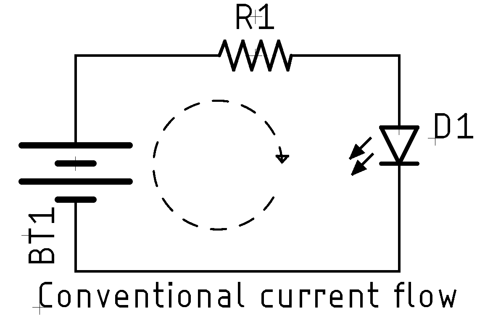

# Non-Intuitive Topics

While a lot of things in electronics aren't particularly confusing, there's a
few topics which I've found historically just a bit surprising and
non-intuitive.

## Conventional Current Flow v Reality

One thing that trips some people up---largely because you can ignore it until
you can't---is the difference between reality and "classical" current flow. This
confusion can all be laid at the feet of one man: [Benjamin
Franklin](https://en.wikipedia.org/wiki/Benjamin_Franklin). When Franklin
performed his famous kite experiment, thereby proving that lightning was
electricity, the general concept of electricity was that it was some kind of
"fluid". Franklin, understandably, surmised that the electrical flow proceeded
from positive to negative. This idea was accepted, and it became the
conventional view.

Today we call this the _conventional current flow_ model, and in it, current
flows from a more positive voltage to a less positive voltage. This all predates
the modern (Rutherford, 1911) model of electrons, neutrons, and protons. Now we
know that an electron is the charge carrier and that electrons travel in the
reverse direction. Franklin was wrong. Electrons move from a lower potential to
a higher potential. This is termed the _model electron flow_.

For most work, you can simply use the conventional flow and everything will be
fine. It's probably easier to understand for most people. There are times,
generally when thinking deeply about semiconductors, where electron flow is more
easy to understand. If someone doesn't talk about what model they are using,
99.999% of the time they are using the historic conventional current flow
model.

If you want to read more, [this
article](https://workforce.libretexts.org/Bookshelves/Electronics_Technology/Book%3A_Electric_Circuits_III_-_Semiconductors_(Kuphaldt)/02%3A_Solid-state_Device_Theory/2.05%3A_Electrons_and_%E2%80%9Choles%E2%80%99%E2%80%99)
might help.

## Everything is a Sine wave

The sine wave is more than the simplest waveform we have, it's also,
mathematically, the only wave form we have (ok, also cosines). Every other
waveform is composed of some number of sine (and cosine) waves superimposed on
one another (more on this later). First, let's start with the most basic of sine
waves.

$$y(t) = A \sin(2\pi f t + \varphi) = A \sin(\omega t + \varphi)$$

where:

* $t$ is the time
* $A$ is the amplitude, or peak deviation of the function from zero (not peak-to-peak)
* $f$ is the frequency in oscillations per second
* $\omega$ is the angular frequency ($\omega = 2 \pi f$) in radians per second.
* $\varphi$ is the phase, specified in radians where in its cycle (think where
  on its curve) the sine wave is when $t = 0$

So far, so good, if you like trigonometry.

What [Joseph Fourier](https://en.wikipedia.org/wiki/Joseph_Fourier) proposed,
quite radically, in the 19th century was that every waveform could be decomposed
(or synthesized) by merging a large number of sine waves together. For example,
a square wave, which seems at first glance to be the absolute opposite of a sine
wave can be constructed using a [Fourier
series](https://en.wikipedia.org/wiki/Fourier_series) thusly:

$$f(x) = {4\over\pi} \sum_{n=1,3,5,\ldots}^{\infty} {1\over n} \sin ({{n \pi
x}\over{L}})$$

Easy peasy, lemon squeezy, right?

Visually, this is more obvious:

Each of the colors represents another sine wave superimposed on the previous.
As you can see with the fancy $\infty$ in the equation, this is an infinite
series. This is true of _every waveform_, just with different formulas and complexity.

When people talk about [Fourier
transforms](https://en.wikipedia.org/wiki/Fourier_transform) (or sometimes FFT,
fast Fourier transforms), what they are talking about is decomposing a waveform
into its constituent sine waves (N.B. this is wildly oversimplified)

So how does this matter to us? Well, let's take a digital circuit running at
10MHz. Because digital circuits are mostly like a square wave (or at least
attempt to behave that way), those 10MHz square waves are actually composed of
an infinite number of sine waves at various harmonics of the fundamental square
wave frequency. Some of those will have gigahertz frequencies. 

Take, for example, a 1MHz square wave coming out of my signal generator and into
my oscilloscope:

In it you can see the artifacts of the direct digital synthesis production of a
square wave.

Even when you think you're not dealing with a high-frequency circuit, there
actually is one underneath, just waiting to trip you up when you least expect
it.

## 3rd Party Resources

* [Square waves, or non-elephant biology](https://lcamtuf.substack.com/p/square-waves-or-non-elephant-biology)