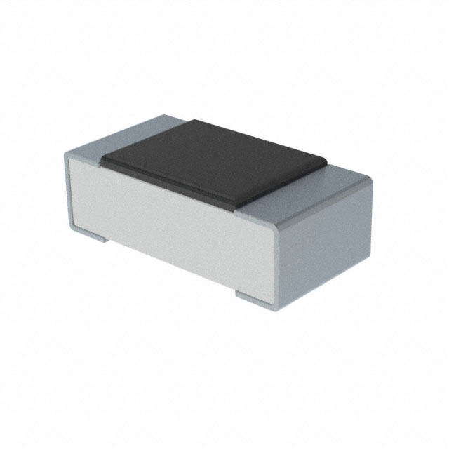

# Resistors

INFO: **Why We Call Them Passives** All components in electronics are
grouped into 2 categories (basically): active and passive. Passive
components don’t need an external power source to function. These
components use some other property to control the electrical signal. As
a result, they only require the current traveling through the connected
circuit. Resistors impede the flow of electrons without introducing more
electricity into the system.

Resistors are, perhaps, the most fundamental component in all
electronics. If you have a wire, which in its ideal form carries the
same current through it, a resistor allows you to limit the flow of that
current. They create _resistance_ to the flow. Resistance is measured in
ohms (&ohm;). One ohm is the resistance represented by a current of
one amp (A) passing across a resistor with a 1V drop across its
terminals. There's that sneaky [Ohm's law](../fundamentals.md#ohms-law)
again!

Starting with resistors is good because they are, by a wide margin, the
simplest and least "weird" component you'll run into. Everything else
has a ton of edge cases to think about. 

## Schematic Symbols
{: width=250, align=right }

There's two main symbols you'll see in use, shown to the right. R1 is
drawn in the standard ANSI symbology of a set of leads with a zig-zag
between them. This hints at the internal structure of many resistors.
Conversely, R2 shows the IEC (international) version of the symbol,
which looks more like the component outline. 

Personally, I find drawing the ANSI version to be an exercise in
futility, and anyone who can hand draw them is prima facie a witch.

## Equivalent Circuit

[Equivalent circuits](https://en.wikipedia.org/wiki/Equivalent_circuit)
are a way to break down a component (or circuit) into easy to reason
about pieces. This is typically defined using [Thévenin
equivalence](https://en.wikipedia.org/wiki/Th%C3%A9venin%27s_theorem).
For resistors outside RF/microwave frequencies, a resistor is just a
resistor. For RF and microwave, [this are more
complicated](https://resources.system-analysis.cadence.com/blog/msa2021-understanding-resistor-behavior-at-high-frequencies).

For everything else, you will not be so lucky!

## Types

In addition to just a regular resistor, there are a few other types that
you'll find pretty commonly (and more you won't). Note that each of
these has a specific schematic symbol you can find [on this
page](https://eepower.com/resistor-guide/resistor-standards-and-codes/resistor-symbols/).
I've taken part photographs from [Digikey](https://digikey.com); part
number in the alt text.

Through-hole axial lead
: {: width=100 align=right }
This is the "classic" resistor. There are standard package sizes and
shapes, and they are effectively interchangeable from manufacturer to
manufacturer. 

Surface mount device (chip)
: {: width=100 align=right }
Like everything these days, resistors come in a diverse set of surface
mount formats, which are typically called "chip resistors".  They start
out huge at 2512 format (0.25" x 0.12") but quickly shrink until you get
to the 0201 (0.024" x 0.012").

In addition to the normal through-hole and SMD resistors, there's a few
that are variable. The first are adjustable:

Potentiometer
: {: width=100 align=right }
A potentiometer is an adjustable resistor with 3 terminals. One
terminal is connected to an adjustable wiper, and the other two are
connected to opposite ends of a resistive component. The position of the
wiper turned with a knob. It effectively is a self-contained voltage
divider. Note there is a [digital
potentiometer](https://en.wikipedia.org/wiki/Digital_potentiometer)
which kinda does the same thing, but accomplishes the entire process
with a large number of resistors switched in and out of the circuit.

Trimming potentiometer (trimpot)
: {: width=100 align=left } 
A trimpot is _very close_ to a potentiometer, but I wanted to call it
out specifically. Trimpots are basically potentiometers that are mounted
_on a PCB_ and are intended exclusively for trimming (tuning or
calibrating) a circuit. They come in single turn and in multi-turn
models, and they are designed to be very precise and stable. They run
the gamut from $0.25 (USD) to $50+ (USD) depending on accuracy and
temperature coefficient, which is basically how much they change over a
temperature range.

Then, there is a set of resistors that are _reactive to the
environment_. 

Photoresistor
: {: width=100 align=right }
Also called light-dependent resistors, photoresistors are, as you might
imagine from the name on the tin, reactive to photons (light). They
typically drop resistance the more light that falls on them. This range
is called their "dark resistance" (R~D~) and their "illuminated
resistance" (R~IL~). All the ones I've seen get less resistive as more
light falls on them. They can be very useful for detecting the presence
of things, although typically photodiodes are more useful in this area.

NTC/PTC thermistor
: {: width=100 align=left }
A thermistor is a resistor whose resistance changes _significantly_ with
temperature. I say significantly, because all resistors change with
temperature to some degree or another. They come in two different kinds:
negative temperature coefficient (NTC) and... you guessed it, positive
temperature coefficient (PTC). As for applications, they're actually
quite different (largely due to how they're constructed). NTC
thermistors are typically used as temperature sensors. {: width=100 align=right } 
PTC thermistors, however, are used in over-current protection, or some form of
self-regulator circuit. NTC respond quickly, where as PTC respond much
slower. In fact, you'll often hear "PTC resettable fuse" used to refer
to the PTC kind when they're used in [protection
circuits](../protecting-circuits.md).

Varistor
: A varistor, also called a voltage-dependent resistor (VDR) is actually
a semiconductor that drops in resistance as voltage increases. Their
main application is in protection circuits where they are tied to
ground. When they are set up in this arrangement, they're called
"voltage clamping". The most common kind in use is a metal-oxide
varistor (MOV). 

Strain Gauge
: {: width=100 align=right } 
One  of the last environmentally-reactive resistors is a strain gauge. A
strain gauge measures, shockingly, strain on an object. Strain is the
deformation of an object. Through that, they can be used to measure
weight (typically through a [Wheatstone
bridge](https://en.wikipedia.org/wiki/Wheatstone_bridge)). Strain gauges
are capable of tolerances down below 0.2%, and are heavily used to
monitor equipment and aircraft.

## Composition

There are a bunch of ways to make resistors, but for a majority of them,
they have one of the following compositions. I've linked to much more
in-depth reviews of the various types along with trade-offs. I mostly
keep carbon-film and metal-film resistors around for most uses, with a
few wirewound for higher power applications. These are listed
(approximately) from cheapest to most expensive.

[Carbon composition](https://eepower.com/resistor-guide/resistor-materials/carbon-composition-resistor/)
: Carbon composition resistors (CCR) are fixed value resistors. They are
made out of fine carbon particles mixed with a binder (for example
clay). After baking, it has a solid form. 

[Carbon film](https://eepower.com/resistor-guide/resistor-materials/carbon-film-resistor/)
: Carbon film resistors are a type of fixed value resistor. They are
constructed out of a ceramic carrier with a thin pure carbon film around
it. This carbon film functions as the resistive material. 

[Metal film](https://eepower.com/resistor-guide/resistor-materials/metal-film-resistor/)
: Metal film resistors have a thin metal layer as resistive element on a
non-conducting body. They are among the most common types of axial
resistors.  

[Metal oxide film](https://eepower.com/resistor-guide/resistor-materials/metal-oxide-film-resistor/)
: Metal oxide film resistors are made of ceramic rod that is coated with
a thin film of metal oxides, such as tin oxide. Metal oxide film
resistors must not be confused with metal oxide varistors, made of zinc
oxide or silicon carbide.

[Wirewound](https://eepower.com/resistor-guide/resistor-materials/wirewound-resistor/)
: In a wirewound resistor, the resistive element is an insulated
metallic wire that is wound around a core of non-conductive material.
The wire material has a high resistivity, and is usually made of an
alloy such as nickel-chromium (Nichrome)

[Foil](https://eepower.com/resistor-guide/resistor-materials/foil-resistor/)
: A foil resistor is a high precision component to limit electric
current. The opposition to current flow is provided by a very thin piece
of metal. 

## Power Rating (W)

All resistors are rated for a specific power handling in watts (W). This
can run anywhere from 0.01W on the smallest SMD resistors up to 250W or
more for large chassis-mount power resistors. You want to ensure you
choose one with enough safety margin for whatever you're going to throw
at it. I mostly stock 1/4, 1/2, and 1W regular THT resistors, and 1/4W
in SMD 1206 and 805.

Once you get about 5W rating on a axial lead THT resistor, for example,
you're going to move into [chassis
mount](https://www.digikey.com/en/products/filter/chassis-mount-resistors/54)
designs. These are _much larger_ because they have integrated metal
heat-sinks. They come in sizes up to about 5KW (yes, 5,000W). These are
designed to be bolted to something like a chassis to expand their heat
dissipation potential. The differences between a high power resistor and
a space heater are few.

## Tolerance

The other major specification you'll run into is tolerance. Simplified,
this is the percentage that the resistor can deviate from it's specified
value and still be considered in-spec. Let's look at a 1k&ohm; resistor
in some common tolerances.

| Tolerance | Lower (&ohm;) | Upper (&ohm;) |
| --------- | ------------: | ------------: |
| 0.1%      |           999 |          1001 |
| 0.5%      |           995 |          1005 |
| 1%        |           990 |          1010 |
| 5%        |           950 |          1050 |
| 10%       |           900 |          1100 |

For most people, 1-5% is the normal tolerance that they are working
with, although SMD devices _tend_ to have tighter (smaller) tolerances,
where 0.5% isn't uncommon. 

For _very high precision_ resistors, where tolerances can be as small as
0.001%, you might see this specified in parts per million (ppm). You can
even, if you have enough money, order resistors with even more precise
tolerances. But they will most definitely cost you. For example, a
1K&ohm; 0.001% resistor with a power rating of 1/5W will cost you $100
(USD) or more _each_. And they're all made by one company: [Vishay
Precision Group](https://vpgfoilresistors.com/). Open up any super
high-precision device, and it'll be chocked full of Vishay resistors.

Note that lower tolerance are typically [laser
trimmed](https://en.wikipedia.org/wiki/Laser_trimming) to achieve very
high precision. There are even
[machines](https://www.ppisystems.com/systems/rapitrim-laser-resistor-trimming/)
just to do this.

## E-Series of Preferred Values

If you've ever looked a resistors, and wondered why they seem to be in a
weird set of values, this is why. While not strictly a measurement
itself, it's a system of standardized measurements. It was originally
standardized in 1952 by the International Electrotechnical Commission
(IEC), and is effectively followed by every single resistor manufacturer
in the world. By standardizing resistors, it also accelerated the mass
production, and turned them into [jellybean
part](https://en.wiktionary.org/wiki/jellybean_part). It also limits the
number of values that have to be manufactured and stocked. There are 6
commonly used E-series:

* E6 for 20% tolerance resistors.
* E12 for 10%
* E24 for 5% and 1%
* E48 for 2%
* E96 for 1%
* E192 for 0.5%, 0.25%, and 0.1%

Resistors with higher tolerance ranges need fewer distinct parts to
cover the range because they automatically overlap. Each of these is a
series of steps on a logarithmic scale. So, for an E12, the step is
equal to:

$$10^{1\over{12}} = 1.21$$

Similarly, for E192, we get:

$$10^{1\over{192}} = 1.01$$

That leads us to a series of [1, 1.2, 1.5, 1.8, 2.2, 2.7, 3.3, 3.9, 4.7,
5.6, 6.8, 8.2]. This range is called a _decade_. You can then multiple
that single to get multiple decades in powers of 10, for example [1.8,
18, 180, 1800, 18000, ...]. 

NOTE: **Choose Value's Wisely** When choosing a value, it's best to
select from the "lowest" E-series that works for you. If you can make a
circuit work with something from E6, then don't use an E96. This will
reduce the cost of finding parts, and ensure you don't run into any
issues. Precision and accuracy both cost money in parts.

## Representing Values

There are a few different ways you'll see resistor value's represented.
I have sorta just made up names in this case, but I think they'll help.

* American
* European
* SMD
* Color bands

Personally, I like the European representation of values, but the
American schematic symbol. Call me weird.

### American

When Americans write resistor values, for example, in a schematic,
you'll see it written with the value and a standard [metric
prefix](https://en.wikipedia.org/wiki/Metric_prefix), such as 120, 1.2k,
12k, 1.2M, etc. So you might have both a multiplier and a decimal point.

### European

The European (and I believe IEC) representation that you will see
replaces the decimal with the metric prefix if there is one. So, for tme
same series you'd see 120, 1k2, 12k, 1M2. Saves a character, at least?

### SMD

The typical SMD resistors use a either a 3 or 4-digit code to mark the
resistance value on the part. The first numbers will indicate the
significant digits, and the third will be the multiplier. 'R' is used to
indicate the position of a decimal point. For example, a resistor marked
27R0 is 27&ohm;, but one marked 272 or 2702 would be 2.7k&ohm;.  

WARNING: **Crazy EIA-96 Format** There is another--antisocial if you ask
me--format developed by EIA termed the EIA-96 format. It is based on the
[EIA-96 series of standard resistor
values](https://www.hobby-hour.com/electronics/eia96-smd-resistors.php)
and is typically used on 1% tolerance parts. It uses three characters
(two numbers and a digit) in which the numbers represent the value (34 =
34th value of the possible range) and the letter represents the
multiplier. So, 36D is 232k&ohm;, but 71A is 536&ohm;. Clear, no?
There's a special place in hell for this crap.

As with others, there are [online
calculators](https://www.digikey.com/en/resources/conversion-calculators/conversion-calculator-smd-resistor-code)
to help do the conversion.

### Color Bands

Finally, we have the color bands, which are little stripes around the
body of an axial resistor. These are standardized in IEC 60062. The
following chart shows how the various colors relate:

There are, occasionally, 6 band resistors with temperature coefficients
indicated, but if you're needing one of those, you're not reading this
page and already know what to do.

As shown, 0.1-1% resistors use the 5-band code, and everything above
that uses 4. There is a 3 band version for 20% tolerance resistors, but
the only resistors that I've seen at 20% are wire-wound power resistors
in chassis-mount packages, and those just have the value printed on
them.

There are [online
calculators](https://www.digikey.com/en/resources/conversion-calculators/conversion-calculator-resistor-color-code)
that will do the work of converting for you. 

TIP: **Practice** Reading resistors by eye takes a _lot_ of practice.
Especially with 5-band resistors, it can be difficult to tell which side
to read from. One way to think of that is if you have some idea of the
tolerance of the resistor, you can eliminate which side is which.
Orange, white, and yellow will never show up on the tolerance band. This
can help you guess, as for many inexpensive resistors, red and orange,
blue and violet, and brown and silver look suspiciously the same. When
in doubt, just stick a multimeter on it and find out.

## Vendors

There's an absolute ton of vendors for most parts, especially passives,
but these are the ones I typically stick to if I can, in alphabetic
order.

* Bourns
* Eaton
* Murata
* Panasonic 
* Rohm
* Samsung
* Stackpole
* Vishay

Note that Vishay has a _ton_ of sub-companies that make various
specialized things, including VPG, Vishay Precision Group for stupid
expensive, insanely precise resistors.

## Recommendations

### Weird Values

First, you probably don't need that super weird value. But if you have a
situation where you have a _very specific_ resistor value requirement,
such as 23.4k, you're just not going to find it. You could try and
assemble a set of resistors in parallel and series to achieve this
exact, or you can combine a precision 1% resistor with a potentiometer.
For example, to get the 23.4k, you might combine a 22k 1% resistor with
a trimming potentiometer in series. Even in small quantities, from one
of the manufacturers above, that resistor will cost you 10 cents, and
you can get a 0.5% for 25 cents. The trimmer, even from Bourns (who,
coincidentally invented the trimmer), will cost you [perhaps a
dollar](https://www.digikey.com/en/products/detail/bourns-inc/3362M-1-202RLF/2536584). 

## Uses

Resistors are _everywhere_ in electronic circuits. They are critical to
so many circuit designs, including:

* Voltage dividers
* Limiting current flow
* Matching circuits
* Loading circuits
* Gain control of an amplifier
* Setting time constant in an RC circuit

We are going to take a quick look at the first two, as they stand alone,
where-as the others depend heavily on exactly what kind of circuit
you're using.

### Current Limiting

Just as one example, if we don't limit current into an LED, it will burn
out very quickly. Taking a [sample red
LED](https://www.digikey.com/en/products/detail/creeled-inc/C503B-RAN-CZ0C0AA2/6561762),
we can see that it has a desired forward current (I~F~) of 20mA,, and a
forward voltage drop (V~F~) of 2.1V (typically for almost all red LED).
If you want to power this with a 5V power supply and limit the current
across it, you can figure this out with Ohm's law:

$$\begin{aligned}
R &= {{5 - 2.1}\over{0.02}}\\[5pt]
&= 145
\end{aligned}$$

{: width=250 align=right }

So we need a resistor of 145&ohm;. Now, that's not a common value, but
[we can get 150](#e-series-of-preferred-values), and so we can just use
that. We could also slightly overdrive it with a 130&ohm;. Close enough!
Or is it?  Let's put it back in and see what happens by flipping Ohm's
law around:

$$\begin{aligned}
I &= {V\over R}\\[5pt]
&= {{5 - 2.1}\over{150}}\\[5pt]
&= 0.19\overline{3}
\end{aligned}$$

That looks good to me! Below, there's an interactive circuit with a 5V
voltage source, a resistor, and an LED. You can adjust the resistor and
see what happens with the LED.

[[ embed_schematic("current-limiter-led") ]]

<!-- TODO: Write about LEDs in depth -->
FUTURE: **More to Come** There's a lot more to driving LEDs than this,
and truthfully you also need to do a few more things. I'll cover the
whole process elsewhere (TBD).

### Voltage Divider

{: width=250 align=right }

Often when working with a circuit, you need to set a specific voltage
into some component, but you don't have that exact voltage. But, you
often have a higher voltage that you can work with. This is where
voltage dividers come in. They do exactly what you think they would from
the label on the tin. We can calculate our output voltage from a divider
using the [voltage divider
equation](https://www.khanacademy.org/science/electrical-engineering/ee-circuit-analysis-topic/ee-resistor-circuits/a/ee-voltage-divider),
using V~S~ as our source voltage.

$$V_{out} = V_S{R_2\over{R_1 + R_2}}$$

If we apply that to our imagined voltage divider circuit shown:

$$\begin{aligned}
V_{out} &= V_S{R_2\over{R_1 + R_2}}\\[5pt]
&= 5{1200\over{1000+1200}}\\[5pt]
&= 5\cdot{0.\overline{54}}\\[5 pt]
&\approx 2.727 
\end{aligned}$$

Now, let's play with it. Using the sliders on the right of the circuit
below, play with the resistance and see how the output changes.

[[ embed_schematic("basic-voltage-divider") ]]

<!-- TODO: Write about voltage dividers -->
FUTURE: **Fun with Voltage Dividers** There's a lot you can do with a
voltage divider arrangement. In fact, you can use more than 2 resistors.
You can use 3 or 4 or 5 or ... by selecting them you can get all sorts
of voltages out of the circuit that can help you solve lots of problems.
Voltage dividers deserve their own discussion.

<!-- TODO: Move elsewhere>
## Capacitors

### Types

### Composition

## Inductors

An inductor can also be known as a coil, choke, or reactor.  It is a
two-terminal component that stores energy in a magnetic field when
current is flowing through it. A standard inductor normally consists of
an insulated (often varnished) wire that has been wrapped into a coil
situated around a core. When the voltage ratio (to current) changes the
inductor will oppose any changes in current through it.  When the power
is removed, the magnetic field will collapse, inducing a current in the
winding wire. A transformer is a form of compound inductor.

## Diodes (kinda)

## 3rd Party References

* [PG&E Application of Underground Distribution
  Transformers](https://www.pge.com/pge_global/common/pdfs/services/building-and-renovation/greenbook-manual-online/062111.pdf). 

-->