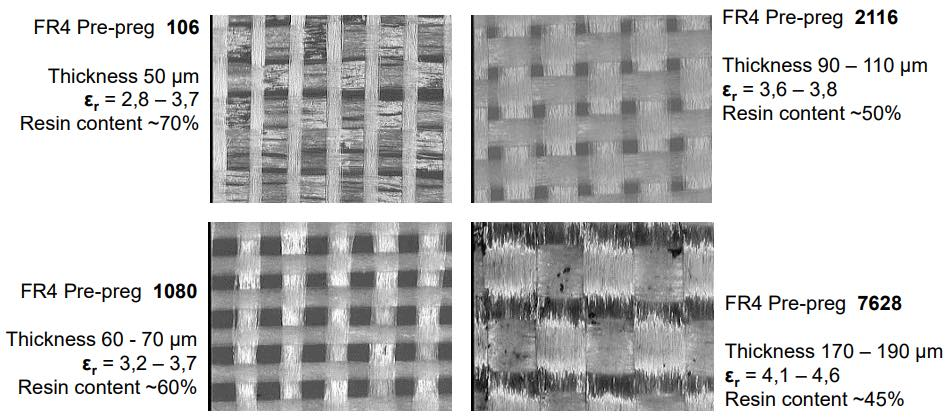
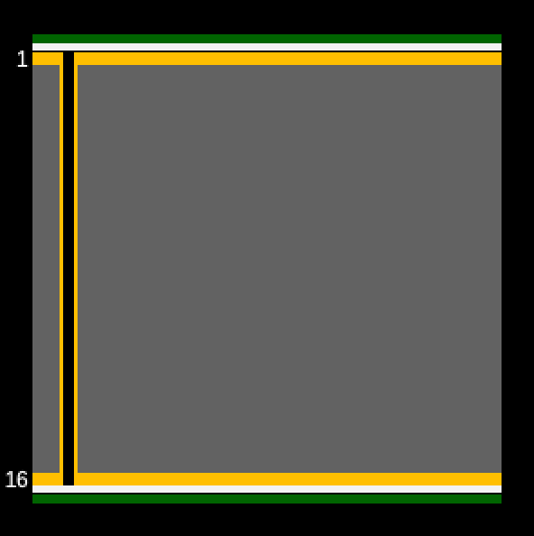
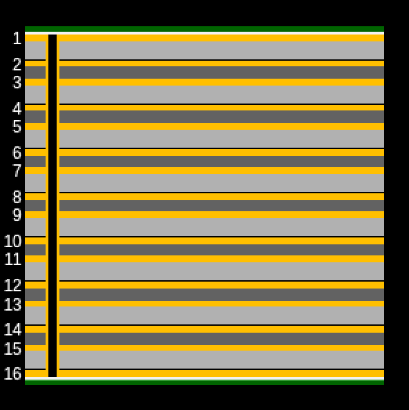
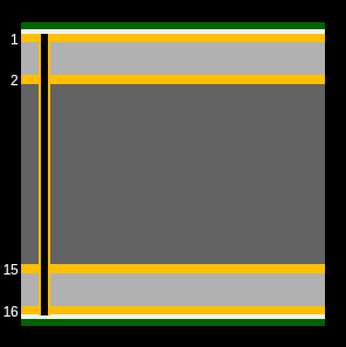
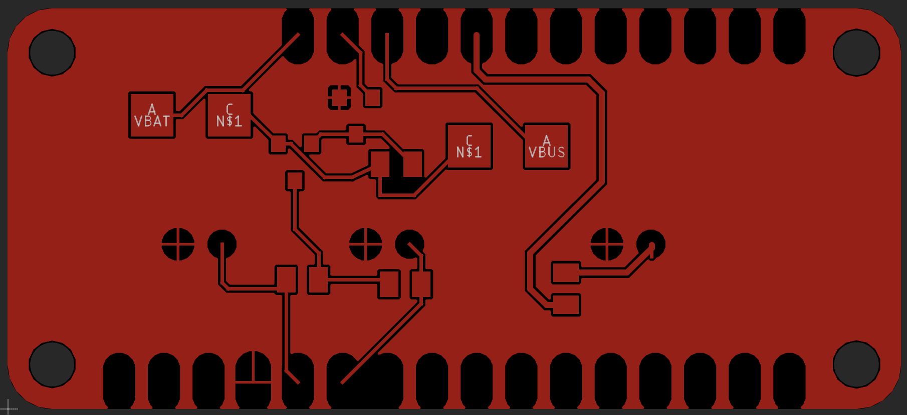
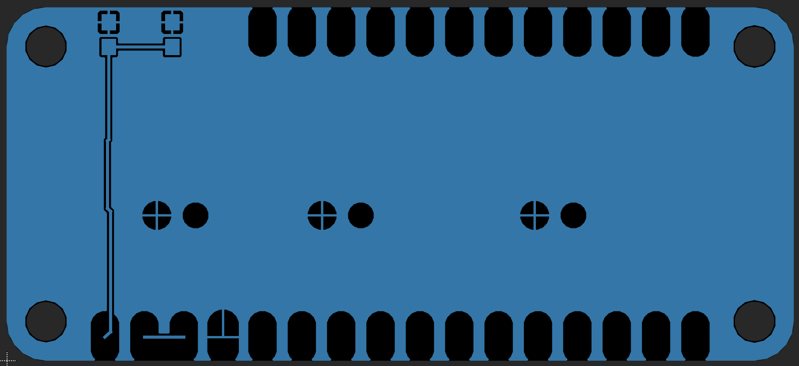
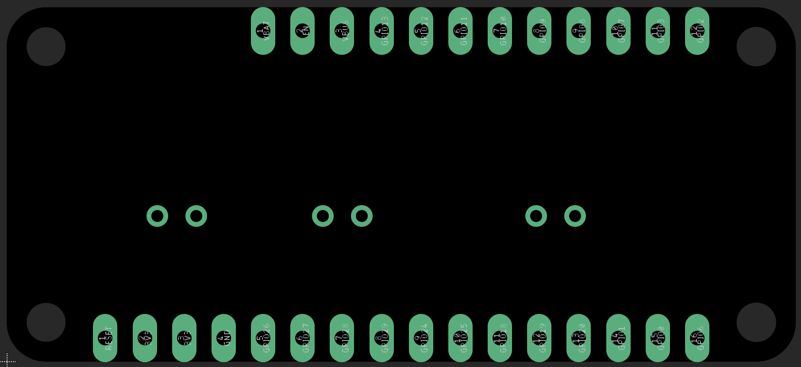
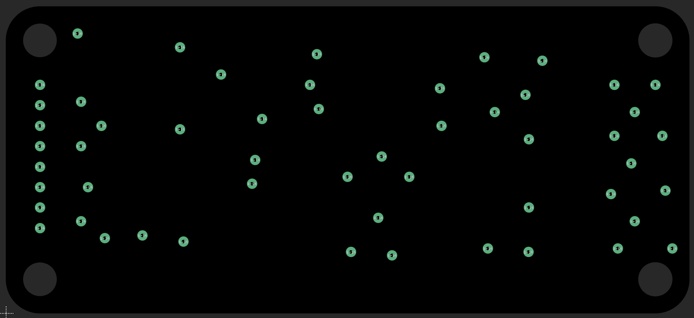
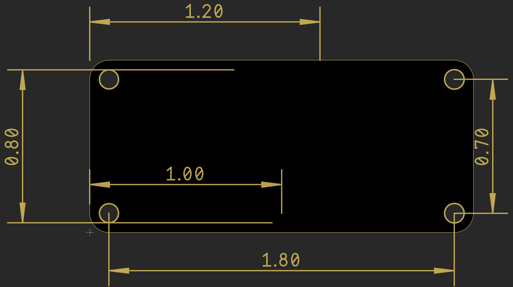

# EDA PCB Layers

When you're designing PCBs, the tool you use, whether it's Fusion 360,
EAGLE, KiCAD, Altium Designer, or ... whatever... it's going to break
the PCB into a bunch of different layers. Here, I want to talk about
what all those layers are for, and what they're called in, at least,
Fusion 360 (and EAGLE) and KiCad. I can't afford Altium Designer to work
with it. 

## Stack-Up

There are a bunch of pieces to creating a PCB, and how they are arranged
is generally called the "stack-up" of the PCB. The main components are:

* Signal/copper
* Prepreg
* Core
* Surface finish
* Solder mask
* Silk screen

We will talk about signal, solder mask, and silk screen below, but you
also have a couple layers that are not typically directly represented in
an EDA tool. Those are the core, prepreg, and surface finish. PCB cores
and prepreg are similar and, in some ways, quite different, so we'll
talk about them separately.

> NOTE: **PCB Material** When having a PCB manufactured, one of the
> things you'll need to choose is the diametric material that makes up
> the main "body" of the PCB. There are many many options, but the most
> common one you'll find for hobbyists (and just general use) is called
> [FR4](https://en.wikipedia.org/wiki/FR-4), which is a glass laminate
> not too dissimilar to fiberglass. FR4 comes in a bunch of ratings
> which specify the maximum temperature and thermal dissipation of the
> material.
> 
> The others you'll see relatively frequently are aluminum (often used
> in high power situations to help dissipate the heat), and one simply
> termed [Rogers](https://www.nextpcb.com/blog/roger-pcb-materials),
> which is made by a specific company (Rogers, which is no shock). It is
> a ceramic composite, and is largely the domain of very high frequency
> work. You will also somewhat commonly see PTFE (Teflon) as a material
> for dielectric. For the purposes of this, we are only talking about
> FR4.

### Prepreg

Prepreg material is a laminated material impregnated with a resin, where the resin is
hardened but left uncured. Most manufacturers describe the prepreg as
the glue that holds core materials together; when two cores are stacked
on each side of a prepreg laminate, exposing the stack to heat causes
the resin to begin bonding to the layers around it. As the resin slowly
cures, its resulting material properties start to approach those of the
core layers. 

The diagram above, from the [Isola Group](https://www.isola-group.com)
shows some examples of pre-preg. The resin material encases a glass
weave, and the manufacturing process for this glass weave is very
similar to that used to manufacture woven fiberglass. The glass weave
can be quite tight (e.g., 7628 prepreg) or loose (e.g., 1080 prepreg),
which is controlled with a loom during manufacturing. Any gaps and the
overall homogeneity of the yarn will determine the electromagnetic
properties, which is then responsible for dispersion, losses, and any
fiber weave effects seen by signals in the board.

### Core

Core is effectively one or more prepreg laminates that are pressed,
hardened, and cured with heat, and the core is plated with copper foil
on each side. It may be made with the same dielectric material as the
prepreg, or it may (often) be something different. The big difference is
that it is hardened _prior_ to the formation of the multiple layers,
where-as the prepreg is not cured/hardened prior. 

### Surface Finish

While every (ok, not every, but nearly every) PCB uses copper for its
traces to conduct energy, those traces need a finish so they don't
corrode when exposed to the air, such as when they do not have a mask on
top of them.  This is called the surface finish, and there are a few
different ones that are widely used (and others that are less widely
used). They are, in order of inexpensive to expensive:

HASL
: Hot-Air Solder Leveling. This is perhaps the most common, and
certainly the most cost effective finish. It is available in both lead
and lead-free, and to produce it, the PCB is dipped into a bath of
molten solder (lead or lead-free), removed, and run through a pair of
[air knives](https://www.mcmaster.com/products/air-knives/) that removes
the excess solder.

OSP
: Organic Solderability Preservatives uses a water-based organic
compound that selectively bonds to copper and protects the copper until
soldering. Personally, I find OSP to be a royal pain in the backside to
work with. It can often require multiple reflow cycles and it's not
conductive (which means if it doesn't all come off, you can have solder
problems). It does have some positive aspects, but really not for a
hobbyist. 

ENIG
: Electroless Nickel Immersion Gold is an electroless nickel plating
covered with a thin layer of immersion gold, which protects the nickel
from oxidation.  Compared with other surface finishes, ENIG (and ENEPIG)
provide the highest solderability for PCBs but at a cost. When you see
PCBs on Youtube or other blogs that look gold, this is almost always the
finish that they have used.

ENEPIG
: Electroless Nickel Electroless Palladium Immersion Gold differs from
ENIG in that a layer of palladium is applied as a resistance layer to
stop nickel from oxidation and diffusion to copper layer.

Hard Gold
: Hard gold is by far the toughest surface you can put on a PCB, and it
is often used to create the edge fingers on a circuit board. It's a
great option when a PCB is designed to be inserted into a receptacle of
some sort, such as with a RAM module. It is extreme durable, but also
_expensive_ and has very poor solderability. Because of this, it's often
combined with something else, such as HASL for the regular soldering areas.

To put these into perspective, here's the prices from a well-known
contract PCB manufacturer for a 50mm square 2 layer board in each
process at a quantity of 5 (common order for a hobbyist):

| Process     |   Price |
| ----------- | ------: |
| HASL (lead) |   $5.00 |
| OSP         |  $38.43 |
| ENIG        |  $49.04 |
| ENEPIG      | $185.64 |
| Hard gold   | $213.09 |

Choices matter. 

## Signal Layers

{: align=right width=200 }

This signal layer contains the copper on your board, whether that’s a
polygon from a copper pour or routed copper traces. When you think about
the parts of a PCB, this is probably what your'e thinking about. For a
hobbyist, you will typically have either 1 (top only) or 2 (top and
bottom) signal layers that are on the outside of the PCB itself. For
more advanced use cases, you can have 4, 5, 6, or as many as 32 layers,
where they can often be split between signal, ground, power, and other
purposes. 

{: align=left width=200 }

TIP: **Copper Pours for Ground** Using a signal layer (and often the
bottom layer as well) to generate a pour (also called a polygon) will
provide an consistent area of copper for all of your signals to ground.
This can actually make routing _vastly easier_ because all of your
grounds get connected automatically.

In Fusion 360/EAGLE and KiCad you can find them labeled as:

| Program          | Name               |
| ---------------- | ------------------ |
| Fusion 360/EAGLE | 1 Top, 16 Bottom |
| KiCad            | F.Cu, B.Cu       |

{: align=right width=200 }

In addition, for EAGLE and Fusion 360, if you are working with more than
a two layer board (4-6 being quite common), they'll be started from 1
and 16 and work in. So a 4 layer board will have signal layers on layer
1, 2, 15, and 16.

For a super simple 2-layer board, the top layer might look something
like this:

and the bottom might look like:

Every tool will use different colors to allow you to show the layers at
the same time, and mostly tell the difference:

I strongly recommend pouring copper on both your top and bottom layers
as a matter of habit, unless you are working with more than two layers,
where the stack-up can get more complicated. You should also
[stitch](https://resources.altium.com/p/everything-you-need-know-about-stitching-vias)
those together, which will help ensure you don't get any isolated areas
which can cause all sorts of nasty problems.

## Pads

## Vias

## Dimension/Mechanical

