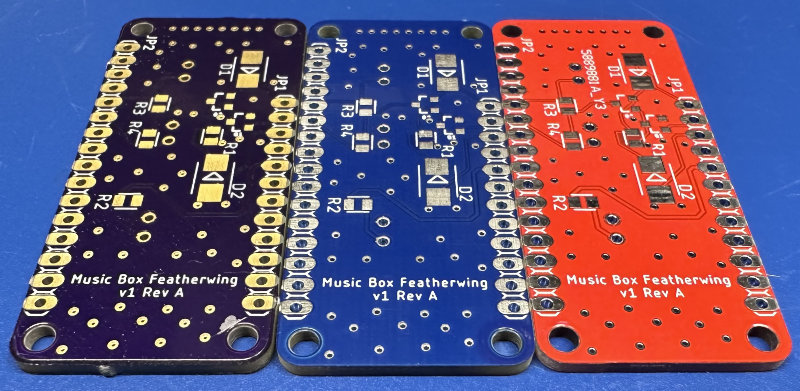
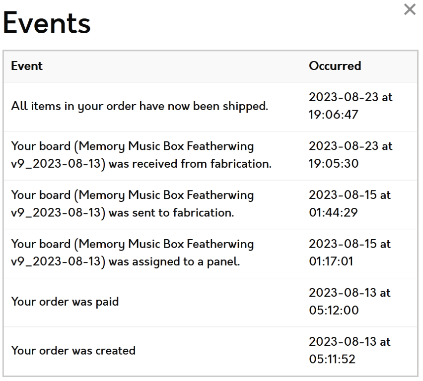
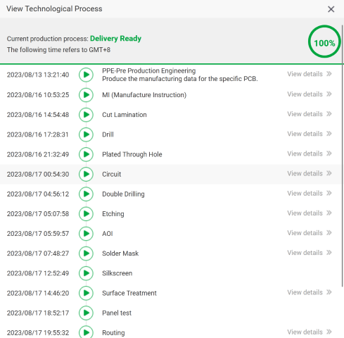
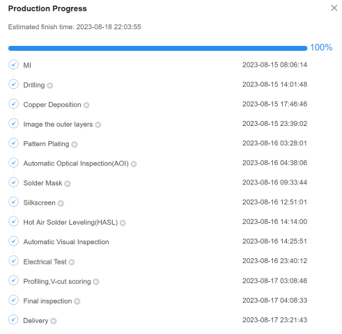

---
tags:
  - comparison
  - jlcpcb
  - oshpark
  - pcb
  - pcbway
  - review
  - supplier
---
# PCB Supplier Comparison

> ABSTRACT: **TL;DR** We live in a golden age of PCB production
> availability and quality. All three vendors produced excellent quality
> PCBs for a hobbyist 2-layer board. The OSHPark board was marginally
> better in quality (largely due to the ENIG coating), but lost points for
> some finish on the board routing. The two Chinese vendors (PCBWay and
> JLCPCB) were largely indistinguishable from one another.
>
> I will probably stay with OSHPark for most things just because it was
> faster, as long as I can live with the purple solder mask. But
> realistically, they'll all produce boards of high enough quality for
> most hobbyist uses.

## Test Board

The basic test board that I put together is a
[Featherwing](https://learn.adafruit.com/adafruit-feather/feather-specification)
to match up with the Adafruit Feather ecosystem. There's nothing fancy
on it, and it's just a 50x23mm (2x0.9") 2-layer PCB with a normal
stack-up. This is typical of the kind of thing I typically work with,
and I think likely also represents a vast majority of the PCB work most
hobbyists are going to be doing.

There's also a bunch of haphazard via stitching going on, which is why
you see lots of little holes all over the board.

## Timelines

I ordered all of the boards one after another around 9pm on 2023-8-12.
This probably gave the Chinese manufacturers a small edge since they
would be in the middle of their day. Still, you gotta order sometime.

| Supplier | Order Date | Ship Date | Receive Date | Total Time |
| -------- | ---------- | --------- | ------------ | ---------- |
| OSBPark  | 2023-8-12  | 2023-8-23 | 2023-8-25    | 13 days    |
| PCBWay   | 2023-8-12  | 2023-8-17 | 2023-8-28    | 16 days    |
| JLC PCB  | 2023-8-12  | 2023-8-17 | 2023-9-1     | 20 days    |

For each supplier, I chose the cheapest shipping option. For both PCBWay
and JLC PCB, this was something called "Global Standard", which I
believe is some kind of combination of bulk shipment and distribution on
the part of the company to each country. For OSHPark their standard
shipping is USPS.

Both PCBWay and JLC offer faster shipping (using DHL), which might have
made them the fastest, but you also would have paid [[ usd(15.00)]] more
for it, which changes the economics unless you need that kind of
turnaround.

## Cost

The reality is that PCBs are pretty cheap now, at least from a decent
number of places, so the actual cost was very reasonable. I just took
all the default settings for each supplier, other than potentially
changing the solder mask color for PCBWay and JLCPCB. This _may_ have
added a day to production, but I don't think it's likely to have been a
major issue.

| Supplier | Qty | Production         | Shipping        | Total                | Unit Cost       |
| -------- | --- | ------------------ | --------------- | -------------------- | --------------- |
| OSHPark  | 3   | [[ usd(9.05) ]]    | [[ usd(0) ]]    | [[ usd(9.05)  ]]     | [[ usd(3.02) ]] |
| PCBWay   | 5   | [[ usd(5.0) ]]     | [[ usd(4.58) ]] | [[ usd(10.31) ]][^1] | [[ usd(2.06) ]] |
| JLCPCB   | 5   | [[ usd(4.0) ]][^2] | [[ usd(1.44) ]] | [[ usd(5.44) ]]      | [[ usd(1.09) ]] |

[^1]: There is an additional [[ usd(0.73) ]] "bank/paypal fee". You
    could avoid this, obviously, by direct payment, but I do try to
    reduce the number of places I share my credit card with.
[^2]: See discussion under [quality control](#quality-control).

## Final Result

Here's the final result with the boards left-to-right from OSHPark,
PCBWay, and JLCPCB. In addition to the color differences, the main
difference is that OSHPark provides an ENIG coating rather than the
normal HASL.

 

If you want to see [a full-size image](img/all-pcb-fullsize.jpg), you
can.

## Quality Control

I want to call out PCBWay specifically here because they identified an
(unintentional) error in the design within just a few minutes of me
uploading the design. I had accidentally put some dimensioning
information on the wrong layer, and it caused a short on the top copper
layer. Interestingly, Fusion 360 did not catch this. 

During this, I communicated with a nice engineer on their side who
pointed out in detail (with screen shots and everything) the mistake,
and when I provided updated Gerber files, swapped them all out for me
and released things to production.

I updated OSHPark files online (which was super easy), and they
manufactured the correct ones from that. The day or two delay in sending
boards for production helped out here. I don't know if they would have
found the mistake on their own, unfortunately. I probably should have
let it go and find out.

Finally, JLCPCB had already released the boards to manufacturing when
the problem was identified, and they were unable to stop them. So I
ended up having to pay for the boards to be produced twice but only paid
for shipping once. 

SUCCESS: **PCBWay** Not only did they find the problem, they did it
quickly and provided very clear and detailed information about what the
problem was and helped clean up the process as soon as I had resolved
it. I'm impressed they found something that the tests in Fusion 360
didn't find (or maybe Fusion 360 just isn't that good at finding things).

## Production Tracking

{: width=200 align=right }

Each of the suppliers provides some level of tracking of the orders.
This is a place where the Chinese vendors definitely excel. The details
and granularity are excellent, whereas OSHPark (shown to the right here)
just provides very coarse information. This is likely to be due to the
fact that they aren't the manufacturer, but instead bundle together a
bunch of boards and send to another supplier who may (or may not) be
able to provide that information to their direct customers.

{: width=200 align=left }

PCBWay provides _very_ detailed information about the progress of the
board through the production stages. This is updated in near real-time
on their website, and they also provide informative links to the
individual stages so that you can understand exactly what's going on at
that point in the manufacturing process. I think this is great,
especially for someone just starting out who might not realize just how
complicated producing a PCB can be. In fact, I couldn't show all the
steps they document because it scrolled out of the window.

{: width=200 align=right }

JLCPCB is very similar to PCBWay in this regard. They provide detailed
information about the process and all the steps along-the-way. They
didn't provide the detailed information about the steps, but this is
less useful if you have some understanding of the manufacturing process.

SUCCESS: **Tie: PCBWay and JLCPCB** The Chinese suppliers are
just far ahead of OSHPark as you can see. I don't think I can really
pick between the two.

## Shipping and Packaging

Both JLCPCB and PCBWay ship in nearly identical boxes with the PCBs
sealed in a plastic bag and wrapped in bubble wrap. OSHPark, by
contrast, ships in a bubble-wrap bag, but the PCBs are loose inside the
bag. This isn't really an issue as FR-4 is a pretty durable material,
and there's little risk of damage. 

> SUCCESS: **Toss-Up** While the packaging is more robust from the two
> Chinese suppliers, it's also _much_ more wasteful for limited benefit. 

## Build Quality

{: width=200 align=right }

Overall, all three providers produced a quality PCB. The OSHPark stands
out for the simple reason that it is _gold_, specific ENIG
(electroplated nickle with immersion gold) coated. This definitely gives
it a stand-out appearance, especially with the purple. While both PCBWay
and JLCPCB offer ENIG as an option, it is a _substantially_ more
expensive surface finish. Think 5x more expensive, which makes OSHPark
quite the bargain here.

_However_, there is one thing that really annoys me about OSHPark, and
it's something that's happened with every order, and that's the residual
mouse bites that are left on the board, and which are quite sharp. Mouse
bites are an artifact of [how PCBs get
panelized](https://resources.pcb.cadence.com/blog/what-is-pcb-panelization-and-why-is-it-important-2).
I don't know if the Chinese houses use the same tab approach, or whether
they use v-grooves, but they produce much smoother edges on their PCB. 

> SUCCESS: **OSHPark** This is a narrow one. I give the win to OSHPark
> simply because for almost the same price, they give you an ENIG finish
> board. This compensates for the mouse bites that didn't get fully
> removed.

## Production Options

This is a bit of a squishy topic, but there are definitely some
differences between the vendors. I'm going to take a few things that
typically you might change between boards and see how they each stack
up as far as the options available in their "normal" workflow. Note that
they may have more advanced workflows that offer more options, in which
case I've added some in parenthesis.

| Variable           | OSHPark   | PCBWay        | JLCPCB           |
| ------------------ | --------- | ------------- | ---------------- |
| Layers             | 2-6       | 1-14 (60)     | 1-4 (20)         |
| Thickness (mm)     | 0.8-1.6   | 0.2-3.2 (6.0) | 0.4-2.0          |
| Substrates         | 2         | 5+            | 1 (3)            |
| Copper weight (oz) | 1, 2      | 1-13          | 1, 2             |
| Surface finish     | ENIG only | 12 options    | None, ENIG, HASL |
| Solder mask colors | 2         | 10            | 7                |
| Silkscreen colors  | 1         | 3             | 1                |

In addition, all three offer flex PCBs. Both of the Chinese suppliers
offer more advanced things like Rodgers material (for RF) and aluminum
or copper cores. They also offer a wide array of other things around via
tenting, edge connectors, castellated holes, etc.

> SUCCESS: **PCBWay** It's just impossible to beat the absolutely
> staggering options that they have. While I'm sure high-end
> manufacturers, like [Sierra Circuits](https://www.protoexpress.com/)
> can offer even more, as a hobbyist, there's unlikely to ever be a
> requirement that is outside their capabilities.

## Conclusion

Overall, I'm impressed with the quality and speed of all the companies.
They all produced things that met (or exceeded) my expectations, and I
find it amazing that you can get them this cheaply and this quickly. It
really is an amazing time.

## Other Suppliers

There's a few other suppliers that I know of, but didn't include in this
round. I should probably give them a shot at some point.

* [NextPCB](https://www.nextpcb.com/)
* [4PCB](https://www.4pcb.com)
* [SF Circuits](https://www.sfcircuits.com)
