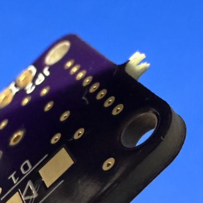

---
tags:
  - comparison
  - pcb
  - supplier
---
# PCB Supplier Comparison

> ABSTRACT: **TL;DR** We live in a golden age of PCB production
> availability and quality. All three vendors produced excellent quality
> PCBs for a hobbyist 2-layer board. The OSHPark board was marginally
> better in quality (largely due to the ENIG coating), but lost points for
> some finish on the board routing. The two Chinese vendors (PCBWay and
> JLCPCB) were indistinguishable from one another.
>
> I will probably stay with OSHPark for most things just because it was
> faster, as long as I can live with the purple solder mask.

## Test Board

## Timelines

I ordered all of the boards one after another around 9pm on 2023-8-12.
This probably gave the Chinese manufacturers a small edge since they
would be in the middle of their day. Still, you gotta order sometime.

| Supplier | Order Date | Ship Date | Receive Date | Total Time |
| -------- | ---------- | --------- | ------------ | ---------- |
| OSBPark  | 2023-8-12  | 2023-8-23 | 2023-8-25    | 13 days    |
| PCBWay   | 2023-8-12  | 2023-8-17 | 2023-8-28    | 16 days    |
| JLC PCB  | 2023-8-12  | 2023-8-17 | 2023-9-1     | 20 days    |

For each supplier, I chose the cheapest shipping option. For both PCBWay
and JLC PCB, this was something called "Global Standard", which I
believe is some kind of combination of bulk shipment and distribution on
the part of the company to each country. For OSHPark their standard
shipping is USPS.

## Cost

| Supplier | Qty | Production         | Shipping        | Total                | Unit Cost       |
| -------- | --- | ------------------ | --------------- | -------------------- | --------------- |
| OSHPark  | 3   | [[ usd(9.05) ]]    | [[ usd(0) ]]    | [[ usd(9.05)  ]]     | [[ usd(3.02) ]] |
| PCBWay   | 5   | [[ usd(5.0) ]]     | [[ usd(4.58) ]] | [[ usd(10.31) ]][^1] | [[ usd(2.06) ]] |
| JLCPCB   | 5   | [[ usd(4.0) ]][^2] | [[ usd(1.44) ]] | [[ usd(5.44) ]]      | [[ usd(1.09) ]] |

[^1]: There is an additional [[ usd(0.73) ]] "bank/paypal fee". You
    could avoid this, obviously, by direct payment, but I do try to
    reduce the number of places I share my credit card with.
[^2]: See discussion under [quality control](#quality-control).

## Final Result

 

If you want to see [a full-size image](img/all-pcb-fullsize.jpg), you
can.

### OSHPark

{: align=right }

OSHPark's main 

_However_, there is one thing that really annoys me about OSHPark, and
it's something that's happened with every order, and that's the residual
mouse bites that are left on the board, and which are quite sharp. Mouse
bites are an artifact of [how PCBs get
panelized](https://resources.pcb.cadence.com/blog/what-is-pcb-panelization-and-why-is-it-important-2).
I don't know if the Chinese houses use the same tab approach, or whether
they use v-grooves, but they produce much smoother edges on their PCB. 

### PCBWay

{: align=right }

### JLCPCB

## Production Tracking

### OSHPark

### PCBWay

### JLC PCB

## Shipping and Packaging

Both JLCPCB and PCBWay ship in nearly identical boxes with the PCBs
sealed in a plastic bag and wrapped in bubble wrap. OSHPark, by
contrast, ships in a bubble-wrap bag, but the PCBs are loose inside the
bag. This isn't really an issue as FR-4 is a pretty durable material,
and there's little risk of damage. 

> SUCCESS: **Toss-Up** While the packaging is more robust from the two
> Chinese suppliers, it's also _much_ more wasteful for limited benefit. 

## Build Quality

> SUCCESS: **OSHPark** This is a narrow one. I give the win to OSHPark
> simply because for almost the same price, they give you an ENIG finish
> board. This compensates for the mouse bites that didn't get fully
> removed.

## Production Options

> SUCCESS: **PCBWay** It's just impossible to beat the absolutely
> staggering options that they have. While I'm sure high-end
> manufacturers, like [Sierra Circuits](https://www.protoexpress.com/)
> can offer even more, as a hobbyist, there's unlikely to ever be a
> requirement that is outside their capabilities.

## Conclusion

## Other Suppliers

There's a few other suppliers that I know of, but didn't include in this
round. I should probably give them a shot at some point.

* [NextPCB](https://www.nextpcb.com/)
* [4PCB](https://www.4pcb.com)
* [SF Circuits](https://www.sfcircuits.com)
