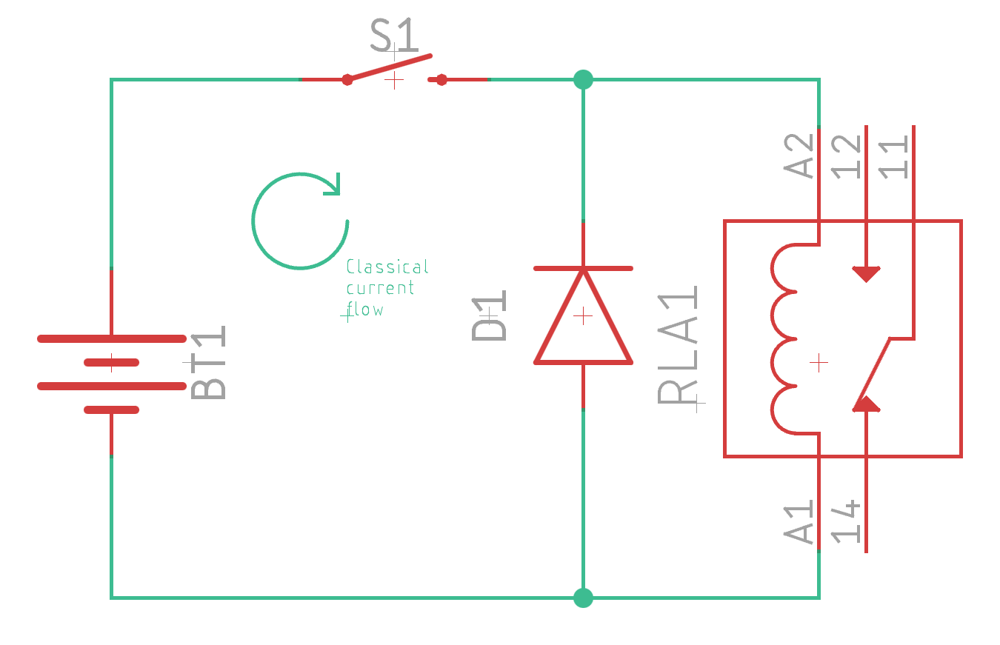
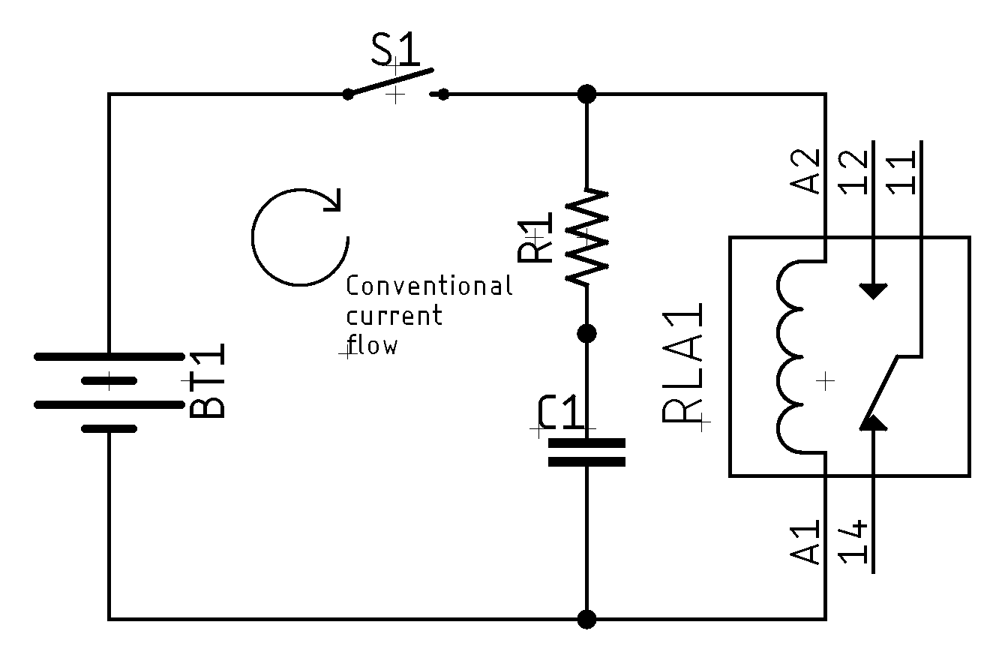

# Protecting Circuits

<!-- TODO:
* Types of damage we worry about
* Overvoltage protection
  * Zener diode/voltage clamp
* Overcurrent protection
  * Choke inductor
* Reverse polarity protection
* Thermal protection
* Decoupling capacitors
* Fuses (resettable and not)
-->

## What Can Damage a Circuit?

## Galvanic Isolation

NOTE: **About the Name** Often just called _isolation_, _galvanic
isolation_ gets its name from [Luigi
Galvani](https://en.wikipedia.org/wiki/Luigi_Galvani) a cotemporary of
Alessandro Volta, also of the [galvanic
cell](https://en.wikipedia.org/wiki/Galvanic_cell).

Galvanic isolation, electrical isolation, or just simply isolation, is a
technique of separating different parts of a circuit so that there is no
possibility of current flow (no conduction path). So, why might we want
or need this. There are two main reasons:

1. Safety. It is a good way to prevent the possibility of electrical
   shocks in systems that are dealing with high voltage or current. 
2. Separate grounds. Since ground is basically the universal return
   path, we have situations where we need to have different grounds
   which are at different potentials (approx. voltage). 

It doesn't mean there's no way to communicate between the sections, it
just means that it can't be a galvanic/electrical communication. This
does leave us with a few major options:

* Capacitive
* Inductive
* Optical

The one we use largely depends on whether we are attempting to isolate
power (current) or isolate a signal (tiny current).

## Snubber Networks

A snubber is a device/circuit that is used to limit (snub) voltage transients in
circuits. Often there can be a sudden interruption of current flow, which drives
a significant rise in voltage across a device. This can lead to both EMI, but
also potential damage to the device due to [back
EMF](https://en.wikipedia.org/wiki/Counter-electromotive_force). There are three
major types of snubbers you can use. The simplest is a snubber diode. The more
complicated is an RC snubber, and while it's marginally more complicated, it is
also better behaved. Finally, you can build one out of solid-state
(semiconductor) components, typically using a pair of Zener diodes.

<!--
TODO: Transformers
TODO: Capacitors
TODO: Opto-isolators
TODO: Hall-effect Sensor
-->

### Snubber Diode

> NOTE: **Alternate Naming** Snubbers can also be called _flyback_ protection, for
> example, a _flyback diode_. They can also just be called a _suppression diode_. 
>
> Flyback is a sudden voltage spike across an inductive load when its supply
> current is suddenly interrupted. It originated in its use in early CRT technology.

A snubber diode is the simplest possible solution and typically works well in DC
circuits. It leverages the diode as a
[rectifier](https://en.wikipedia.org/wiki/Rectifier). We wire the diode in
parallel with the load (say a relay), but set so that it doesn't conduct under
normal use. 

When current is interrupted, the magnetic field of the inductor (the coil in a
relay) collapses, causing back EMF. This can drive a big spike in voltage. With
the snubber diode, the inductor's current flows through the diode instead, and
the energy is slowly released via the diode's inherent voltage drop.

WARNING: **Possible Problems** One reason that snubber diodes aren't that
popular is that they are _slow_. Because of this, the inductor can stay active
longer than you want. For example, it can cause the turn-off time of a relay to
increase substantially.

You can watch [this great video](https://www.youtube.com/watch?v=c6I7Ycbv8B8)
discussing it in more detail

### RC Snubber

RC snubbers operate on a similar principle to diode snubbers and are more
"popular" in the industry as they work with both AC and DC systems. Since the
voltage across a capacitor cannot change instantly, any voltage spikes are
mitigated. An example, using the above basic schematic is:

Unlike a diode snubber, there's some calculations you'll need to do to choose R
and C correctly. This is [quite
complicated](https://www.eetimes.com/calculating-an-r-c-snubber/), and so I
generally just use a diode snubber unless the timing is critical.

## 3rd Party Resources

* [Introduction to Transient Voltage Suppressors (TVS)](https://www.allaboutcircuits.com/technical-articles/transient-voltage-suppressors-tvs-an-introduction/)
* [Methods of circuit protection](https://resources.altium.com/p/methods-protect-your-circuit)
* [Transient suppression devices and principles](https://www.littelfuse.com/data/en/application_notes/an9768.pdf)