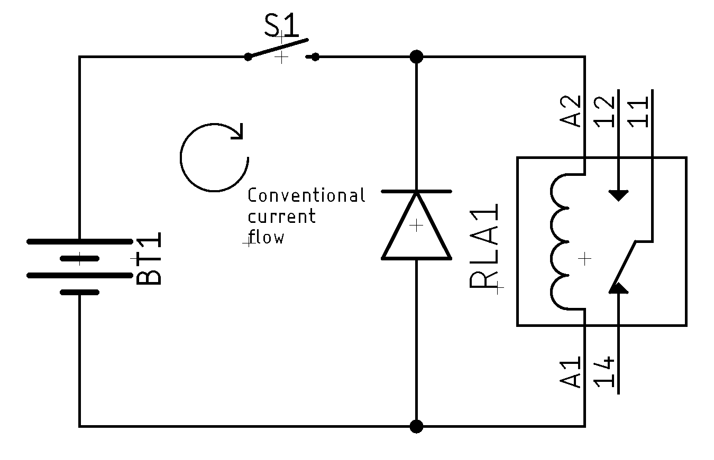

# Protecting Circuits

<!-- TODO:
* TODO: Types of damage we worry about
* TODO: Overvoltage protection
* TODO: Zener diode/voltage clamp
* TODO: Overcurrent protection
* TODO: Choke inductor
* TODO: Reverse polarity protection
* TODO: Thermal protection
* TODO: Decoupling capacitors
* TODO: Fuses (resettable and not)
-->

## What Can Damage a Circuit?

Before we talk about what kind damage a circuit, let's talk about the
three major types of damage that a circuit can succumb to:

1. Catastrophic damage. This is something that causes the component or
   circuit to fail completely. When people talk about "releasing the
   magic smoke", this is what they're talking about.
2. Parametric damage. This is when the damage is not immediately
   obvious, but instead shows up as a change in one of the defining
   parameters of the component. For example, the ESR of a capacitor
   might change enormously after ESD damage.
3. Latent damage. Here, like parametric failure, the damage can go
   unnoticed for some period of time. You can think of latent damage as
   a kind of stress on the component that, over time, builds up, till
   something small instigates a complete failure of the component.

So, what are some of the major causes of these? They break down into the
following categories, typically:

* Environmental. This is the temperature, humidity, and presence of
  potential other materials, such as corrosive compounds.
* ESD. Electrostatic discharge is the result of the build-up of
  electrical charge, typically on the human body, that is then
  transferred very quickly to the component. Think about the experiment
  with a balloon and hair. What causes your hair to stand up is the
  electrostatic buildup on the balloon's surface. The voltages involved
  can easily be tens of thousands.
* Circuit behaviors. As we'll talk about later, sometimes there are
  behaviors in the design of the circuit that introduce unexpected
  electrical patterns in a component. These are different than ESD as
  they are coming from _inside_ the circuit, rather than outside.

## Electrostatic Discharge (ESD)

### What Parts Can Be Damaged by ESD?

This is an area that is the most contentious with hobbyists versus
professionals. While nearly every component _can_ be damaged by ESD, the
most likely victims are:

* Integrated circuits. ICs can sustain burnout (just what it sounds
  like), contact damages, or damage to the interface circuitry on the
  IC. For example, excessive current flow in ICs forms holes in chips.
  It can result in excessive heat generation, which may lead to damage
  or early failure to not just the IC, but other components in the
  spatial neighborhood.
* Transistors. ESD can cause insulation breakdown, thermal stress, metal
  deposition failure, or even the the migration of materials from one
  side to another.
* LEDs. Like other semiconductors above, LEDs can sustain damage from
  ESD. This takes the form of material loss in the substrate responsible
  for emission. More powerful LEDs often have ESD protection circuits on
  them, in the form, typically, of another diode.
* Capacitors. While we typically think only of semiconductors, both
  aluminum-electrolytic and ceramic capacitors can be damaged. The
  damage shows up as parametric damage typically, and more obvious as
  the voltage increases in circuit.
* Resistors. Thin and thick-film resistors are subject to ESD damage.
  This manifests itself as parametric damage that (typically) reduces
  the resistance. While minor, repeated exposure may cause it to exceed
  the tolerance specified.

### How to Protect

While there are _very extensive_ practices [followed in production
environments](https://www.esda.org/standards/), the hobbyist really
doesn't need to obsess over this. I would recommend a few simple rules:

1. Use either a static-control mat or wrist-strap, or both.
2. Store ICs, especially high-performance or low-voltage ones, in ESD
   safe packaging, either in the form of ESD containers (typically
   black) or dissipative foam (also black). Obviously foam isn't very
   effective without the leads of a DIP/etc.
3. Touch something grounded when you first sit down. This can be the
   metal case of a bench power supply, or anything else which is
   _grounded_.

If you take those steps, you're highly unlikely to have any major
mishaps. If you start selling things to other people, then you might
want to up your ESD protection game.

## Environmental

Environment shows up in a couple of different factors: temperature,
humidity, chemicals, and finally what we'll call "build-up". Temperature
changes can cause an electronic circuit to fail. This can show up in a
couple of different ways though:

* Complete failure due to excessive overheating well outside the
  operating temperature range for the component.
* Sustained operation outside the operating range for the component. 
* Physical thermal stresses due to rapid shifts in temperature. 

Every component has a manufacturer-defined operating (and storage)
temperature range. Over time, these have been grouped into a couple of
de facto industry standards:

| Name       | Lower (C) | Upper (C) | Swing (C) |
| ---------- | --------: | --------: | --------: |
| Commercial |         0 |        70 |        70 |
| Industrial |       -40 |        85 |       125 |
| Military   |       -55 |       125 |       180 |

As you can see, the variation is huge (2.5x), and along with that comes
a wildly increasing cost. Above military is actually another (somewhat
orthogonal rating) for "radiation hardened" components which are
designed (primarily) for space applications. Where as a good LDO
regulator in commercial (or even industrial) ratings might cost you $1-5
USD, the radiation hardened one will easily set you back $500-1,000 USD
for a _single part_. They also come in some rather unorthodox packages.

But there's another way, even operating inside the designed range, you
can have failures. Wih temperature swings, you will experience expansion
and contraction of materials in the component and PCB. These expansions
and contractions may cause a warped board and damage to solder joints.

Another equally devastating environmental factor is moisture, especially
in the form of humidity.. If moisture is introduced to your electronic
circuits, it can cause rust, oxidation, and corrosion rather quickly.
This is why you're often see ratings for operating humidity
(non-condensing). 

Lastly, and one that people often overlook, is build-up. Build-up is the
accumulation of material such as dirt, dust, fibers (human and
otherwise), and even small insects and can also contribute to electronic
circuit failure. This build-up over time can clog up fans thereby
reducing air flow, or otherwise impede the head dissipation of ICs and
heat sinks. This leads to overheating and electronic circuit failure.

Protection typically involves a few things:

* Understand the environment you're operating in.
* Account for the heat dissipation of things like ICs and resistors.
* Ensure adequate air flow, whether passive, convective, or fan-driven.

More airflow, especially with filtration, can also reduce the
probability of settling of build-up onto components. 

## Circuit Behavior

FUTURE: **More to Come** Will be talking about things like back
(reverse) EMF, reverse polarity, et.c

Circuit problems come in a few major categories: isolation failure,
over-current, and over-voltage.

### Isolation

NOTE: **About the Name** Often just called _isolation_, _galvanic
isolation_ gets its name from [Luigi
Galvani](https://en.wikipedia.org/wiki/Luigi_Galvani) a cotemporary of
Alessandro Volta, also of the [galvanic
cell](https://en.wikipedia.org/wiki/Galvanic_cell).

Galvanic isolation, electrical isolation, or just simply isolation, is a
technique of separating different parts of a circuit so that there is no
possibility of current flow (no conduction path). So, why might we want
or need this. There are two main reasons:

1. Safety. It is a good way to prevent the possibility of electrical
   shocks in systems that are dealing with high voltage or current. 
2. Separate grounds. Since ground is basically the universal return
   path, we have situations where we need to have different grounds
   which are at different potentials (approx. voltage). 

It doesn't mean there's no way to communicate between the sections, it
just means that it can't be a galvanic/electrical communication. This
does leave us with a few major options:

* Inductive
* Capacitive
* Optical

The one we use largely depends on whether we are attempting to isolate
power (current) or isolate a signal (tiny current).
<!--
TODO: Transformers
TODO: Capacitors
TODO: Opto-isolators
TODO: Hall-effect Sensor
-->
#### Transformers

When attempting to provide isolation for power, one of the best ways is
through the use of an [isolation
transformer](https://eepower.com/power-electronics-textbook/vol-i-electrical-power-systems-design/chapter-5-impedance-matching-and-power-transfer/understanding-electrical-transformers/).
As opposed to step-up or step-down transformers, an isolation
transformer has a 1:1 ratio between the windings, which means there is
no change in voltage between the two sides, but there is an inductive
isolation.

#### Hall-Effect Sensors

{: width=200 align=right }

Another method of passing information between two electrical systems
with separate grounds is the use of a [Hall-effect
sensor](https://en.wikipedia.org/wiki/Hall_effect_sensor), which detects
inductance and does not require direct contact with the signal in
question and does not violate the isolation barrier.  The most common
place you may have seen this being used is in a current sense probe
(like the clamp shown).

#### Capacitors

WARNING: **Reasons** There are good reasons, discussed here, why
capacitors aren't a particularly good isolation mechanism, but if you
need "something", but not full isolation, they might be worth
considering. They are also discussed here because it plays into their
overall role in AC/DC circuits.

Another method of achieving isolation is the use of series capacitors.
As capacitors are permissible to AC signal, this can be a somewhat
effective method of isolating portions of the electrical system from
mains (think 120V AC). The reason this isn't a common method is that the
isolation is less robust than the transformer method, as a transformer's
failure mode is an open while one of a _capacitor's failure modes is a
short_, and one of the purposes of creating galvanic isolation from the
mains is such that in the event of a failure the user is safe from a
effectively limitless current source.

#### Opto-isolators

NOTE: **Alternative Names** Opto-isolators are also called opto-couplers
(what?), optical isolators, or even photo-couplers. These are all the
same basic thing: something that emits light and something that detects
light. 

When working with signal-level circuits, an opto-isolator is one of the
easiest ways to separate two parts of a circuit with different potential
on he ground. For example, if you have one part of your circuit that's
operating at 48V, but the rest is 3.3V, then you can use an
opto-isolator to communicate signals across that boundary. 

[Altium](https://resources.altium.com/p/which-type-opto-isolator-right-your-signal)
has a great write-up of how to choose an opto-isolator and how to
understand the data sheets.

### Current Transients

<!--
TODO: Fuses
TODO: PPTC Resettable fuses
TODO: Thermistors
TODO: Transient Current Suppressor
TODO: Inrush current limiter
TODO: Surge stopper (LT4380)
-->
#### Short Circuit & Ground Faults

Put simply, a short circuit is an unintended path that current can
traverse, typically with little or no resistance. This typically results
in substantial (excess) current flowing. This is bad. A _ground fault_
is a specific kind of short circuit where electricity travels to ground
outside the design’s intended path.

#### Current Transients

Occur momentarily in response to a change in the equilibrium of a
circuit and frequently when power is applied to, or removed from, a
circuit.

#### Circuit Overload

Occurs when an electric circuit is carrying more
current than it's designed to handle, potentially
creating a fire hazard due to overheating.

#### Reverse polarity

In all DC circuits, there is a normal direction of current flow, and if
you accidentally connect something reversed from this normal flow, this
can cause substantial issues. Take, for example, a common barrel jack
power has a tip and a sleeve component. In sane connectors, the tip is
the positive, but not all connectors are sane, and I have seen plenty of
power supply "wall warts" that have them reversed. Plugging that into
something will cause you to have a bad day.

### Voltage Transients

<!--
TODO: 
-->
#### Electrostatic Discharge

<!--
TODO: ESD suppressors
TODO: ESD diode arrays
TODO: Multilayer varistors
-->

#### Back EMF 

<!--
TODO: TVS diodes
TODO: Varistors
-->

The voltage across an inductor is caused by a change in current which
causes a change in the magnetic field within/around the coil. This
change self-induces a voltage in the inductor. The polarity of the
induced voltage _always opposes that of the change in applied voltage_.
This is so that current will stay constant. This means when you remove
the current from the inductor, it will get very angry, and you will get
a spike of voltage (hundreds of volts, typically) reversed in polarity
from the normal flow. This is bad because: 1) it can cause
electromagnetic interference, which can in turn either cause the device
itself to act weird or it can have a negative effect on nearby systems,
and 2) if the spike in voltage is more than the system is designed to
tolerate, it can cause significant or even catastrophic damage to the
device itself.

Looking at the circuit below, you can click on the button and see what
happens to the circuit when the magnetic field of the inductor
collapses.

[[ embed_schematic("back-emf") ]] 

One of the best ways to protect against this back EMF is a snubber
network. A snubber is a device/circuit that is used to limit (snub)
voltage transients in circuits. Often there can be a sudden interruption
of current flow, which drives a significant rise in voltage across a
device. This can lead to both EMI, but also potential damage to the
device due to [back
EMF](https://en.wikipedia.org/wiki/Counter-electromotive_force). There
are three major types of snubbers you can use. The simplest is a snubber
diode. The more complicated is an RC snubber, and while it's marginally
more complicated, it is also better behaved. Finally, you can build one
out of solid-state (semiconductor) components, typically using a pair of
Zener diodes.

<!--
TODO: Thyristors with snubber circuits
-->
##### Snubber Diode

> NOTE: **Alternate Naming** Snubbers can also be called _flyback_ protection, for
> example, a _flyback diode_. They can also just be called a _suppression diode_. 
>
> Flyback is a sudden voltage spike across an inductive load when its supply
> current is suddenly interrupted. It originated in its use in early CRT technology.

A snubber diode is the simplest possible solution and typically works well in DC
circuits. It leverages the diode as a
[rectifier](https://en.wikipedia.org/wiki/Rectifier). We wire the diode in
parallel with the load (say a relay), but set so that it doesn't conduct under
normal use. 

When current is interrupted, the magnetic field of the inductor (the coil in a
relay) collapses, causing back EMF. This can drive a big spike in voltage. With
the snubber diode, the inductor's current flows through the diode instead, and
the energy is slowly released via the diode's inherent voltage drop.

WARNING: **Possible Problems** One reason that snubber diodes aren't that
popular is that they are _slow_. Because of this, the inductor can stay active
longer than you want. For example, it can cause the turn-off time of a relay to
increase substantially.

You can watch [this great video](https://www.youtube.com/watch?v=c6I7Ycbv8B8)
discussing it in more detail, or you can also just play with this little
circuit here:

[[ embed_schematic("back-emf-diode-snubber") ]]

##### RC Snubber

RC snubbers operate on a similar principle to diode snubbers and are more
"popular" in the industry as they work with both AC and DC systems. Since the
voltage across a capacitor cannot change instantly, any voltage spikes are
mitigated. An example, using the above basic schematic is:

Unlike a diode snubber, there's some calculations you'll need to do to
choose R and C correctly. This is [quite
complicated](https://e2e.ti.com/blogs_/b/powerhouse/posts/calculate-an-r-c-snubber-in-seven-steps),
and so I generally just use a diode snubber unless the timing is
critical. Here's a version you can play with:

[[ embed_schematic("back-emf-rc-snubber") ]]

#### Load Dump

Load dump refers to what happens to the supply voltage when a load is
removed. If a load is removed rapidly (such as when the battery is
disconnected), the voltage may spike before stabilizing and damage
electronic components. In a typical 5V circuit, load dump can rise as
high as 60V and take 400 milliseconds to decay – more than enough to
cause serious damage.

## 3rd Party Resources

* [Introduction to Transient Voltage Suppressors (TVS)](https://www.allaboutcircuits.com/technical-articles/transient-voltage-suppressors-tvs-an-introduction/)
* [Methods of circuit protection](https://resources.altium.com/p/methods-protect-your-circuit)
* [Transient suppression devices and principles](https://www.littelfuse.com/data/en/application_notes/an9768.pdf)
* [TI POWERSTAGE-DESIGNER](https://www.ti.com/tool/POWERSTAGE-DESIGNER).
* [OSRAM AN020 ESD protection while handling LEDs](https://dammedia.osram.info/media/resource/hires/osram-dam-2496644/ESD%20Protection%20while%20handling%20LEDs.pdf)
* [ESD Association overview](https://www.esda.org/esd-overview/)