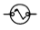

# Reference Designators

NOTE: **Unoriginal Thoughts** None of this is original work, and the
main reason I have put this here is that, unfortunately, the standards
that govern this are _expensive_ and therefore not easily available.[^1] 

When designing a schematic, or PCB, every component needs a unique
identifier. This is called the _reference designator_. You've seen
these. They're designations like C12, R44, Q1, or U4. They're not just
line noise or random things, but encode meaning into them as well. There
are two main standards that govern this:

* ASME Y14.44-2008
* IEEE 315-1975 (yes, 1975)

We'll break this apart into the "class" designation, which is the letter
prefix, and the numbers after.

## Class Letters

{: width=64 align=right }

The class letters you see in schematics (R12, C33) are all derived from
a specific standard that is, by and large, global. In the United States,
this is standardized as IEEE 315-1975 (ANSI Y32.2-1975), "Graphic
Symbols for Electrical and Electronics Diagrams (including Reference
Designation Letters)". This is 264 pages, but most of it is focused on
the actual symbology of all sorts of things, and far more than just what
we might concern ourselves with, such as the one to the right for an
explosive squib (igniter). Specifically, &sect;22, "Class Designation
Letters" covers the actual letters used.

There are _many_ possible uses for each of these, but I've tried to just
collate the most common usages I've seen.

| Letter | Usage                                                                              |
| ------ | ---------------------------------------------------------------------------------- |
| A      | General circuit element Sensor                                                  |
| AR     | Amplifier                                                                          |
| AT     | Bolometer Termination                                                           |
| B      | Blower                                                                             |
| BT     | Battery                                                                            |
| C      | Capacitor                                                                          |
| CB     | Circuit breaker                                                                    |
| CP     | Connector adapter                                                                  |
| D      | Diode Photodiode Thyristor                                                   |
| DL     | Delay line                                                                         |
| DS     | Display                                                                            |
| E      | Antenna Electrical contact Ferrite bead Magnetic core Permanent magnet |
| F      | Fuse                                                                               |
| FL     | Filter                                                                             |
| G      | Electronic chopper Generator Oscillator                                      |
| H      | Fastener (hardware)                                                                |
| J      | Jack Connector receptacle (stationary)                                          |
| K      | Contactor Relay                                                                 |
| L      | Inductor Non-transformer coil                                                   |
| LS     | Buzzer Speaker Siren                                                         |
| M      | Clock Timer Instrument Meter                                              |
| MK     | Microphone                                                                         |
| MT     | Accelerometer Measuring transducer                                              |
| P      | Plug Connector movable portion                                                  |
| PS     | Power supply                                                                       |
| Q      | Transistor Phototransistor Semiconductor switch                              |
| R      | Resistor Rheostat Potentiometer Shunt                                     |
| RT     | Current-regulating resistor Thermistor                                          |
| RV     | Voltage-sensitive resistor                                                         |
| S      | Contactor Switch                                                                |
| SR     | Slip ring                                                                          |
| SW     | Switch (non-standard, but _very_ common)                                           |
| T      | Transformer                                                                        |
| TB     | Terminal board/strip                                                               |
| TC     | Thermocouple                                                                       |
| TP     | Test point                                                                         |
| U      | Integrated circuit Photocoupled isolator                                        |
| V      | Electron tubes                                                                     |
| VR     | Voltage regulator                                                                  |
| W      | Bus bar Cable Wire                                                           |
| X      | Fuseholder Lampholder Socket Terminal strip                               |
| Y      | Oscillator Quartz crystal                                                       |
| Z      | Resonator                                                                          |

## Number Assignment

The general rules are:

1. Start in the upper left of a schematic.
2. Move left to right, top to bottom.
3. Never re-use numbers.
4. Always increment from the end.

What the standard says, specifically in &sect;2.1.3:

> Within each significant item (unit, assembly, subassembly, etc.), for
> the parts of each class, numbers shall be assigned sequentially on the
> schematic diagram in a systematic manner beginning with 1. Preferably
> start at the upper left of the schematic diagram and proceed from left
> to right and top to bottom for each successive portion of the circuit.
> Continue (preferably from left to right) until all parts of the
> circuit have been designated in order of input to output or functional
> sequence. If revisions require deletion or addition of items, the
> original items should not be renumbered to keep the series
> consecutive. Added items shall be assigned numbers following the
> highest number originally used. Numbers assigned to items that have
> been deleted shall not be reused.

For small projects, people will typically start with 1, and work their
way up, as it's unlikely you'll have more than 100 of any one type of
component (e.g., resistor). In commercial work, like a modern
motherboard, you may see 3, or even 4-digit numbers. In addition, I have
seen companies use a number scheme for a multi-board product that is:

`<ref letter><board number><incremented number>`

so you'll find resistor 33 on board 4 marked as R433. 

NOTE: **Suffix Letters** If parts of a component are drawn separately
from each other, it is normal to append a suffix letter to the
designator. For example, if you had an IC which was a dual op-amp, and
it was designated U3, you might draw them separately (for various
clarity and style reasons) and label them as U3A and U3B.

## Component-Specific Guidance

For many types of components, there is specific guidance for how to
refer to various aspects of them. We're going to cover a few of the most
common. 

### Terminals

For terminals, whether they be terminal blocks, relays, switches, where
there are aa number of connections, you would append a dash and the
number of the pin. For example, for a 3 position terminal block,
designated X1, the individual contacts would be X1-1, X1-2, and X1-3.

### Sockets

Sockets for other components are prefixed with the letter "X". So, for
example, for U1, the socket is XU1. 

### Connectors

Connectors are broken into two pieces: the movable and the stationary
component. The movable component is typically designated with a "P",
where-as the more stationary one is designated with a "J" (or sometimes
"X").

### Relays

Oh no... relays are a mess. The problem is that there are very
different ways to refer to the contacts on a relay. One, IEC 60947-1,
another from the Relay and Switch Industry Association, and another
other is the DIN system, specifically [DIN
72552](https://en.wikipedia.org/wiki/DIN_72552), which you'll see
extensively in automotive applications.

I'll be honest. I just look it up every time I need it and I don't feel
like I can make sense of it for you quite yet.

## Large Systems

There's a ton in ASME Y14.44-2008 covering how to structure and organize
components in a larger system. Specifically, &sect;2.2, "Complete
Reference Designations" talks about units, sub-assemblies, etc. and how
to number and organize them. This is something I find very fascinating,
and I'll likely discuss in another area eventually.

Just to give you a sneak peak, here is Figure 7 from that standard:

The short summary of it is that you break the designator down into three
pieces:

* Unit number
* Subassembly class letter and number
* [Item class](#class-letters) and number

For example, the 12th capacitor in the first subassembly B of unit 1
would be written as: 1B1C12. 

I'm not sure that's clear, but it is at least standardized. As I
mentioned [above](#number-assignment), people often don't use this
scheme and develop their own.

## Tool Support

Any tool that does schematic capture, such as Fusion 360/EAGLE, KiCAD,
Altium Designer, etc., will automatically deal with naming of things on
the schematic, and almost always correctly according to the standard.
Where you can run into problems is if you, like me, create a bunch of
resistors, and then move them around, and now the numbering doesn't
follow the left-to-right, top-to-bottom scheme.

If you use Fusion 360 or EAGLE, there is a [ULP to renumber
automatically](https://www.autodesk.com/support/technical/article/caas/sfdcarticles/sfdcarticles/How-to-renumber-elements-in-the-PCB-schematic-file-in-Fusion-360.html).
I'm sure that others have similar tools to renumber things for you. If
you know of them, let me know at the link below.

## Third-Party Resources

* [ABB guide to relay nomenclature](https://library.e.abb.com/public/c1256d32004634bac1256e19006fe686/1MRK590006-BEN_en_Relay_symbols_and_their_device_numbers.pdf)
* [Indian (English) version of IEC 60947-1:2004](https://law.resource.org/pub/in/bis/S05/is.iec.60947.1.2007.pdf)
* [Engineer's Relay
  Handbook](https://web.archive.org/web/20170705143411/http://www.esterline.com/powersystems/DesignReference/RelayHandbook.aspx) (archived)

[^1]: One _might_ be able to find some of them for "reduced cost" if one
    were to use a search engine to find a specific file type PDF with
    the standard's number. Hypothetically. Alas, Carl Malamud hasn't
    [gotten around to it yet](https://public.resource.org/index.html).
