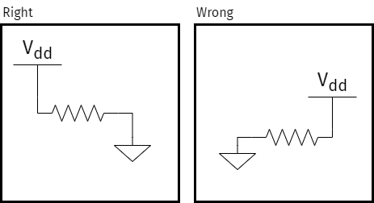

---
tags:
  - best-practices
  - design
  - ground
  - naming
  - pcb
  - schematics
---
# Best Practices for Schematics

Over the years, and from a bunch of sources, I've collected some "best
practices" that use when designing the schematic for a project. I wish I
could remember where I had picked these up from, as I would love to
attribute them, but unfortunately that's lost. I don't think any of
these are "original thoughts". A schematic serves two purposes. First,
it sets up all the components and the connections between them. Second,
and equally important, it should make clear how the circuit is supposed
to work.

So here goes...

1. Flow left to right
2. Section the schematic
3. Include calculations/formulas
4. Why are pins tied to ground?
5. Ground down; power up
6. Use line jumps
7. IC symbols should be logical not physical
8.  Every net gets a label
9. All text is horizontal
10. Use a maximum of 3 lines at a junction
11. Relative location should be accurate
12. No overlapping text
13. Colors are good
14. Number parts by page
15. Label parts with important attributes

Let's take each of those in turn.

## Flow Left to Right

{: height=200 }

## Section the Schematic

## Include Calculations/Formula

## Explain Why Pins are Tied to Ground

## Ground Goes Up; Power Goes Down

## Use Line Jumps

## IC Symbols Should be Logical

## Every Net Gets a Label

## All Text is Horizontal

## Use a Maximum of 3 Lines

## Relative Location Should be Accurate

## No Overlapping Text

## Colors are Good

## Number Parts by Page

## Label Parts with Important Attributes