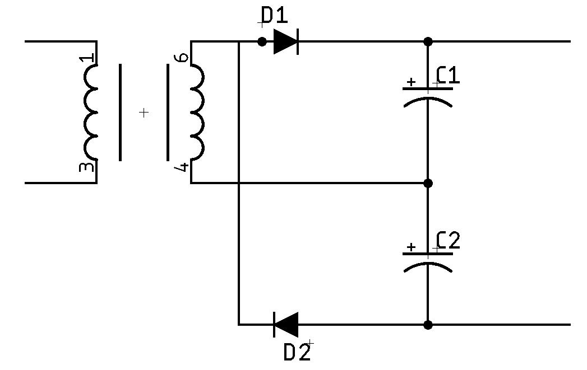
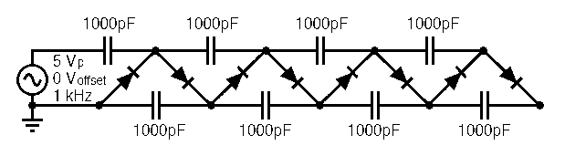

# Voltage Multiplier

All voltage multipliers convert an input AC voltage into an output DC voltage
some multiple of the source.

## Basic

NOTE: There are many other forms of voltage doublers, but this is the one I
learned and it's called a Delon circuit.

Using a pair of half-wave rectifier circuits in series, we can create a voltage
doubler. Technically, it's a full-wave rectifier (both halves of the input are
used), but operating wth a ripple frequency twice the AC frequency (120Hz in the
US).

The voltage (DC) on the right-hand side will be double the input (AC) voltage.

## Cockroft-Walton

If we extend the idea of the basic voltage multiplier, we can create something
even more interesting: a Cockroft-Walton generator. This is basically a form of
[charge pump](https://en.wikipedia.org/wiki/Charge_pump), and is not designed to
deliver large current just high voltage.

NOTE: I did not draw this because  Fusion360 doesn't let you easily put parts at
45 degree angles, and I'm too lazy to design new parts pre-rotated. These are
taken from [this article](https://www.allaboutcircuits.com/textbook/semiconductors/chpt-3/voltage-multipliers/).

This shows a generator with 4 doublers. If we have 5VAC in and 5 stages we can calculate the output voltage of the
multiplier using this (and ignoring diode drops):

$$\begin{aligned}
V_{out} &= 2NV_p \\[10pt]
&=2\times 4 \times 5\\[10pt]
&=40 \mathrm{VDC}
\end{aligned}$$

The output voltage ($V_{out}$) is twice the peak input voltage ($V_p$)
multiplied by the number of stages ($N$). If we add in the typical diode drop
(0.7V), then we're not quite getting 2x gain, we're getting $2\times(5 - 0.7) =
8.3$, giving us a total of 33.2V 