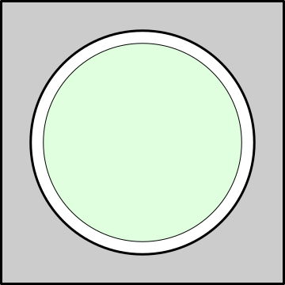
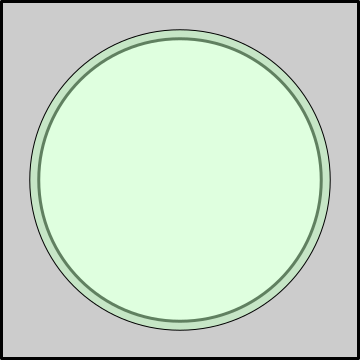
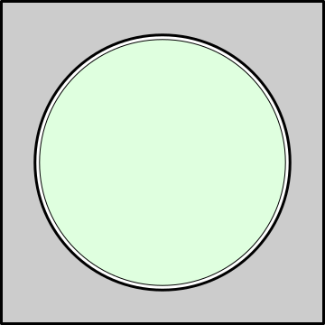

---
tags:
  - fit
  - mechanical
---
# Engineering Fit

This discussion is entirely driven by the ANSI/ASME B4.1-1967 and B4.2-1978
standards for "Preferred Limits and Fits for Cylindrical Parts". There are other
standards, but this is the standard for American, British, and Canadian
organizations up to 20 inches in diameter. 

## Definitions

Let's start with some definitions.

Nominal Size
: The _nominal size_ is the designation used for the purposes of general
identification. Think of this as when we talk about a 2x4 piece of lumber. That
is the general identification, but it is _not_ the actual size.

Dimension
: A _dimension_ is a geometric characteristic such as diameter, length, angle, or
center distance.

Size
: _Size_ is a designation of magnitude. When a value is assigned to a dimension,
it is referred to as teh size of that dimension. Often size and dimension are
used largely interchangeably. 

Allowance
: An _allowance_ is a prescribed difference between the maximum material limits
of mating parts. It is a minimum clearance (positive allowance) or maximum
interference (negative allowance) between these parts.

Tolerance
: A _tolerance_ is the total permissible variation of a size. The tolerance is
the upper and lower bounds of size.

Basic Size
: The _basic size_ is the size from which the limits of size are derived by the
application of allowances and tolerances.

Design Size
: The _design size_ is the basic size with allowances applied.

Actual Size
: An _actual size_ is a measured size.

## Fits

_Fit_ is the general term used to signify the range of tightness that may result
from the application of a combination of allowances and tolerances in the
designed mating of two parts.

### Actual Fit

The actual fit between two mating parts is the relation existing between them
with respect to the amount of clearance or interference that is present when
they are assembled.

### Clearance Fit 

{: width=100 align=right }

A _clearance fit_ is one having limits of size so that a clearance always
results when mating parts are assembled. With a clearance fit, the shaft is
always smaller than the hole. This enables easy assembly and leaves room for
sliding and rotational movement.

### Interference Fit

{: width=100 align=right }

An _interference fit_ is one having limits of size so that an interference
always results when mating parts are assembled. Interference fits are also known
as press fits or friction fits. These types of fits always have the same
principle of having a larger shaft compared to the hole size. 

### Transition Fit

{: width=100 align=right }

A _transition fit_ is one having limits of size so that either a clearance or
interference may result when mating parts are assembled. A transition fit
encompasses two possibilities. The shaft may be a little bigger than the hole,
requiring some force to create the fit. At the other end of the spectrum is a
clearance fit with a little bit of room for movement.

## Determining Fit Measurements

For both standard and metric measurements, there are a set of _standard fits_,
which prescribed tolerance limits and clearance for a specific type of fit for
specific functional goals. For example, let's take a hole and shaft with a
nominal diameter of 1 inch that need to meet with a RC1 (close sliding) fit.
This leads us to (with tolerance in thousandths of an inch):

| Dimension | Base |         Upper |           Lower |
| --------- | ---: | ------------: | --------------: |
| Hole      |  1.0 | 1.0004 (+0.4) |      1.0 (-0.0) |
| Shaft     |  1.0 | 0.9997 (-0.3) | 0.99945 (-0.55) |

Thees guides, whether you want standard or metric, are a very useful thing to
understand as a starting point when you're working with materials. You can find
in-depth discussions, equations, and pre-calculated tables in [_Machinery's
Handbook_](../resources/books.md)'s "Dimensioning, Gaging, and Measuring".

NOTE: When working with FFF 3D printing, however, you will find that the
tolerances of the machine are so sloppy that you will need to develop your own
understanding for your printer and printer settings (see [Prusa
MINI+](../3d/prusa.md)).