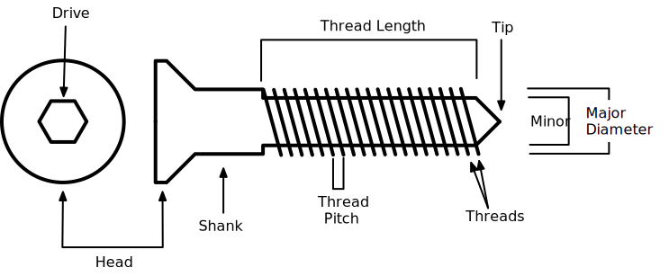
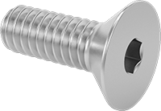
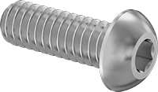
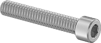
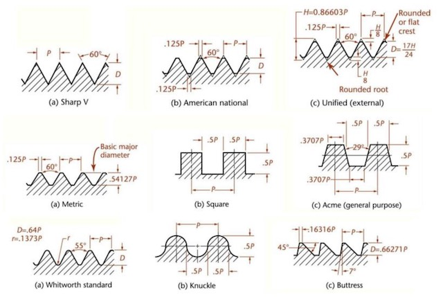

---
tags:
  - corrosion
  - joints
  - screws
---
# Screws

Screws are probably the single most useful (and common) way to join two
different things together. That doesn't mean they aren't interesting in
their own right, so let's take a dive into them.

Note we're not going to talk about lead screws at this point. Lead
screws are screws that are used to turn rotary motion into linear
motion, rather than to join two surfaces together. You'll see them in 3D
printers, CNC machines, and many other applications. They'll likely get
their own topic at some point.

## When is a Screw not a Bolt?

For this, I'm just going to go to [the Bible of all things
machinery](../resources/books.md): 

> A bolt is an externally threaded fastener designed for insertion
> through holes in assembled parts, and is normally intended to be
> tightened or released by torquing a nut. A screw is an externally
> threaded fastener capable of being inserted into holes in assembled
> parts, of mating with a preformed internal thread or forming its own
> thread, and of being tightened or released by torquing the head. An
> externally threaded fastener which is prevented from being turned
> during assembly and which can be tightened or released only by
> torquing a nut is a bolt. (Example: round head bolts, track bolts,
> plow bolts.) An externally threaded fastener that has thread form
> which prohibits assembly with a nut having a straight thread of
> multiple pitch length is a screw. (Example: wood screws, tapping
> screws.)

So, screw joints have threads on both sides, bolts do not. At least as
best as I can figure out. People will argue about this until the end of
time. You can read more detail [on
Wikipedia](https://en.wikipedia.org/wiki/Screw), so I'm just going to
talk about what I find most useful.

## Parts of a Screw

Head
: The head is the top of the screw. It’s wider than the shank and
thread. Heads can be flat or domed. Some are tapered to fit flush.

Drive
: This is where your screwdriver's tip goes. This comes in a lot of
different designs as [discussed below](#head-design).

Shank 
: Not all screws have threads all the way down. Partial thread screws
offer an section below the head that is entirely free of threading. This
non-thread area of a screw is called the shank or shoulder and will vary
in length depending on the bolt's application.

Threads
: The thread is the structure that converts between rotational and
linear force. A screw thread is a wrapped around a cylinder (or cone) in
the form of a helix. When it's wrapped around a cylinder, it's termed a
straight thread, while a cone has a tapered thread. While a vast
majority of screws have a right hand thread, there are some with left
hand threads, and they can be quite surprising when you find them.

Thread Pitch
: The thread pitch is distance in between threads that make a
difference. It is measured from the crest of one thread to the same
point on the next thread. Some screws have thread that are small and
close together, while other screws have larger threads spaced further
apart. 

Thread Length
: This is the total length of the thread, which is not necessarily the
entire length of the screw. 

Tip 
: The point is  where the screw enters whatever material you’re putting
the screw into. If no point (i.e. flat tip),  some people might call it
a bolt, but that's a point discussed above. Screws meant for different
materials, specifically self-tapping screws, will have very different
tip designs to engage with the material properly.

Major Diameter (Gauge)
: The major diameter is the diameter at the widest part of the thread
(i.e. outer part of the thread). This part of the thread is called the
crest. This is also commonly called the gauge of the screw.

Minor Diameter
: The minor diameter is the thickness at the base of the screw without
the threads. For example, imagine if the threads were removed. The
remaining shaft would be the minor diameter).

## Metric versus Imperial

NOTE: **There Can be Only One** There is a war between metric and
imperial, and, if we're being honest, imperial _should_ have lost
decades ago, but the stubbornness of the United States keeps it, sadly
relevant. 

While it would be nice to simply have a single system for screws, this
is not the world we exist in, at least in the United States. Other
places are more lucky. The two sets of screws are based on either the
metric or imperial/customary systems. The former is in millimeters while
the later is in inches (whatever those are). A few things are materially
different between the two:

* Metric and imperial screws measure thread pitch totally differently.
  Metric measures the distance between crests of the pitch (0.5mm for
  example), while imperial measures the number of threads in an inch.
* Metric screws are always specified in a clear major diameter and
  length. For example, an M4x0.5 screw is 4mm in major diameter and
  0.5mm thread pitch, excluding the head. Imperial screws are specified
  with a number, like a #6 screw. A #6 screw has a major diameter of
  0.138in or 3.51mm. Simple! 

Note that there is also some standard pitches for imperial in the form
of Unified National Coarse Thread (UNC) or Unified National Fine Thread
(UNT). 

NOTE: **Metric Screw Naming** You will often see people refer to
something like an M3x8 screw. This isn't a screw with an 8mm thread
pitch, but instead a screw that is 8mm long. If not otherwise specified,
this typically refers to the [standard coarse metric thread
pitch](https://en.wikipedia.org/wiki/ISO_metric_screw_thread), which for
an M3 would be 0.5mm. This means the full specification would be
M3x0.5-12. 

If you can, use metric. While there are situations where it's
unavoidable to deal with the other sizes, metric will generally be more
logical and predictable and require, quite honestly, much less
memorization.
 
## Head Designs

There are two basic designs countersunk and non-countersunk.

Countersunk 
: The countersunk group is composed of flat, oval, and bugle heads.
These heads require a countersunk hole unless the material is _very_
soft. When countersunk, little or no part of the head protrudes above
the surface of the material.

Non-countersunk
: Non-countersunk is where the head is completely above the surface of
the material. These comprise the widest variety: binding, button,
cheese, fillister, hex, pan, flange, socket, round, square, and truss
heads.

Sometimes features are combined, as in the case of slotted hex, hex
washer, slotted hex washer, and round washer head designs. I'mn just
going to talk about the most common ones that I run into.

I have lifted all of the photos from
[McMaster-Carr](https://mcmaster.com). 

### Flat

{: width=120 align=right }

These screw heads are countersunk, which ensures that the screw head
isn’t exposed. This way the finishing looks cleaner and easier on the
eyes. Screws with a flat head are also commonly known as slotted screw
heads. The name is derived from its single opening for flat
screwdrivers. Flat screw heads are popularly used and cost-efficient but
also most prone to stripping- they are designed that way to avoid
over-tightening issues.

82&deg; imperial
90&deg; metric

### Bugle

{: width=120 align=right }

These screw heads are nearly identical to flat head screw heads, but
have a curve below the head to reduce damage to a surface. Bugle screws
are mainly utilized on drywall and decking. Bugle screws are advantageous due to
their self-drilling property eliminating any pilot-hole drilling prior
to use.

### Rounded/Domed/Button

{: width=120 align=right }

There's a huge category of different "rounded" screw heads, which are
differentiated based on the exact profile of the head, but they all are
very similar. Round screw heads are falling out of favor, but they have
a very rounded top, and the underside is flat. 

### Socket Cap

{: width=120 align=right }

For a socket cap screw, the head is typically 1.5 times the major
diameter. This makes it a smaller diameter than most other "machine
screws". The socket head cap screw is usually recessed within a
counter-bored hole so that the head is flush with the surface of the
component. This result is a clean appearance. 

## Drive Designs

The drive is the point where a screwdriver engages with the screw. Each
design has its own advantages, but if I'm honest, I almost exclusively
use hex if I can. They are a good compromise across a bunch of
dimensions. I avoid slotted at nearly any cost. They just are terrible.

NOTE: **Cam Out** One way that all these differ is in what is termed
the cam out_ rating. This is the amount of torque (rotational force)
before a screwdriver will jump out of the drive. When this happens, not
only do you lose drive force, but you will almost always damage the
screw itself at the same time. 

### Slotted

{: width=120 align=right }

The oldest kind of manufactured screw, slotted screw drives have a
single horizontal indentation (the slot) in the fastener head and is
driven by a flat-bladed screwdriver. For hundreds of years, it was the
simplest and cheapest to make, but we know better now. Don't use it.
While it is OK where minimal torque is needed, it's not well suited to
power tools, and will torque out at very low values.

Just don't.

### Phillips

{: width=120 align=right }

The Phillips drive was created by John P. Thompson, but named after
Henry F. Phillips, whom he sold his business to after not achieving much
success. The company is [still around](https://www.phillips-screw.com/),
and has actually introduced some designs, such as Supadriv. It will cam
out quite easily, and lower quality screws are notorious for stripping
quite quickly.

### Robertson

{: width=120 align=right }

OK, this is one I don't often see, but I really like its design. It has
a perfectly square drive. Unfortunately, it's really not seen outside of
Canada for reasons that are fascinating but outside my skills. Still,
it's something you might run into. [The History
Guy](https://www.youtube.com/watch?v=R-mDqKtivuI&pp=ygUPcm9iZXJ0c29uIHNjcmV3)
did an episode on this screw and it's continued use.

### Hex

{: width=120 align=right }

This is probably the one I used the most. You might also hear it called
"Allen head", but that's a brand name. You'll hear the screwdriver for
it called hex wrench, Allen wrench, Allen key, hex driver, or hex key.

For me, these are the right balance of ease of use, reliability, and high
cam out torque. They're super common, so they are also quite
inexpensive typically.

### Torx

{: width=120 align=right }

Properly called a hexalobular socket screw drive (Torx is a brand name)
or by the generic name star drive. It uses a star-shaped recess with six
rounded points. It was designed to excel at automated manufacturing with
low probability of torque out. It also, because of the surface area, has
a higher likelihood of holding a screw on the driver. Weirdly, they're
harder to find in the consumer retail space.

## Thread Type

Often people just want "a screw", but there's actually a gigantic
variety of different types of screws even when it just comes down to the
design of the thread itself. In addition to the big categories of metric
versus imperial, they come in a wide variety. I'll try and touch on the
high-level here, but there's definitely a rabbit hole you can fall down
if you're so inclined. 

### Gender

When we're talking about gender of a screw, we are talking about whether
the threads are on the outside of the screw (male) or the inside
(female). The inside threads are typically inside of a hole.

### Handedness

Threads are, by design, asymmetric (formally, they have
[chirality](https://en.wikipedia.org/wiki/Chirality)). A vast majority
of screws are right-handed (often noted as just RH), which means if
you're looking along the length of the screw, the helix moves away from
you when turned clockwise, and towards you when turned
counter-clockwise. If they go in the opposite direction, they're
left-handed (noted as LH). 

The main occasion where you might need a left-handed screw is where the
screw is placed in something that is rotating, and where the normal
direction of rotation would cause the screw to loosen itself. For
example, the left-hand item on a shaft will have a left-handed screw (or
bolt).

> NOTE: **Left-Handed Threads Elsewhere** While left-handed screws are not
> that common, left-handed threads are quite common in other uses. For
> example: 
>
> * Connections for gas supplies, such as LPG canisters, or the natural
>   gas line into a house.
> * Often on [leadscrews](https://en.wikipedia.org/wiki/Leadscrew) to
>   provide for a more natural response to the rotation by a human. 

### Pitch

Pitch is the distance between the peaks (or valleys) of a screw's helix.
Typically, for any system (metric v imperial), there are coarse and fine
versions of the screw's threading system. Coarse is almost always the
pitch that people use, and would be the one expected if not specified
otherwise. Fine (or even extra fine, EF) pitch screws will mate more
evenly and tighter, but will also cost substantially more due to the
tighter tolerances needed during manufacture. 

### Form Cross-Section and Angle

I'm not going to dig into this gigantic optic, other than to say that
not all threads are alike. They differ not just in the pitch, but in the
angle of the surface of the screw threads, the shape of those surfaces,
etc.
[ThomasNet](https://www.thomasnet.com/articles/machinery-tools-supplies/screw-thread-systems-types-terminology-and-dimensions/)
has a more in-depth article, but the major ones I've heard of are:

* Sharp V
* American National
* Metric
* Acme
* Unified
* Square
* Whitworth
* Knuckle
* Buttress

Below is a diagram showing some of these:

As always, I refer you to the [Machinery's
Handbook](../resources/books.md), which will cover this in enormous
detail for just about every possible thread form. 

One thing to be aware of is that two different thread forms _will not_
work together, even if they seem to start to fit. They will, eventually,
fail completely.

## Material

You can get screws made out of a multitude of materials, but let's
discuss the main ones.

### Steel

The most common material for screws is steel. A bunch of different
alloys are used to achieve different [tensile
strength](https://openstax.org/books/university-physics-volume-1/pages/12-3-stress-strain-and-elastic-modulus).
For most hobbyist applications, you're rarely going to need to worry too
much about this. Additionally, screws are typically processed with a
finish of some sort, with two being the most common:

* Black oxide. This treatment results in a darkly colored screw and one
  which is mildly corrosion resistant. 
* Zinc plated. Resulting in a general grey color, [zinc
  plating](https://galvanizeit.org/corrosion/corrosion-protection/zinc-coatings/zinc-plating)
  gets you a bit more corrosion resistance than black oxide.

There are also "alloy steel" screws. These are made from a high strength
steel alloy and are always heat treated, but not typically plated. This
results in a dull dark finish. Alloy steel bolts are very strong but can
be somewhat brittle.

### Stainless Steel

Stainless steel screws are much more corrosion resistant than regular
steel screws. They can be made from a bunch of formulations of
stainless, including 18-8, 316, and 410, each of which bring different
properties with them. 

It's easy to think that stainless steel is going to be stronger than
regular steel. Unfortunately, because of the low carbon content, many stainless
 alloys cannot be hardened by heat treatment. So, if you compare
stainless steel to regular steel, the stainless alloys often used in
bolts will be slightly stronger than an unhardened (grade 2) steel, but
they will be significantly weaker than hardened steel fasteners.

### Brass

An alloy of copper and zinc, brass is highly resistant to corrosion and
electrically conductive. Because it’s relatively soft it is often used
for its appearance. You will find it a lot more in marine applications.

### Plastic

There are plastic screws, for example, motherboard standoffs, which are
available for specific applications. These are made from nylon most
commonly, but are also available in an enhanced glass-filled nylon,
polypropylene,
[PEEK](https://en.wikipedia.org/wiki/Polyether_ether_ketone), or even
[PTFE](https://en.wikipedia.org/wiki/Polytetrafluoroethylene). 

### Other Materials

Other materials are available, but their usage is a bit more
specialized. They include: 

* Aluminum
* Nickle alloy.
* Titanium
* Bronze

### Grades

The grade of a screw (or bolt) refers specifically to its strength,
hardness, and load bearing capabilities.  There are a [huge number of
grades](https://www.aftfasteners.com/grades-of-bolts-bolt-grade-markings-bolt-strength-chart/),
especially in the imperial system. Having said all that, for most
hobbyist uses, you don't need to worry too much about it. But, if you
happen to be planning to do something that will have high stress loads,
such as a drone or model aircraft or car, you should definitely evaluate
what grade is right.

Grade enormously impacts price. In my experience, most mainstream things
purchased through you regular big-box retailer are grade 2 (or metric
4.6), if they have even been graded at all.

## Reference Charts

Below are a few charts with general information on the most common
hobbyist level screws.

### Metric

{{ read_csv("./screws-metric-chart.csv") }}

### Imperial

{{ read_csv("./screws-imperial-chart.csv") }}

## Third-Party Resources

* [Imperial thread specifications and calculator](https://www.threadspecification.com/un/)

