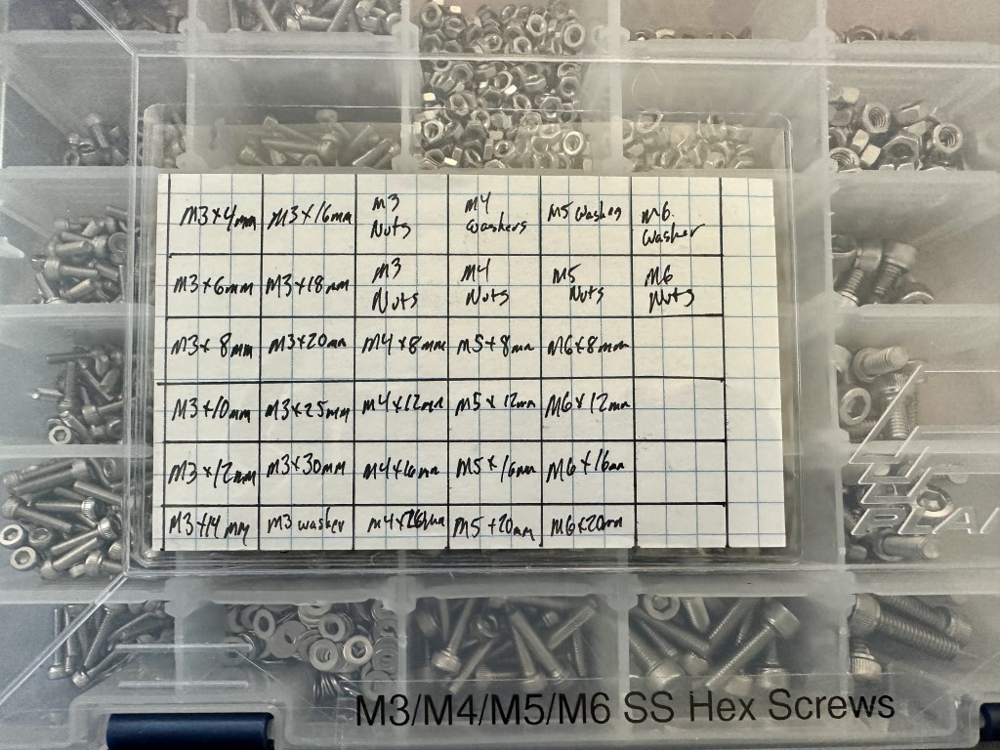
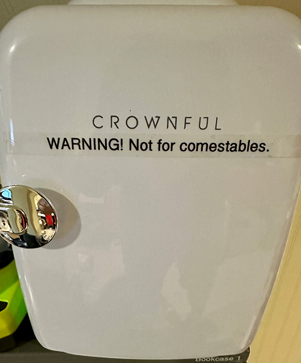

---
tags:
  - organization
  - storage
  - containers
  - consumables
---
# Storage

<!--
* Discoverability as an idea as it applies to storage.
-->

## Large Storage Organization

### Bosch/Sortimo

I recently (July 2023) acquired a few pieces of the
[Bosch/Sortimo](sortimo.md) products, and am just beginning to organize
around them. I've created [another page](sortimo.md) that covers this
more in-depth.

### IKEA ALEX

I'm a pretty big fan of the IKEA
[ALEX](https://www.ikea.com/us/en/cat/alex-series-47147/) series of storage. I
have several of the [9 drawer
units](https://www.ikea.com/us/en/p/alex-drawer-unit-with-9-drawers-white-90486139/)
and one of the [5 drawer
units](https://www.ikea.com/us/en/p/alex-drawer-unit-white-00473546/). They go
together pretty quickly, and are mildly durable.

### Government Surplus Bookcases

I have some great military surplus metal bookcases from my partner's old
place, and they have a glass door that slides up and out of the way.
Definitely recommend searching auctions and surplus sales to find
something. These are much deeper than your typical bookcase, which makes
them even more useful, and the top can hold a [cheap-ass
fridge](#cheap-fridge). 

## Small Parts Storage

One of the things you'll accumulate a huge number of is small parts.
Whether it's a screw, an IC, or a bunch of tiny SMD resistors, you need
to figure out a way to keep them organized. For a lot of people, this
means drawer systems, but due to the arrangement and design of my work
area, these are not feasible for me.

### Plano ProLatch

I'm a pretty big fan of Plano's ProLatch series of storage. They're designed for
fishing lures, but are well made, the lid seals pretty tight to the top of the
dividers (reducing risk of parts moving around), and best of all, inexpensive.
And they're even made in the United States. I use the following models for
various purposes:

* [3500](https://www.planooutdoors.com/prolatch-3500-stowaway-1592729). 9.13" x
  5" x 1.25"
* [3600](https://www.planooutdoors.com/prolatch-3600-stowaway-1592734). 11" x
  7.25" x 1.75"
* [3700](https://www.planooutdoors.com/prolatch-3700-stowaway-1592742). 13" x 9"
  x 2"
* [3780](https://www.planooutdoors.com/prolatch-3700-deep-bulk-stowaway-1592738).
  14" x 9.13" x 2.8"

For each box, I put 2 large labels (see [Labeling](labeling.md)) on it with a
top-level description of what is in the box (e.g., "M3/M4/M5/M6 SS Hex Screws" for
stainless-steel M3-M6 screws). One goes on the long edge (with the latches), and
the other on the short edge for better discovery when shelved.

In addition, I use 3x5 index cards to describe the organization within the box's
many compartments. These are just handwritten and then places in a small holder
on the front ([Amazon](https://www.amazon.com/gp/product/B0BJQ7TM4F/)), which
lets me read it and update it as necessary. You can see an example here:

### AideTek

For small surface mount parts, I'm a big fan of the
[Aidetek](https://aidetek.com/mm5/merchant.mvc?Screen=PROD&Store_Code=A&Product_Code=BOXALL)
144 compartment SMD storage enclosure, shown below:

They make these in a bunch of configurations. They also make nice
ESD-safe boxes for a little more money that are perfect for things that
need a little extra protection, such as ICs and transistors.

## Liquid Storage

There are two different ways I like to store liquids, depending on how
they'll be used. The first is to use [wash
bottles](https://www.amazon.com/gp/aw/d/B07Z8ZN9Z3/) made out of LDPE
for things that get used in more of a "squirt here and there", like
wetting a sponge, or rinsing something. For everything else, I keep it
in either 1oz (28ml) or 2oz (56ml) [clear boston round
bottles](https://www.specialtybottle.com/glass-bottles/clear-boston-rounds)
with integrated eyedroppers. 

## Cheap Fridge

{: width=400 align=right }

Sometimes you need to store things below normal room temperature. Some
examples include solder paste, flux, and the like. Since these are all
_quite toxic_, you really shouldn't store them in the same place you
keep your dinner, so I've "invested" in an inexpensive [Crownful 4L/6
can
fridge](https://crownful.com/collections/beverage-cooler/products/crownful-4-liter-6-can-mini-fridge-white)
pictured here. It uses a [Peltier
plate](https://en.wikipedia.org/wiki/Thermoelectric_cooling) to cool it,
so it's not super efficient, but it's also tiny. I just wish I'd seen it
in other colors before buying the boring white.

If you use one of these, I've [designed a replacement
shelf](https://www.printables.com/model/512793-interior-shelf-for-crownful-4l-mini-fridge)
that you can 3D print. It will hold a few syringes of flux/paste and
some tubs of paste as well. 