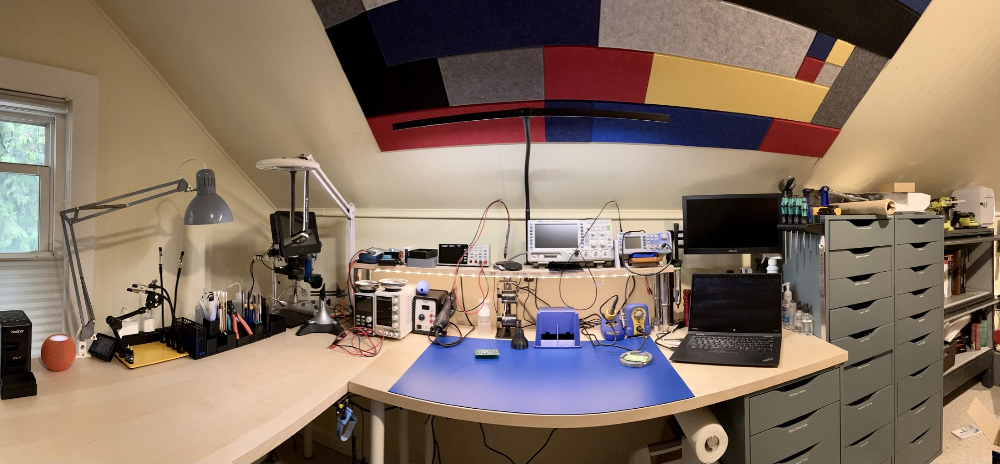

# Work Area

For my work area, I am primarily working in the attic of my 110yo
1,000sq' Seattle bungalow. This comes with both charms, but also unique
challenges. For me, that's:

1. This is directly under the roof, so the roof starts about 48" off the
   floor, and slopes up at something around 55 degrees to a 2' wide
   center section at the ridge. This makes for some space challenges
   when you're 6'3" tall as well.
2. There isn't a huge amount of modern electrical service. The house, as
   a whole, has only 80A service, which means I have to pay attention to
   what I plug in and run simultaneously.
3. It's carpeted. This is sub-optimal both from a stability perspective
   and for static discharge.

So, what have I done with the space? Here's a quick panorama:

I've tried to cram in everything I need, but I've had to make some (a
lot) of compromises along the way. The work area is composed of IKEA
[birch veneer
tabletops](https://www.ikea.com/us/en/p/malskytt-tabletop-birch-veneer-40461103/)
sitting on a combination of [metal
legs](https://www.ikea.com/us/en/p/adils-leg-white-90217972/) and a [5
drawer
unit](https://www.ikea.com/us/en/p/alex-drawer-unit-gray-turquoise-30483799/#content).

FUTURE: **Rigidity Improvement** Currently, they aren't physically
joined, but just butted up against one another. Occasionally, they start
to separate, and this needs to be resolved. Likely some strapping with a
few self-taping wood screws will be plenty to hold in place. and hold
them flat at the same time.

Sitting on the main desk is a large [Bertech ESD soldering
mat](https://bertech.com/esd-soldering-mat-kits/blue-esd-soldering-mat-kits/),
which I discuss more [elsewhere](../tools/workbench.md). I then have a
bodged together self composed of some red oak stair treads from my local
lumber yard placed on shiny chrome-plated [IKEA kitchen cabinet
legs](https://www.ikea.com/us/en/p/godmorgon-leg-kasjoen-shiny-90391730/).
These are adjustable and can handle a lot of weight. I specifically,
wanted them to be able to be a reasonable height so that I could use the
space under the shelf. There's also a small [IKEA LED
strip](https://www.ikea.com/us/en/p/vattensten-led-light-strip-white-00530542/)
that provides a bit of extra light under the shelf.

Finally, I have a USB DisplayLink monitor from Asus that's mounted to an
[inexpensive Monoprice
bracket](https://www.monoprice.com/product?p_id=5402) which alows me to
keep it above my laptop (a ThinkPad X1 Yoga that I've had forever and
probably needs updating since getting Windows 11 on it was a chore).

Next to that is the [drawer
cabinets](../organization/storage.md#ikea-alex) that I keep a bunch of
parts in, and then past that some
[bookcases](../organization/storage.md#government-surplus-bookcases).
The only cabinet worth discussing is the one directly under the desk.
I've arranged the drawers for:

* Writing & Notes. This is pens, paper pads, 3x5 note cards, small
  scissors, and a calculator basically. [A lot of
  pens](note-taking.md#note-taking-tools).
* Small hand tools. These are extra sets of pliers, multi-bit
  screwdriver kits, security screwdriver kit, small metal
  [roller](../tools/hand-tools.md#metal-roller).
* Medium hand tools. This is a soft-faced hammer, all my crimpers and
  cutters, etc, and large screw drivers.
* Measurement. Here is where I store my calipers, micrometers, levels,
  and other things I used regularly to measure something.
* Safety and Cleaning. This has gloves, masks, lint-free cleaning tools,
  etc. 

All of these are designed to be in quick reach when working. Note that I
also keep a roll of paper towels under the desk on a holder that is both
taped and screwed to the drawers.

I'll discuss all the various things sitting on the bench elsewhere,
primarily under [tools](../tools/index.md).