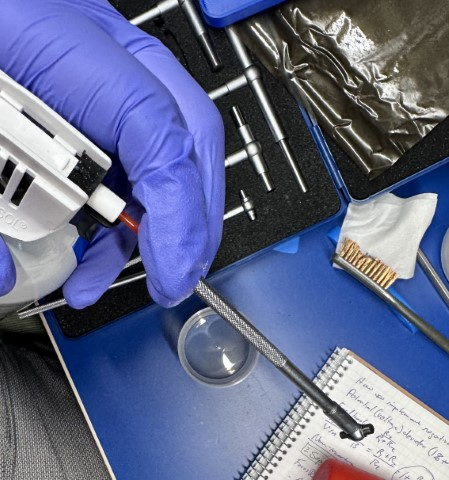
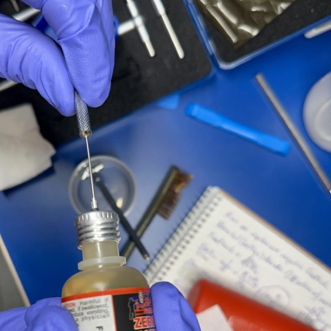
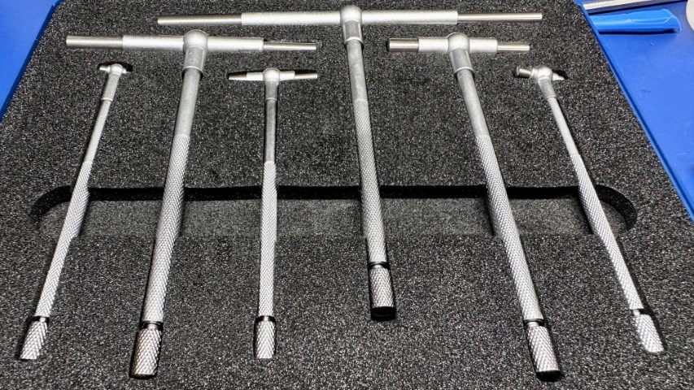
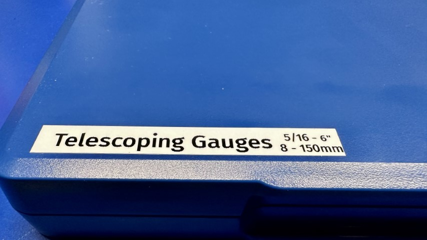
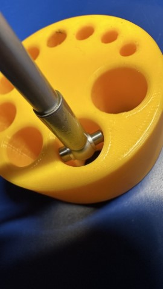

---
tags:
  - gauge
  - measurement
  - metrology
  - micrometer
---
# De-Crunching Telescoping Gauges

A bit ago, I picked up a _super cheap_ set of (quite obviously)
inexpensive telescoping gauges. They were in dubious shape, and very
crunchy when I tried to use them, but for 
[[ usd(5.0, as_of="3 September 2023") ]], who was I to
say no? This is the story of getting rid of the crunchiness and making
them worth at least twice what I paid.

NOTE: **Cost** Just to put it in perspective, a _single_ Starrett
telescoping gauge pin can cost anywhere from 
[[ usd(50.0, as_of="3 September 2023") ]] to 
[[ usd(150.0, as_of="3 September 2023") ]]. Each. Mitutoyo and Brown and Sharpe are similar
prices. Quite obviously my find isn't even in the same universe as those
products, but it's also _good enough_.

## What's Crunchy?

{: width=400 align=right }

What do I mean by crunchy? First, let's talk about what a telescoping
gauge is. It's a metrology device that is used to measure the inside
diameter (ID) of a hole. There are other ways, such as inside
micrometers, or even calipers, but there are many occasions where the
hole is too deep, or perhaps too small, to be measured using other
mechanisms. 

NOTE: **Repeatability** I'm not a machinist, but I was raised by one.
One downside to telescoping gauges is they aren't super repeatable
across machinists. Once you have a feel for using _a specific set_, you
can get pretty repeatable readings, but your feel and someone else's
feel, are not super close when you're working at a scale that metrology
concerns itself with typically (thousandths of an inch). Still, for
_most things_, it's good enough.

To use it, there's a few steps:

1. First, you need to collapse both the measuring heads by manually
   pushing them in, and then rotating the locking screw at the end of
   the handle counter-clockwise.  
2. Place the gauge into the bore with one head held in place against the
   wall of the bore. I like to use the larger of the two for this. 
3. Start to loosen the screw, but you have to go slowly because the rods
   are spring loaded.  
4. Tilt the gauge so the rods are slightly inclined and tighten the
   locking screw _most of the way_.
5. Whichever end you lifted a bit above horizontal, force it slowly
   downward through the bore. As you do this, wiggle the gauge back and
   forth. This will allow the gauge to find its smallest size on the
   spring.

So, there's a few things that move inside the telescoping gauge:

1. Each of the telescoping rods (plungers, basically) inside the sleeve.
2. One or more internal springs that cause the rods to telescope.
3. An internal rod from the handle that tensions the telescoping rods so
   they don't move.
4. The end knob on the handle is running in screw threads.

These all felt dirty. Super dirty. You could hear a crunching sound when
you rotated the handle or manually depressed the heads as though there
was sand in the works. It's most likely due to the fact that the pieces
were made quickly and without the final cleaning stage that is very
manual, and therefore expensive.

Can we make them better?

## Process

Here's the process I followed. First, I disassembled the gauge, removing
the knob at the end and the rod inside. I wiped the rod down with some
IPA. Then, because I knew there were clearances inside the gauges, I
flushed the inside with IPA:

Then, I let them set in a bath of IPA for a little while. While they
soaked, I cleaned the end of the knob's screws with a brass brush and
more IPA:

That, plus a few wipes with clean cloths/rags/wipes got a lot of
miscellaneous debris off the threads, which were by far the crunchiest
thing.

Next, I flushed the inside of the handle out with canned air. This
caused residual IPA to go _everywhere_. Fortunately, it evaporates quickly.

Then, just add a couple drops of a reasonable lube (this one is designed
for moving surfaces in firearms). Two to three drops should be plenty.

And after wiping it down, and repeating 5 more times, I have a box of
gauges that are passably clean and usable.

Now they just need a quick label.

So how are they?

## Testing 

NOTE: **Laughable Precision Overkill** I am using a 3D printed part for
this, for which a micrometer is laughable overkill. I know it's
overkill. But it's nice to know just how bad the prints are to at least
1/2 a ten-thousandth of an inch

Finally, I wanted to make sure they worked reasonably well now. I pulled
a 3D printed tap guide I made out, and tried it out.

After locking it, I pulled it out and measured it with a micrometer.

The hole measured 17.559mm, versus the 17.75mm it was intended to be.
That's about what I would expect in overage for a fused filament printer. 

Are they great? No, I've used Starrett telescoping gauges, and there's
simply no comparison. But they are _better_ than they were, and they are
1/100th of the price.