# Kelvin Clips for LCR Meter

For a while, I've used a [Der EE
DE-5000](https://www.deree.com.tw/de-5000-lcr-meter.html) LCR meter.
While this is a relatively inexpensive product (typically $150 or so),
it's well regarded and punches _well above its weight_. Comparable
meters from other companies might cost 4-5x as much. It even has an
optically isolated USB connection available. Anyway, it's a great meter
(and I should write it up eventually), but it does come with the most
laughably short measurement clips I've ever seen. It also comes with a
pair of SMD-focused tweezers. 

Anyway, I decided to replace the the absurd alligator clips with some
proper Kelvin clips. I bought some, with BNCs, online for a reasonable
price, and then proceeded to attach them to an existing TL-21 alligator
clip lead case. I bought a spare for this project, just in case. 

## What Are Kelvin Clips?

{: width=150 align=right }

Named after [Lord
Kelvin](https://en.wikipedia.org/wiki/William_Thomson,_1st_Baron_Kelvin),
Kelvin clips are a way to perform a four-wire measurement. In a
four-wire measurement you have a pair of force wires (wires 1 and 4) and
a pair of sense wires (wires 2 and 3). The force wires push some current
across the DUT, while the pair of sense wires actually sense the voltage
changes. Sometimes also called _remote sensing_, it's a way to perform a
very accurate measurement while taking many variables of the leads
themselves out of the calculation.  Many higher-end bench-top
multimeters, LCR meters, and similar use four-wire measurements for
accuracy.

I will note that the provided absurd alligator clips did in fact have
4-wire connections. They were just silly.

## The Replacement

WARNING: **Not Everything Was Photographed** In spite of my best
attempts, I got distracted at various points and didn't actually
photograph everything. I'll try to walk through the steps anyway.

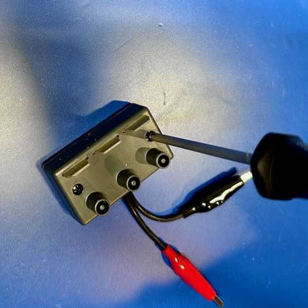{: width=150 align=right }

**Step 1**. Open the box. There are some self-tapping Phillips head screws
on the back which need to be removed. You can see the absurd alligator
clips here. At the top, there are three tabs which insert into the
meter's slots and provide the four wire measurement as well as a "guard"
connection. We won't be touching the gard connection in this project.

NOTE: **Guard What?** It always puzzled me, until I talked to a friend
who used to work for HP Test & Measurement (note, this is the real HP,
and not whatever monstrosity now uses the name). The guard connection
is used to help minimize noise and reduce the parasitic effects coming
from the component being measured. This can get you much higher
precision. I never use it.

{: width=150 align=left }

**Step 2**. One you have the box open, you can see the internal parts.
There's a small PCB with with the connections from the alligator clips.
There are 6 connections: connections 1, 2, and ground for each positive
(+) and negative (-). The grounds are not labeled, but the others are
labeled "-1", etc. As far as I am aware of, there's really no difference
in most clip designs between 1 and 2, as they join together at the tip
and are designed to be as close to identical in length as possible. This
reduces any differences in the measurement due to length difference in
the clips themselves. Keep note of this idea, as it's important.

{: width=150 align=right }

**Step 3**. Now we need to remove all the screws holding the PCB into
the plastic case. Like the exterior screws, these are all self-tapping
ones. There are _4_ of them, since I missed 1 the first time. For some
reason, these are non-ferrous, and so magnetic screwdrivers won't help.
Make sure you keep them safe because they are tiny. I use these neat
little [3d printed
trays](https://www.printables.com/model/114308-sorting-tray-with-funnel)
from @Area51. Print lots of them! 

{: width=150 align=left }

**Step 4**. Once you have the PCB out of its case, set the case to the
side. You should take a close look at the PCB, just to make sure you
understand exactly how it's wired up together. I recommend taking a
picture with your phone so you can see all the connections. We will be
replicating these later.

{: width=150 align=right }

**Step 5**. Now, we need to remove the little zip tie that's been
attached through 2 small holes in the PCB. You can use some form of
snips, as I did in this case with a pair of flush cutters (my personal
go-to for most any job). This little zip tie forms a [strain
relief](https://www.essentracomponents.com/en-us/news/solutions/wire-cable/guide-to-cable-strain-relief-and-protection)
to reduce strain on the solder joints. We will be replicating this later.

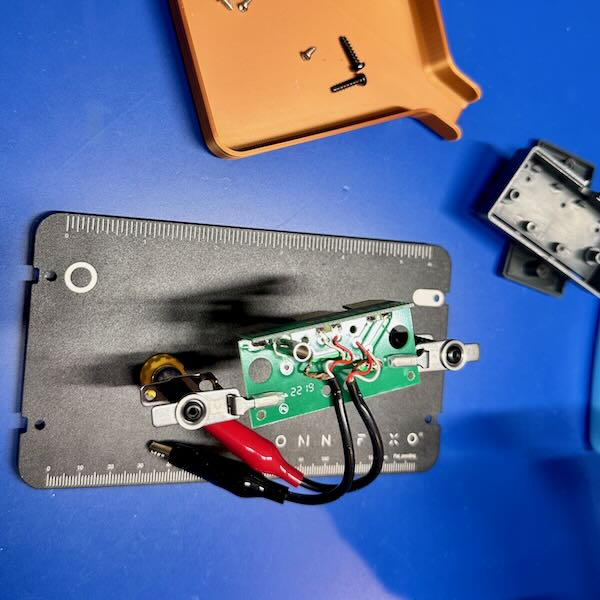{: width=150 align=left }

**Step 6**. Next, we put the PCB in some kind of holder. Here, I'm using
my favorite, an [Omnifixo](http://omnifixo.com). This will hold the PCB
securely while we're working. While you can try and use your hands, I
try to keep my fingers as far away from the hot tip of a soldering iron
as I can. You should too. As you can see from the photo, the solder is
actually on the bottom of the PCB, so we'll need to flip it over.

{: width=150 align=right } 

**Step 7**.  Once you flip the PCB over, you can go to removing the
solder. Here, I'm using a [solder
sucker](../tools/hand-tools.md#desoldering-tool-and-solder-wick) to
remove the solder itself. You may need to clean up a little bit with
solder wick when you're done. I find that pulling _gently_ on the wires
as you're heating them helps pull them out more easily. I'm not sure
what solder was used on this PCB originally, but it required _quite
alot_ of heat, and I had to crank my soldering iron to 400C to get
things to come out.

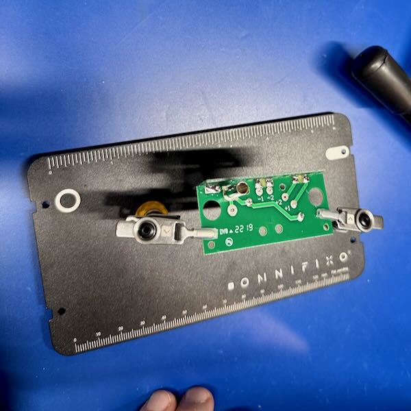{: width=150 align=left } 

**Step 8**. Now we have the wires and ground pulled off, we should
inspect the PCB to make sure there's nothing wrong. What I'm typically
looking for is damage to the pads or traces. I was especially worried
about it this time because of the amount of heat that was required to
get the solder to melt and come off. Fortunately, there didn't appear to
be any major damage to anything.

{: width=150 align=right }

**Step 9**. After examining things, we want to clean the PCB. I use
[IPA](../tools/consumables.md#isopropyl-alcohol-ipa) for this job, and
give it a good scrub with a cotton swab. I want to make sure I get any
residue off the board so that we can get a good solder joint when we put
the new leads on. However much IPA you used, use more. It's inexpensive,
and it cleans really well, and you can _never_ have too clean a surface
on a PCB.

WARNING: **Missing Pictures** This is where I messed up and didn't take a
lot of pictures, so I'm going to try and just walk you through the
steps.

**Step 10**. Now it's time to bring in the new clips! The first step is
to [not shown] clip the cables off. You want to do this as accurately
and evenly as possible. I pulled them tight, and then held them while I
cut all 4 (a pair per clip) at the same time. We want to make sure we
pay attention to consistency with the clips. It's not as important how
long they are, but that they're all _the same length_.

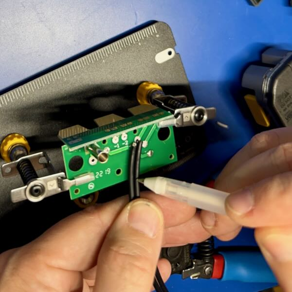{: width=150 align=left }

**Step 11**. Now that you have your cables cut-to-length, we need to
figure out how much needs to be stripped. We want to strip the outer
insulation back to a just ahead of the strain relief zip tie mentioned
earlier. I found that holding them against the PCB and marking them with
a pen (in this case a white pen) was the most useful.

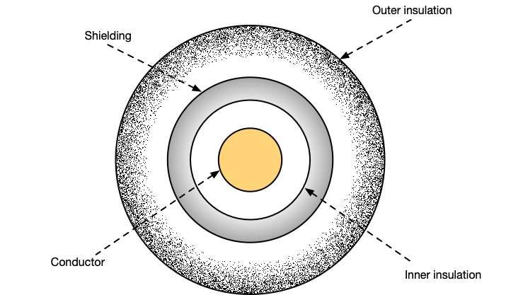

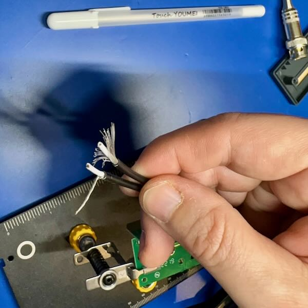{: width=150 align=right }

**Step 12**. Now you need to strip the cables. I use my somewhat fancy
[Irwin automatic cable
stripper](../tools/hand-tools.md#general-wire-strippers), which
magically just do the _right thing_. You'll want to strip the outer
insulation back to the marking. Then, take the _very fine_ wire that
makes up the outer shielding and pull it all to one side and twist it
together as shown to the right. Be careful doing this that you get _all
of the wires_. They tend to be very fine, and if you accidentally miss
one you could end up shorting the shield to the conductor, which would
result in very poor measurements, or worse. 

**Step 13**. Now you need to strip the inner insulation back to expose
the conductor. Here you only want to strip off 3-5mm of insulation. We
want to ensure the wire is insulated as close to the final solder joint
as possible. This will reduce the risk of any shorts and protect the
wire over time.

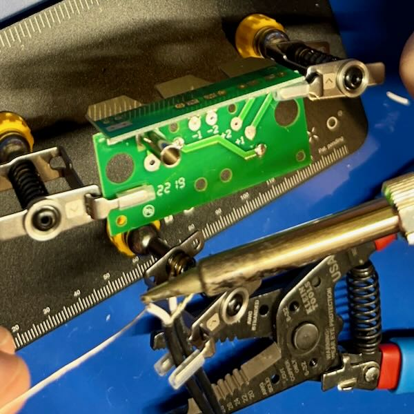{: width=150 align=left }

**Step 14**. Now comes [tinning of the
wires](https://www.instructables.com/Strip-and-Tin-Wires-Like-a-Pro/).
We tin the wires to hold all the strands together and prepare them for
soldering to the contact pad later. By doing this, we make the later
soldering much more reliable and easier. Skipping this step just makes
more work later.

Just heat the wire up and run the solder along it. The first time will
feel weird, but after that you'll be able to do it quite quickly.

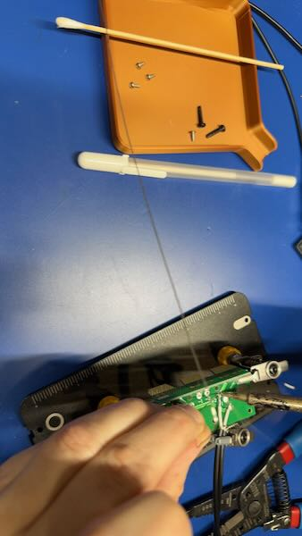{: width=150 align=right }

**Step 15**. [Now is the time on Sprockets were we
solder](https://www.youtube.com/watch?v=QHZR9SA5pOg). I start on the
inside wires (-2 and +2), and work my way out. Put a little bit of
solder on the pad itself first, then press the wire against the pad,
heat it, and the combination of the solder on the pad and the tinned
wire should quickly solder together. If they don't, you might need a
little bit more solder on the pad to start. 

This is where the Omnifixo (or any other "helping hands") comes into its
own. It helps you hold the wire in the right place as you're soldering
to ensure that you get a good contact, without risking putting your
tender flesh close to the solder tip.

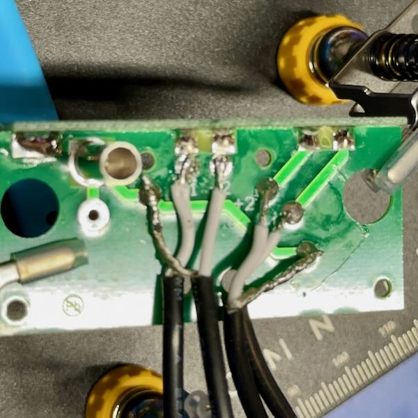{: width=150 align=left }

**Step 16**. Final examination. Look at all the solder joints. They
should look reasonably shiny. If they are really rough looking, you
should add some flux (a flux pen is great from this) and reheat them to
let them set correctly. We don't want a [cold solder
joint](https://www.wevolver.com/article/cold-solder-joint-understanding-and-prevention).
Now is also the time where you can pull out the IPA again and give the
board a good wipe down and cleaning. We _especially_ don't want any
residual flux on something where we are hoping to make precise
measurements. Flux has some conductance (and resistance) and will
interfere potentially. Note, this picture was before cleaning the flux
off the PCB.

**Step 17**. Finally, we re-assemble it. I haven't shown these because,
quite honestly, it's just a reverse of opening it. First, though, insert
a plastic zip tie through the two small holes where the original one
was. Don't tighten it just yet, just make sure it's sticking out around
the cables. Then, insert the PCB back into the plastic box, making sure
to get the  Add the 4 tiny PCB screws. Once those are tightened,
complete the zip tie, tightening it snugly and trimming the excess.
Finally, reattach the top to the case.

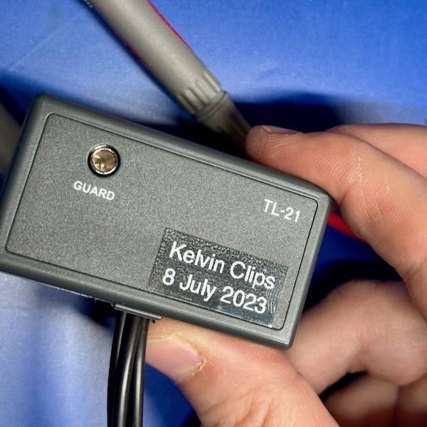{: width=150 align=right }

**Step 18**.  Stick a label on that sucker.

Seriously though, I tend to label anything like this so that I know what
and when this was done. Especially since the box itself has a part
number that wouldn't map correctly. 

That brings us to a point where we need to figure out if this thing even
works. To do that, we're going to stick it in the meter and give it a
try. 

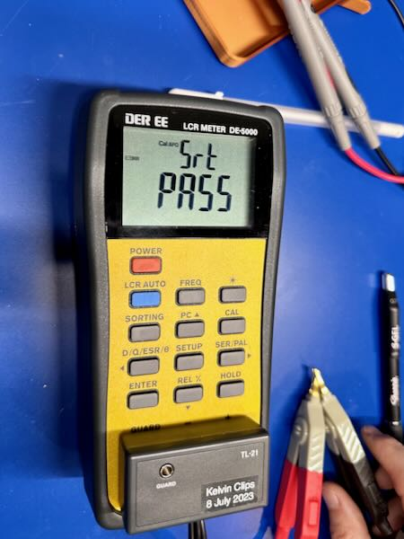{: width=150 align=left }

**Step 19**. Calibrate the clips. For my meter, this means pressing the
CAL button for 2 seconds, then going through a calibration with the
clips open (not connected) and then with the clips shorted (connected).
Doing this calibrates out the wire itself so that the meter can measure
just the DUT. Each of those steps takes 30 seconds, then you can use the
meter. 

While you don't have to do this _every single time_ you use the meter,
it's not a bad habit to get into to do it frequently. Environmental
influences, like temperature, can impact the readings.

## LCR Meter Use

FUTURE: **Speed Run** This is just the most absolutely simplified use of
an LCR meter, and I'll be writing up a more detailed dive on what and
how to use LCR meters in the future. This is just a taste, and fits with
some of the [fundamentals](../electronics/fundamentals.md).

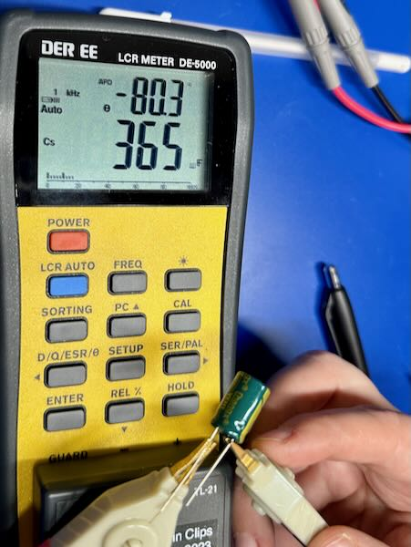{: width=200 align=right }

So, skipping over a lot of things, one of the things an LCR meter can
tell you that a regular multimeter cannot are the characteristics of a
capacitor beyond its basic capacitance for a DC load. An LCR meter looks
at it as a sine wave (typically), which means the measurement has a
frequency. 

First, let's take a look at this little aluminum electrolytic capacitor
at 1kHz. Here we see the capacitor shows a capacitance of 365&micro;F.
Above that, however, you can see a second display showing &Theta;
showing that the current leads the voltage by 80.3&deg;. This is part of
the behavior of [impedance](../electronics/fundamentals.md#impedance).

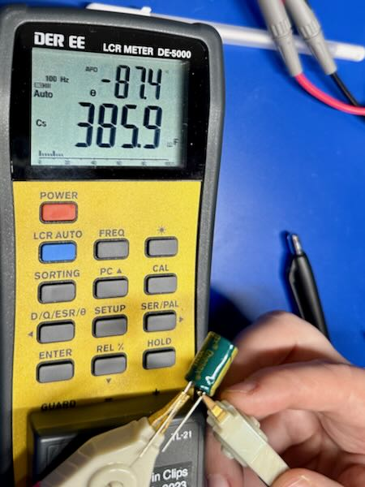{: width=200 align=left }

If we now take a look at the capacitor with a 100Hz signal instead, we
find that it has totally different values. Here, we have 385.9&micro;F
(about 5% more) and the current leads by 87.4&deg; (about 9% more). 

This is, unfortunately, one of the areas where electronics gets
complicated. Fortunately, for a lot of hobbyist type work, you can get
away without the extra complexity, but I find it useful to at least
understand what's there, and then you can _choose_ to ignore it.

## SMD Leads

{: width=200 align=right }

Just as an aside, I thought I'd show you what the SMD leads/tweezers
look like, and how the Kelvin arrangement is achieved. Looking at the
inside of the probe, you can see dual wires, leading to dual traces that
go all the way down to the metal tip where they meet. Since the metal
tip has well-known characteristics, it can be compensated out of the
calculations.

These tweezers are designed to grab tiny little surface-mount
inductors (L), capacitors (C), and resistors (R). That's where the name
of the meter comes from.

Neat, huh?