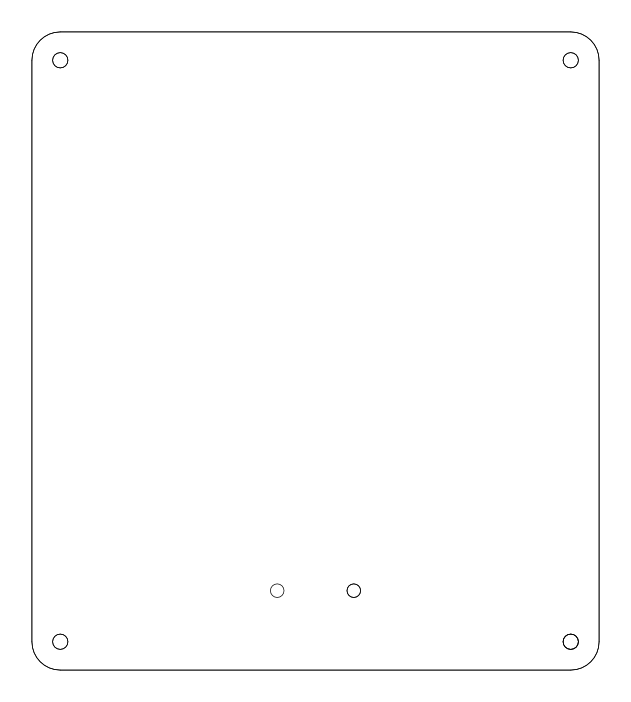
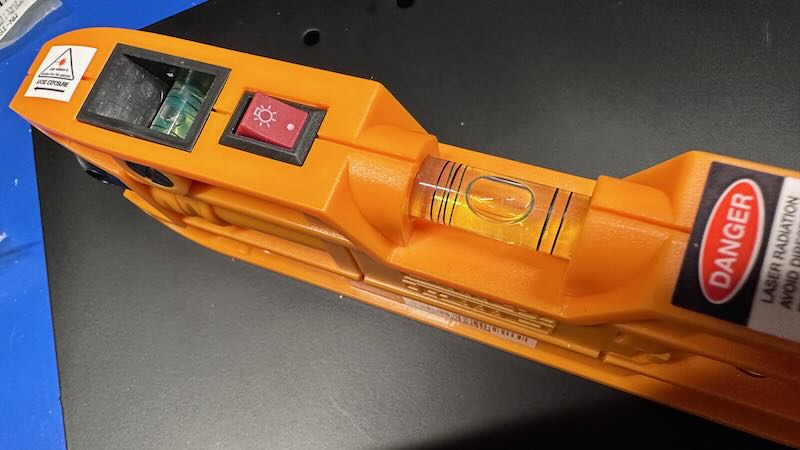
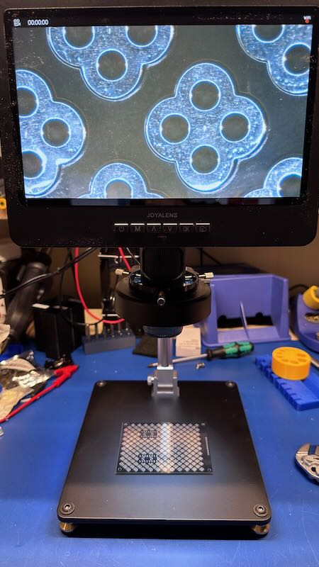
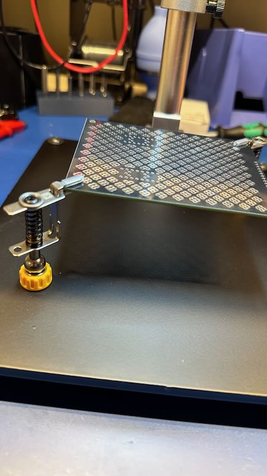
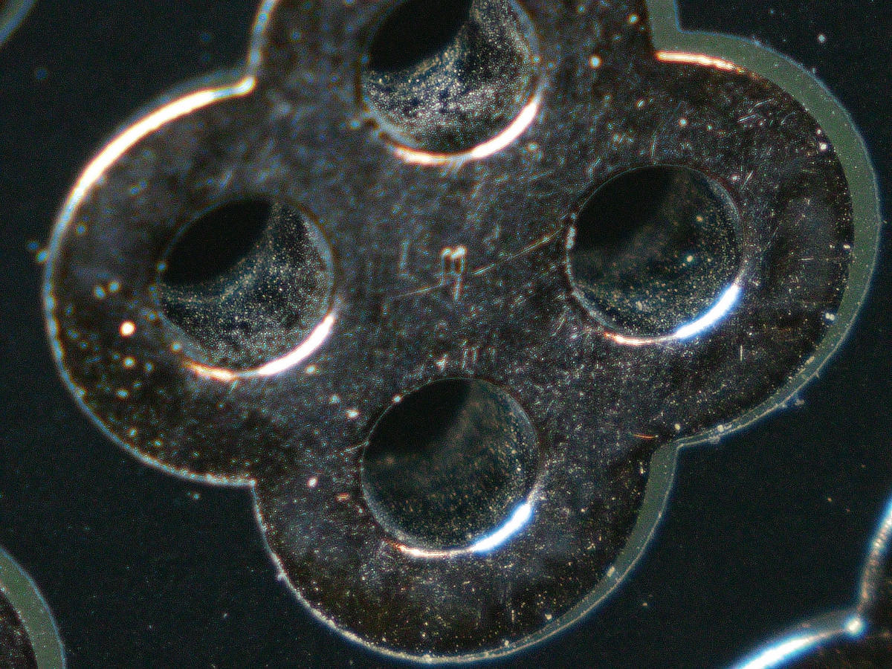

---
tags:
  - metal
  - microscope
  - project
---
# Replacement Microscope Base

This isn't meant to be a review of the video microscope that I use (a
Joyalens JL249MS, also called Adonstar AD249M). Instead, this is about
an improvement that I made to it recently. One of my frustrations with
the microscope, which is overall excellent, was the light-weight
aluminum base. It was both insubstantial (something you don't want in a
microscope), and non-magnetic, which prevented me from using my
[favorite holding
tools](https://omnifixo.com/). So, since the the overall design was just
2 holes in a plate, I decided to make something better.

[{: width=200 align=left }](/files/joyalens-replacement-base-v1.dxf)

Since I needed it to be magnetic, I turned to my old friend, steel. I
designed a small replacement that also had holes for 4 adjustable
self-balancing feet. To do this, I did some quick measurements, and
created a quick 2D file in DXF format ([[
link_for_download("joyalens-replacement-base-v1.dxf", license="Creative
Commons v4 BY") ]]). I then shot it over to
[SendCutSend](https://sendcutsend.com/) to be manufactured in 1/4"
(6.3mm) hot-rolled [pickled and
oiled](https://www.metalsupermarkets.com/what-is-pickling-and-oiling/)
A36 steel. This was then powdered coated in matte black to reduce any
reflections in the lens.

While I waited, I put together a quick order for everyone's crack
dealer: McMaster-Carr. This meant:

* Swivel leveling mount in yellow-zinc with a rubber cushion and M6
  threaded hole (P/N [6120K38](https://www.mcmaster.com/6120K38/))
* M6x1.0-10mm alloy steel flanged button head screws in [black
  oxide](https://en.wikipedia.org/wiki/Black_oxide) to keep the finish
  matte (P/N [92137A525](https://www.mcmaster.com/92137A525/)). 
* [TiN-coated](https://en.wikipedia.org/wiki/Titanium_nitride)
  [HSS](https://en.wikipedia.org/wiki/High-speed_steel) M6x1.0 plug tap
  (P/N [26475A74](https://www.mcmaster.com/26475A74/)). While I had a tap
  for this, it was an excuse to upgrade to a much higher quality one
  that will last a long time.

{: width=200 align=right }

The custom cut and finished steel plate took a couple weeks to work its
way through production and shipping, and finally, I was ready to
re-assemble the microscope. It was also much heavier than the original,
being 5lb (2.2kg) versus < 1lb (450g). 

The first step was to tap the M6 holes for the feet, which I did...
using my old janky tap, and not the fancy new one I had bought, because
I forgot I bought a new one. C'est la Vie. It worked fine, if just a bit
slow because the steel isn't as sharp as the new one would have been.

{: width=200 align=left }

Next, I screwed on the new feet with the new flanged screws. The
original plate just had some rubber feet on the bottom, but these are
substantially more secure, and are largely self-leveling. They have a
nut that you can use to snug up and ensure they are properly level. I
just screwed down all the way and tightened them up, without really
paying much attention, figuring I'd need to re-level it after anyway.

I used a quick check with the level to ensure everything was fine:

{: width=400 align=right }

Ta'da! No leveling needed. Everything was "flat enough" for my purposes.
Machinist friends would certainly scoff, but it works for what I need it
for, where it's not really a reference plane to anything else.

Finally, I screwed in the support for the microscope head, and Bob's
your uncle. I threw one of the neat [IMSA Guy HP-reproduction analog
protoboards](https://www.youtube.com/watch?v=-DdpwAWd7eg) to see how it
worked:

{: width=400 }

Perfect, and exactly what I was hoping for. But that's just a heavier
version of the original, so how about those fancy clips?

{: width=400 }

Perfect. So let's take a look at this super neat analog protoboard. This
was taken with the microscope itself, and I've actually reduced the
resolution substantially to make it a bit more manageable.

100% worth every dime (about [[ usd(75.0, as_of="20 August 2023") ]] for
the plate and parts). 