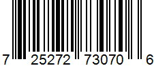
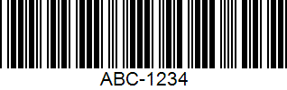
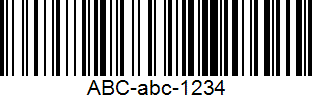
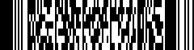
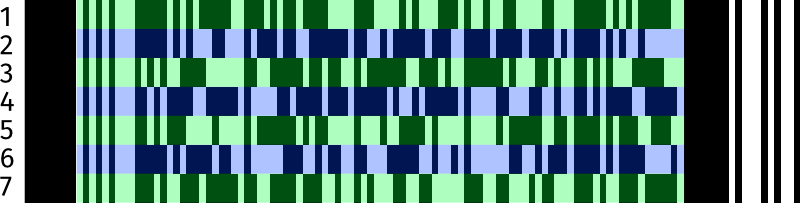
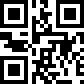
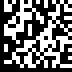

# Barcodes

<!--
TODO: Discuss uses for barcodes
TODO: Discuss readers
TODO: Discuss libraries for creating
-->

Barcodes are everywhere around us, from the back of your cereal box to a
part in the latest electric vehicle. They're on the back of books, and
the bottom of rocket engines. Anytime you need a machine-readable format
to represent data visually.

Here I just want to talk about the ones that I've run into the most, and
a bit about them, what they look like, and some details. There's
literally hundreds of barcode schemes out there, but many are very
narrowly scoped. 

## Formats

Formats can be broken down into 1D and 2D formats. As the name implies,
1D barcodes require traversing the barcode in a single dimension. 2D
barcodes, like QR codes, require traversing the code in 2 dimensions.
This also impacts the complexity of the reader required.

### 1D Barcodes

#### UPC A

{: width=200 align=right }

 UPC-A is one of the most common and well-known barcode types. It's the
 one you've seen on the back of a cereal box. In fact, the first UPC
 barcode ever scanned was a pack of Wrigley's Juicy Fruit chewing gum.
 It is widely applied to retail in the United States. It is also known
 as Universal Product Code version A. You can't just generate your own
 UPC-A code, as the assignment of manufacturer ID numbers is controlled
 in the USA by the [Uniform Code Council (UCC)](https://www.gs1us.org/),
 which is now just known as GS1 US.

UPC-A is a subset of EAN-13 (the European counterpart and largely
interchangeable). To be specific, an UPC-A bar code is an EAN-13 bar
code with the first EAN-13 number system digit set to "0". Beyond this,
UPC-A barcode is able to convert to UPC-E. A UPC-A barcode consists of
12 digits. It begins with a single digit number system character, which
designates how the code should be classified: as a regular product, a
weighted item, pharmaceuticals, coupons, etc. After that is a five digit
manufacturer's number, followed by a five digit product number, and
finally a check digit. Each digit is represented by a uniquely
identifiable pattern of two bars and two spaces of varying width. No
letters or other special characters aside from numbers may be used.

 A [mathematical
 formula](https://www.gs1.org/services/how-calculate-check-digit-manually)
 computes the check digit from the other numbers.. So if the check digit
 doesn't match the digit generated by the other numbers, you know
 immediately that there's an error.

 Advantages
 :  UPC-A barcodes are simple, short, popular, and can be read by just
 about any standard barcode reader. In addition, the check digit guards
 against accidental errors, especially when entering in the code by
 hand. 

 Disadvantages
 : The 12 digit system of a UPC-A barcode provides for small, limited
 encoding, which makes it ideal for supermarket and retail use, but less
 suited for other scanning and identification purposes. You can't just
 reuse it and let your own codes out in the wild without having assigned
 numbers.

#### Code 39 

{: width=200 align=right }

Code 39 barcodes are also called a Code 3 of 9 barcode. I believe it was
the first barcode to allow the use of _both_ letters and numbers. It's a
variable length barcode that can have up to 43 alphanumeric characters.

A Code 39 barcode contains both a start and end symbol for the scanner.
Typically, the scanner will convert this to a `*`. Aside from the
start/end character, the barcode can technically only encode the numbers
1-10. To encode letters, it uses special designations. It does this by
dividing them up into categories:

* For example, the first 10 letters (A-J) are given numeric values,
  preceded by a "Letters" designation. 
* The next 10 (K-T) are designated "Letters +10." So K would be Letters
  +10, followed by a 1, showing that it's the 11th letter of the
  alphabet. 
* The last set (U-Z) then become "Letters +20." 

Numbers, of course, have their own designation as well.

Advantages
: The use of both letters and numbers makes Code 39 more versatile. In
addition, it is self-checking, so it does not require a check number
(though one  is still recommended).

Disadvantages
: It is limited to a maximum of 43 characters. Also, its method of
assigning number values to letters in order to read them limits
versatility and precludes other characters. It also makes decoding the
barcode more complicated.

There is a related Code 93 barcode that is used by Canada Post that has
more density, but is otherwise very similar.

#### Code 128

{: width=200 align=right }

Code 128 is a denser barcode than most, but it is also the most
versatile barcode in the 1-D category, in terms of potential information
storage. Its name comes from the fact that it can encode all 128 ASCII
characters. That includes letters and numbers, but also punctuation,
symbols, and more. It is most commonly used in the logistics of things
like purchasing and shipping, but can potentially be used for a variety
of other purposes.  

There are six sections to a Code 128 barcode. The first and last
sections are both quiet zones, which consist of a certain amount of
white space, based on other elements of the code. After the opening
quiet zone is a start character, which designates what code set the
barcode falls into. Code 128 has three code sets:

* Set A designates codes with all capital letters. 
* Set B is for codes with both capital and lower case letters.
* Set C is for codes with only numeric data -- which allows it to
  compress twice as much data into the same space. 

After the start character comes the data itself. Each encoded character
consists of exactly three bars and three spaces. After that is a check
digit, to ensure accuracy, followed by an end character to signify the
end of the code, and finally the closing quiet zone.

Advantages
: Not only is Code 128 versatile, it is compact, being able to store a
much larger amount of data than a regular barcode in the same amount of
space. 

Disadvantages
: Mostly just the limitation to the length of the barcode itself and
therefore he length to the amount of data you can encode.

### 2D Barcodes
#### PDF417

{: width=200 align=right }

PDF417 is used in a variety of applications, primarily transport,
identification cards, and inventory management. It is defined in ISO
15438. PDF stands for Portable Data File and was developed by Symbol
Technologies. As far as I'm aware, it has _absolutely no relation_ to
Adobe Acrobat's PDF, or Portable Document Format. PDF417 uses built-in
error correction to ensure better readability, and it can encode 100-200
characters quite comfortably. 

{: width=250 align=left}

PDF417 is a different style than QR codes and Data Matrix in that it is
not strictly a 2D spatial orientation, but instead a series of stacked
1D barcodes. A single PDF417 symbol can theoretically hold up to 1850
alphanumeric characters, 2710 digits or 1108 bytes. Due to internal data
compression algorithms the exact data capacity depends on the structure
of the data to be encoded. 

The barcode contains a way to detect and correct errors based on the
Reed Solomon algorithm. The level of correction included can be between
0 and 8.  

To give you an idea of the age, PDF417 uses the
[CP437](https://en.wikipedia.org/wiki/Code_page_437) character set that
was introduced with the original IBM PC in 1981. It also uses a very odd
[codewords](https://en.wikipedia.org/wiki/PDF417#Codewords) approach to
encoding. 

Advantages
: As far as I can tell, the only advantage of the PDF417 barcode is that
it can be read with a "simple" line reader that's swept over the
barcode. That was likely a huge benefit in the original timeperiod, but
now is simply not worth the hassle.

Disadvantages
: Complexity. Ooof. It's also about 1/4 the data density (bits per
square centimeter, for example) of either a QR code or a Data Matrix.

#### QR Code

{: width=200 align=right }

 [QR (Quick Read) code](https://en.wikipedia.org/wiki/QR_code) is a
 matrix code originally designed for use in the labeling and identifying
 of automotive parts. It's became very popular with the introduction of
 camera phones that could easily read it.
 
 A QR code can be either very simple or very complex, and can vary in
 size. It's a square shape that includes both black and white cells. The
 top two corners and the bottom left corner each contain a small finder
 pattern, displayed as a square within a square.

 QR codes can hold a maximum of 2,953 bytes, 7.089 numbers, or 4,296
 alphanumeric characters. There is also a "micro" version of the QR code
 that can hold anywhere from 5-35 numbers, 5-21 alphanumeric characters,
 or 7-15 bytes.
 
 Advantages
 : It can be read very quickly and has an enormous storage capacity,
 making it superior to UPC bar codes in just about every way. It can
 encode both  numeric and alphanumeric characters, as well as binary
 characters and even Chinese logographic characters.

Disadvantages
: It has a high storage capacity, as well as error correction for
damaged codes, but it's a tradeoff between the two. The higher the error
correction,  the lower the storage capacity. Also, since the standard
allows it to specify that it contains executable code (Javascript via
URL), there are some additional risks that simply aren't required. 
#### Data Matrix

{: width=200 align=right }

The [Data Matrix](https://en.wikipedia.org/wiki/Data_Matrix) is a 2D
matrix code (ISO/IEC 16022), capable of encoding very large amounts of
data (2,335 alphanumeric or up to 3,116 numbers)in a compact space. Data
Matrix codes are made up of small black and white squares that form a
big square or rectangle. They're used in a variety of industries,
including aerospace, component labeling, food and beverage,
pharmaceutical, defense, mail, and printed media where tracking and
traceability is critical. It is also a core part of the GS1 framework
for global trade.

These are my favorite barcodes (not really a barcode, but...), if one
can have such a thing. They're compact, reliable, and don't waste a ton
of space on things that others do.

{: width=200 align=left }

Each Data Matrix has multiple parts:

1. _Finder or 'L' pattern_. This helps a barcode reader locate and
   determine the orientation of the code.
2. _Clocking pattern_. This provides a count of the number of rows and
   columns in the code.
3. _Data region_. This can be alphanumeric data. Redundant data using
   [Reed-Solomon
   encoding](https://en.wikipedia.org/wiki/Reed%E2%80%93Solomon_error_correction),
   which can make up anywhere from 28% to 62.5% of the available data,
   is often included so even if one or more cells are damaged, the code
   is still readable.
4. _Cell or module_. This is the blocks inside the _data region_ and are
   the interior components of the code that make up the pattern
5. _Quiet zone_. The margin of white space around the entire code; Data
   Matrix codes must have a quiet zone to be decoded correctly a
   perimeter finder and a timing pattern. 

While there are a lot of different Data Matrix arrangements, let's talk
about just a few of them: 10x10, 32x32, and 144x144 (the largest). Each
of these is a different number of "regions", which are the maximum size
before you have to reset the finder pattern. We'll look at how much they
can hold, and how that is broken down by data and error recovery.

| Rows | Columns | Regions | Numbers | Alpha | Bytes | % ECC |
| ---- | ------- | ------- | ------- | ----- | ----- | ----- |
| 10   | 10      | 1       | 6       | 3     | 3     | 62.5% |
| 32   | 32      | 4       | 124     | 91    | 62    | 36.7% |
| 64   | 64      | 16      | 560     | 418   | 280   | 28.6% |
| 144  | 144     | 36      | 3,116   | 2,335 | 1,558 | 28.5% |

There are a huge number of encoding options for a Data Matrix,
including: 

* ASCII ([ISO/IEC 646](https://en.wikipedia.org/wiki/ISO/IEC_646))
* C40, which is optimized for uppercase letters and numbers. There's
  [some information
  here](https://www.keepautomation.com/tips/data_matrix/c40_encodation_in_data_matrix.html). 
* [X12 EDI](https://datainsight.health/edi/intro/) for heavily
  structured and hierarchical data. Mostly, I've run into it in the
  healthcare space.
* [EDIFACT](https://en.wikipedia.org/wiki/EDIFACT), a United Nations
  standard for EDI, so you know it's going to be simple and
  uncomplicated. It is, however, very widely used in B2B interactions.

It's worth noting that the _standard use_ of Data Matrix is based on the
[GS1 Data Matrix
guidelines](https://www.gs1.org/standards/gs1-datamatrix-guideline/25),
which institute some additional structure to it. One of the neat things
about Data Matrix is that it is designed to be applied in a wide variety
of technologies, including direct inkjet printing, laser engraving, and
even [dot peen
marking](https://www.pannier.com/stamping/dot-peen/what-is-dot-peen-marking/), 

Advantages
: The barcode is designed to be read even when it's up to 30% damaged,
due to a built in error correction system. It's also capable of encoding
either letters, numerical data, or other ASCII characters. Data Matrix
codes can be read with image-based barcode readers or mobile devices. It
can operate with a lower resolution, and is easily read in any position. 

Disadvantages
: Although it can store a lot of characters, far more than most 1D
barcodes, Data Matrix codes still have an overall character limit and
cannot be read with traditional 1D barcode scanners.   It is also not
quite as widely support a 2D variant as QR Codes.

### Others Random Barcodes

There are a bunch of other visual representations of data that come up
in various specialized applications. A few that I've run into are:

* [Aztec Codes](https://en.wikipedia.org/wiki/Aztec_Code), which is also
  ISO/IEC 24778:2008, but which I've only seen used in airlines, as it
  is standardized by
  [IATA](https://en.wikipedia.org/wiki/International_Air_Transport_Association). 
* [April Tags](https://april.eecs.umich.edu/software/apriltag) are a
  coding system optimized for robotics and visual processing in 3D
  space. For example, it can quickly determine the orientation of an
  object based just on the April Tag applied.
* [POSTNET](https://en.wikipedia.org/wiki/POSTNET). This is the old US
  Postal Service (USPS) barcode automation. It is a 2D barcode because
  the length of the bars is used to encode the data.
* [Intelligent Mail
  Barcode](https://en.wikipedia.org/wiki/Intelligent_Mail_barcode) is
  the replacement for POSTNET since 2013. It extends the POSTNET
  2-length encoding to a 4-length with a center tracking region.

## Third-Party Resources

* [Online barcode generator](https://barcode.tec-it.com). Generates
  barcodes in just about every format possible. Can be embedded into a
  webpage. 
* [Online label generator](https://label.tec-it.com/en). Generates label
  layouts for things like automotive, nutrition, etc, where a
  standardized format is available
* [GS1 Standards](https://gs1.org/). Global organization that helps
  coordinate all markings in trade.
* [Using Barcodes in Documents - Best
  Practices](https://web.archive.org/web/20120524085651/http://accusoft.com/whitepapers/barcodes/BarcodesinDocuments-BestPractices.pdf).
  A (somewhat dated) document that goes over a lot of the best practices
  about printing barcodes, such as minimum size, contrast ratios, etc.
  especially as it relates to the scanner's resolution.