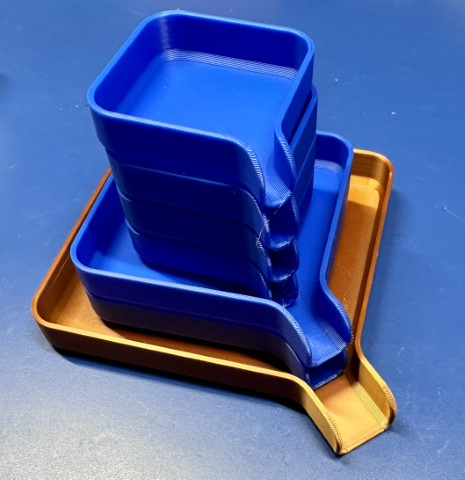

---
tags:
  - 3d-printing
  - measurement
  - organization
  - pcb
  - soldering
  - tools
---
=======
# 3D Printed Tools

Unlike many people, I don't think that FFF 3D printing is a
great technology for making tools. There's a good reason that they have
historically been primarily made from metals. Having said that, there's
a huge number of things you can print yourself that will enhance your
experience in a home workshop or lab.

## Sorting Containers

{: width=200 align=right }

There are two models from [@Area51](https://www.printables.com/@Area51)
that I have found insanely useful. The first is [these sorting
trays](https://www.printables.com/model/114308-sorting-tray-with-funnel)
that you can 3D print using a minimum of filament. They come in a _ton_
of sizes (50, 75, 100, 125, 150, adn 175mm square). They have a very
useful funnel attached, and most importantly they stack! I print them
with my [fast profile](../3d/prusa.md#makers-muse-slicer-settings) and
with my [fast profile](../3D/prusa.md#makers-muse-slicer-settings) and
they are super solid. They're fine in PLA as well as PETG.

In addition, @Area51 has provided
[dividers](https://www.printables.com/model/131075-dividers-for-sorting-tray-with-funnel)
for the sorting trays. This is great when you need to divide a larger
tray or want to block them from leaving via the funnel.

I use these _extensively_ when sorting through parts, or even when I am
assembling/disassembling something to collect screws and other small
parts. 

FUTURE: **Improvement Opportunity** I've thought about maybe adding some
magnets to the bottom of them to help hold ferrous screws/bolts better.
While I have some metal sorting containers, these are wildly better
sized and the funnel should never be underestimated. 

## Gridfinity

I do use some of the [Gridfinity grid storage
system](https://gridfinity.xyz/catalog/), and have found it to be super
helpful. This was created by Zack Freedman, and he talks about it in
[this Youtube video](https://www.youtube.com/watch?v=ra_9zU-mnl8).  I
use base plates with tiny magnets in them to hold things together,
although I've never gotten to little ties to tie baseplates together to
work properly. 

My only caution is that I think some people have gone a bit overboard
with the system, and you see a bit of "if all you have is a hammer..."
problem solving. Still, it's super useful, module, and you should take a
look at it.

There is a [master
collection](https://www.printables.com/model/242711-gridfinity-master-collection)
by [@GlitchPrinter](https://www.printables.com/@GlitchPrinter) on
Printables. 

## Hakko T-18 Soldering Tip Holder

{: width=200 align=right }

This [3D
model](https://www.printables.com/model/74404-hakko-t-18-soldering-iron-tip-holder)
from [OzRocky](https://www.printables.com/@Rocky_123148) is a great way
to store your extra soldering tips for a Hakko iron that uses T-18 tips,
like the FX-888. Just be careful to ensure the tips are cool before you
put them back in.  You can also find some super cheap tip sets that come
with a machined aluminum holder, and that might be better in some cases.

## PCB Holders

If you're working with a bunch of PCBs, there's a couple designs that
might be helpful that I've used. The first is [this one for 10 small
PCBs](https://www.printables.com/model/253302-pcb-holder) by
[Kytor](https://www.printables.com/@Kytor). It's not designed for huge
PCBs, but it does work great for the typical small (less than 50mm
square) PCBs hobbyists are using most of the time.

For larger PCB holding, I really like [this
model](https://www.printables.com/model/317916-pcb-rack) from [Thiadmer
Riemersma](https://www.printables.com/@ThiadmerRiemer_47800). 

## Silica Gel/Desiccant Containers

{: width=200 align=right }

I've discussed this elsewhere around filament storage, but one thing you
really need to do is keep desiccant with the filament. I originally just
used those little mesh bags you see for clothing drawers, but they never
sealed well enough. Then, I found [this amazing
containers](https://www.printables.com/model/1367-malolos-silica-gel-desiccant-containers)
designed by [Malolo](https://www.printables.com/@Malolo). I use the full
core models, and they work just amazingly well.

One note, _print the funnel and cone_ to help with filling. You don't
want tiny desiccant beads flying everywhere. You'll never find them all.

## Lead-Forming Tool

{: width=200 align=right }

When you're working with axial leaded components (typically resistors
and inductors), you have to bend the leads to fit into either a
breadboard or your PCB. Doing that is trivial with a set of pliers, but
it's even more _consistent_ with a tool like [this
one](https://www.printables.com/model/275510-resistor-lead-forming-tool-component-bender-plieur)
from [Timot](https://www.printables.com/@Timot_100253). You just find
the right match for component size and lead length and then press them
down around it. 

## Panavise Speedwheel

{: width=200 align=right }

I _love_ my
[Panavise](https://www.panavise.com/index.html?pageID=1&page=full&--eqskudatarq=1),
especially with the [5! pound (2.3kg) cast iron
base](https://www.panavise.com/index.html?pageID=1&page=full&--eqskudatarq=13),
but one thing that could be better is the rate at which the screw allows
the jaws to expand. It can sometimes take _forever_ to get the jaws open
to the right size. [This cute little
addition](https://www.printables.com/model/35272-panavise-speedwheel) by
[ZRex](https://www.printables.com/@ZRex_7692) is a great addition.
Panavise does [make their own
version](https://www.panavise.com/index.html?pageID=1&page=full&--eqskudatarq=228),
but I think this version from ZRex actually works better. And you can
print it in any color you want.

Just stick your finger in one of the little openings and spin it.

## Plier/Wrench Organizer

If you're anything like me, you have a bunch of pliers and wrenches of
various types. I used to store them just in a drawer, piled up a bit,
which isn't really good for finding them, or for their long-term
durability. Recently, though, I found [this great little
rack](https://www.printables.com/model/43666-plier-wrench-organizer-with-2495mm-version)
from [TeasleyPrint](https://www.printables.com/@TeasleyPrint_93987), and
it's worked great to keep all my pliers at easy reach.

## Heat Set Insert Press for Dremel and Hakko FX-888

{: width=200 align=right }

One of the things I bought _years ago_, on sale no doubt, was a [Dremel
220 workstation](). This is kinda like a little "drill press" but for
your Dremel tool. It's supremely well designed and made (like pretty
much anything from Dremel), and with [this great little
addition](https://www.printables.com/model/405918-heat-set-insert-press-hakko-fx888-dremel-workstati)
from [APuckNut](https://www.printables.com/@APuckNut), you've got yet
another great function. This lets you take a Hakko FX-888 soldering iron
handpiece and securely mount it in the Dremel workstation. You can then
use this to accurately and reliably do [heat set
inserts](../3d/joining-parts.md#threaded-inserts). 

If you want something _even cooler_, and wildly specialized, but
amazingly made and designed, I've heard nothing but great things about
[Naomi Wu's
insert tool](https://cybernightmarket.com/products/heat-set-insert-press), and
if I was doing anything like production work, it would be something I'd
snap up immediately. But the little 3D-printed insert works great for my
limited applications.

## Box for Omnifixo

{: width=200 align=right }

I haven't written about my love for my
[Omnifixo](https://omnifixo.com/), although that love is nearly
boundless, but Norm from Tested (Adam Savage) did [a great
video](https://www.youtube.com/watch?v=NR9-GOLoJ3U) on how amazing it
is. Well, [this
box](https://www.printables.com/model/415363-box-for-omnifixo-makers-third-hand)
from [Tritshi](https://www.printables.com/@Tritschi) is perfect for
storing everything. Definitely print the [magnet
holders](https://www.printables.com/model/456788-omnifixo-third-hand-system-clamps-for-neodym-magne)
as well. The only change that I made to the design is I added some _very
thin_ rubberized tape to the inside of the magnet holders to keep them
more secure as they were still leaping out. The magnets for the Omnifixo
are _very strong_.

## Wire Soldering Jig

{: width=200 align=right }

If you're just trying to solder two pieces of wire together, [this
soldering
jig](https://www.printables.com/model/132447-cable-soldering-jig) from
[werz99](https://www.printables.com/model/132447-cable-soldering-jig)
has served me well. When I don't want to pull out the Omnifixo or
something else, this holds the wires perfectly so they can be joined
together, or even just tinned. Yes, plastic with a glass transition
temperature under 100C isn't that durable around a 350C soldering tip,
but I've not had any problem, and even if there is a problem, they're
super cheap and fast to print a replacement.

## Screw Measuring Tool

{: width=200 align=right }

These are _all over the place_, but I really like [this
design](https://www.printables.com/model/32160-screw-measuring-tool-m2-m10-4-120mm)
from [Boogie](https://www.printables.com/@Boogie) for a screw measuring
tool. If you have a screw that you're not sure what the size of it is,
you can jsut quickly figure that out, both diameter and length. It uses
very little filament, and is great. If you print it with an [M600
filament change](https://marlinfw.org/docs/gcode/M600.html), you can
print the labels in a different color filament.

Snazzy!