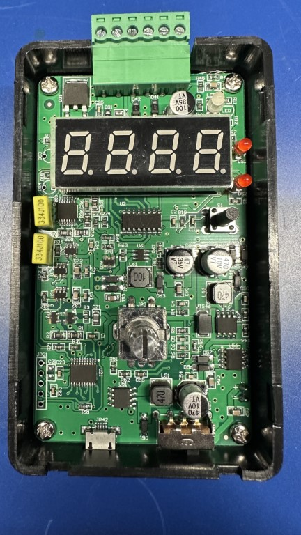

---
tags:
  - current
  - voltage
  - source
---
# Precision Current and Voltage Signal Generator

NOTE: **Limitations** This is just what _I_ know from experience. I
don't know all the characteristics, and the documentation is nearly
zero. It is only the quality of the output that made it worth looking at
this in the first place. If you find mistakes or have other information,
please let me know!

{: width=200 align=right }

A while back, I picked up [this voltage and current
reference](https://www.aliexpress.us/item/3256805285277753.html) from
AliExpress. It has a product number, I think of ZYX-HOD-2AO-VI, but who
knows? I can't remember which person had mentioned it to me, but
they thought it had *excellent* characteristics, and behavior far in
excess of what you might expect for a sub 
[[ usd(15.0, as_of="21 August 2023") ]] 
device. It's also quite compact at 3.9" (100mm) by 2.36" (60mm) by 1"
(25mm). 

One thing it didn't have, though, was a good manual, so I've pulled this
together from both it's kinda "manual", some digging, probing, and
general beating my head against the wall.

Let's start with the specs:

| Attribute        | Range    | Tolerance |
| ---------------- | -------- | --------- |
| Voltage range    | 0-10VDC  | 0.01V     |
| Current rage     | 0.22mA   | 0.01mA    |
| Load equivalence | 500&ohm; |           |

The one I bought has a built-in 3.6V LiIon battery that can be charged
over a micro-USB connector. The screw terminal lock is also removable,
something they don't typically mention. This means you can potentially
swap them quickly for various setups. 

## Inside the Box

As I mentioned above, this device is far more complicated than anything
at this price point has a right to be. If you pop the front cover off
after removing the rotary knob, you peer inside, and find this.

That's a _lot_ for what this does. Unfortunately, they've scrubbed all
the ICs of any marks. There's one inside that has the faint residual
marking of "ZYX", but that's useless.  There's a few seemingly
high-quality polyester caps as well (marked 334J100 on top). Still,
impressive for the price, and explains the rather outstanding
performance.

We truly live in a bizarre, and in many ways golden, era of electronics.

## Power Options

There are three ways to power the one I have:

1. External 15-30VDC power supply, which it will never draw more than 1W
   operating, and 5W charging.
2. External micro-USB at 5V and 0.2A operating and 1A charging.
3. Internal 3.7V battery.

Obviously, you can only use one of these at a time.

## Output Modes

There are two output modes, current and voltage, which you can think of
a constant-current and constant-voltage sources. You can switch between
them using the MODE button. 

## Terminal Block

On the top of the device, there is a (removable) screw terminal bock. It
has 6 connections, which are numbered left to right 1-6:

| Terminal | Label | Use                                                                                               |
| -------- | ----- | ------------------------------------------------------------------------------------------------- |
| 1        | GND   | Ground for either signal output or external 24VDC power supply                                    |
| 2        | 24V   | 24VDC positive connection for external power supply                                               |
| 3        | AI+   | Not sure of this one, it discusses a two-wire acquisition device, but this isn't a 4-wire device. |
| 4        | AIo   | Constant current output                                                                           |
| 5        | AVo   | Constant voltage output                                                                           |
| 6        | GND   | Ground for either signal output or external 24VDC power supply                                    |

## Changing Parameters

Getting to the parameters setting is a bit weird. First, there are
settings for each mode (voltage v current), so you will need to make
sure you're in the right mode before starting. To get access:

1. Press and hold down the control knob for 2 seconds. This will display
   `F001`, which is a reference to parameter 001.
2. Rotate the knob clockwise to select `F002`. The first time you do
   this, you will get a display consisting of 4 underlines: `_ _ _ _`.
   This means that the device wants a passcode.
3. To enter the password you rotate the knob clockwise for a `|-`
   symbol or counterclockwise for a `-`. To get to parameters F002-F009,
   you use the passcode `|-  -  -  |-`. That's clockwise,
   counter-clockwise, counter-clockwise, clockwise. Then press down on
   the rotary control. To get to F100-F109, you will use a different
   passcode, which is `|-  -  |-  -`, or clockwise, counter-clockwise,
   clockwise, and counter-clockwise. Again, press down on the rotary
   control. 
4. Rotate the the parameter you want to change, then press down on the knob.

After you've set a parameter, or once you've not interacted with it for
10 seconds, it will return to "normal" operation.

| Parameter | Use (I)                 | Use (V)                | Notes                                                     | Default |
| --------- | ----------------------- | ---------------------- | --------------------------------------------------------- | ------- |
| F001      | Coarse/Fine             | Same                   | 0 = coarse, 1 = fine, 2 = quick output (F100 set above 0) | 0       |
| F002      | Display Range           | Same                   | 0 = 20mA/10V, 1 = 20mA/5V, 2 = 22mA/3.3V                  | 0       |
| F003      | Actual v Percentage     | Same                   | 0 = Actual I/V, 1 = Percentage of range                   | 0       |
| F004      | Coarse Adjustment Step  | Same                   | See below                                                 | 1       |
| F005      | Fine Adjustment Step    | Same                   | See below                                                 | 1       |
| F006      | Unused                  | Unused                 |                                                           |         |
| F007      | 0.2mA Calibration Value | 0.1V Calibration Value | Allows you to adjust the actual output at 0.2mA or 0.1V   |         |
| F008      | 20mA Calibration Value  | 10V Calibration Value  | Allows you to adjust the actual output at 20mA or 10V     |         |
| F009      | Screen Brightness       | Same                   | 0 = normal, 1 = bright, 2 = super bright                  |         |
| F100      | Quick Output Mode       | Same                   | 0 = disabled, 2 = 9 distinct points (F101-F109)           |         |
| F101      | Quick Output Value #1   | Same                   |                                                           |         |
| F102      | Quick Output Value #2   | Same                   |                                                           |         |
| F103      | Quick Output Value #3   | Same                   |                                                           |         |
| F104      | Quick Output Value #4   | Same                   |                                                           |         |
| F105      | Quick Output Value #5   | Same                   |                                                           |         |
| F106      | Quick Output Value #6   | Same                   |                                                           |         |
| F107      | Quick Output Value #7   | Same                   |                                                           |         |
| F108      | Quick Output Value #8   | Same                   |                                                           |         |
| F109      | Quick Output Value #9   | Same                   |                                                           |         |

## Quick Output Mode

It is possible to set "preset" voltage and current settings, but no
matter what I try, I cannot figure out how to access them after they
have been set. If you know, please let me know!

## Adjustment Steps

Out-of-the-box, the unit does voltage steps in 0.1V increments, and
current in 0.1mA steps. This can be adjusted using the parameters F004
and F005 mentioned above. For both, the coarse adjustment steps controls
how many tenths (0.10) each click of the rotary knob increases things.
I have yet to figure out how F005 works, actually. It seems to imply
that it might be adjusting at the hundredths, but that just doesn't seem
to be the case.

## Saving Values

If you want to set a "default" value for it to start up in, you can
short-press the rotary wheel (about 1s). When you do that, it will
display `. . . .` on the screen, which means it saved the value. Now,
when you turn the box back on, it will use that as the starting point.

## Precision

I took the following measurements with a B&K Precision 2709B multimeter,
but it should be good enough for hobbyist uses. Here's a few checks at a
few points out-of-the-box, and before any calibration was done. I didn't
do calibration as I don't currently own anything I trust more.

| Voltage Set | Voltage Read | &Delta; V | %     |
| ----------- | ------------ | --------- | ----- |
| 1.3         | 1.297        | 0.003     | 0.023 |
| 3.3         | 3.296        | 0.004     | 0.013 |
| 5           | 4.995        | 0.005     | 0.01  |
| 9           | 9.001        | 0.001     | 0.01  |
| 10          | 10.002       | 0.002     | 0.02  |

Calibration can be done using F007 and F008 in both current and voltage
mode. 

## Mechanism of Operation

Honestly, not being able to see the labels on the chips makes it super
hard to figure out how this thing works. Reverse engineering hardware
isn't my expertise. But from reading a bit between the lines, I'm pretty
sure it's a DAC-controlled constant voltage and current source. You can
[read more about how this might
work](https://www.analog.com/en/analog-dialogue/articles/20-bit-dac-and-accurate-precision-voltage-source.html).
This would also explain why the current delivery is so low. Given the
apparent 0.01V and 0.01mA precision, I would _guess_ that it's driving it
with a 12-bit DAC, which are relatively inexpensive at this point (under
[[ usd(1.0, as_of="21 August 2023") ]] in any quantity).