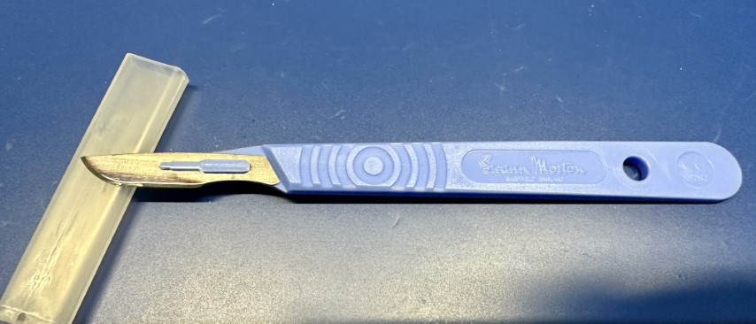

# Hand Tools

<!-- TODO:
* Write up larger tools: power drill/driver, glue gun, air, dremel, tap and die sets. 
* Xuron 475
 -->
## General Guidance

My general guidance is that you should buy an inexpensive/cheap tool to start,
and upgrade once you've figured out 1) whether you would use it enough; 2) what
you value in the tool. Yes, there is often huge differences between cheap and
expensive tools, but it may not matter for your purposes. I call this the Harbor
Freight Rule. You don't buy a $700 Snap On bearing puller to do it once.

What I've included in here are the tools that I _personally_ like. Some are
super cheap, and some aren't.

## Soldering

### Soldering Iron/Station

My soldering iron of choice is a (10 year old?) Hakko FX-888 (analog). A while
back they converted to the [FX-888D digital
version](https://hakkousa.com/fx-888d), and I'm sure it's equally good. Hakko is
one of the big makers of soldering equipment, and their equipment is very well
regarded. I like the FX-888 because it's small, and heats up quickly.

I have a few recommendations, though, if you're considering buying a soldering
iron/station:

1. You absolutely, positively must have accurate temperature control. Super
   cheap irons just don't have that control which can lead to poor soldering,
   terrible user experience, and potentially damaged components.
2. Stick to one of the well known manufacturers. There's a lot of
   random-string-of-letters named companies on Amazon peddling knock offs, and
   some are probably fine, and a lot are not. When I say "well known", I'd list
   Hakko, Weller, JBC, Metcal, or Edsyn. Not only are they better made, but they
   (and the entire ecosystem) will be supported for decades. I can easily buy
   T18 tips for my Hakko from dozens of places.
3. Soldering stations (meant to be in a single location) tend to be better bang
   for buck than a soldering pen (like the well regarded
   [TS-80P](https://www.adafruit.com/product/4244)). All that additional
   complexity cost money. Unless you need to be able to throw it in your
   backpack, it's not really the best trade off.
4. Don't overspend. Yes, get a decent brand, but you don't need a $3,000 JBC
   workstation.

NOTE: You might not need a soldering iron. There are a lot of ecosystems, like
[STEMMA
QT](https://learn.adafruit.com/introducing-adafruit-stemma-qt/what-is-stemma-qt),
which don't require soldering to connect things together.

### Desoldering Tool and Solder Wick

It doesn't matter how good you get, you'll always make mistakes. It just
happens. Being able to clean up and correct them is critical, and there's two
things you can use to remove solder:

* "Solder suckers". These are spring-loaded little tubes that will suck the
  solder off the PCB or wire. They have big brothers that use vacuum pumps to do
  the same thing, but those are _very_ expensive.
* Solder wick. This is basically super-fine copper braided together and then
  with a coating of flux and other materials to help remove solder.

Which one should you get? I would get one of each. Solder wick is cheap, but
it's single use and a consumable. For a solder sucker, I absolutely swear by the
original Edsyn [Soldapullt](https://www.edsyn.com/product/DHT/DS017.html) (I
actually have the [Silverstat](https://www.edsyn.com/product/AS196.html) model I
got on clearance from [TEquipment](https://www.tequipment.net/)). 

For solder wick, like solder and flux, I would recommend sticking with one of
the big names: Multicore, MG Chemicals, or Chip Quik. My luck with cheap little
ones I've gotten off AliExpress and elsewhere is... disappointing. 

WARNING: Be careful when using solder wick. You are holding copper braid, and
copper loves nothing so much as to transfer heat ... quickly. 

## Screwdrivers

You're going to need screwdrivers, either to put things together, or pull them
apart. They're also insanely useful for a bunch of things where it might not be
their design intent. They come in a few categories that I'll cover: normal,
micro, and insulated. This advice is for makers, and not mechanics. I wouldn't
necessarily always make the same choices of tools to work on a car or furnace as
I would for smaller things.

NOTE: **So Many Choice** There are, quite literally, hundreds of types of screw
heads out in the world. You can see a list of some of the most popular
[here](https://resources.tannerbolt.com/articles/what-type-of-screw-is-this).

### Normal

{: width="400" align="right" }
This is your run-of-the-mill everyday screwdriver. It's not unreasonable to just
buy a random set that has a selection of both Phillips and the accursed slotted
screwdrivers. These are a pair from the nicest ones I own.

They're [Wera Kraftform](https://www-us.wera.de/en/great-tools/kraftform/), and
they're my favorite because they're insanely comfortable, strong, and still
quite light. I bought them as part of a
[kit](https://products.wera.de/en/screwdrivers_kraftform_plus__series_300_334_sk_6.html)
that came with a nice little rack to hold them. There's tons of good brands you
can buy besides Wera. A few are: Craftsman (yes, the old Sears brand), Cobolt,
Klein, Wiha, Gearwrench, Knipex, Bosch, Swiss, and Tekton. You can find a couple
of [interesting reviews](https://www.youtube.com/watch?v=xtZ2jh_J7XE) [on
Youtube](https://www.youtube.com/watch?v=845HUaWYSQA).

Personally, I don't like the multi-tip screwdrivers for my main screwdrivers.
That's different for the micro side of the screwdriver world. Find 2-3 of each
type (Phillips and slotted), and that'll be fine for a long time.

### Micro

{: width="400" align="right"}

Electronics are full of tiny little screws and bolts. To deal with them, you
have a couple options. You can pick up a set of dozens and dozens of tiny
screwdrivers ([Wera makes a lovely one, but
pricey](https://products.wera.de/en/screwdrivers_series_kraftform_micro_kraftform_micro_big_pack_1.html)).

The other option is to pick up one of many "kits" that have a ton of bits and a
holder or two. It might have other things with it as well. I'd say [iFixit has
the best value](https://www.ifixit.com/Store/Tools/Pro-Tech-Toolkit/IF145-307)
for that. This is the one I've had for 15 years from Wiha.

For most people, the multi-bit set is the way to go.

### Insulated

{: width="400" align="left"}
Insulated screwdrivers come in two forms: ones for high-voltage, and ones for
fine adjustment of electronic components. The first, for high-voltage, are
typically rated to 1,000V, and are heavily insulated for both the handle and the
shaft to protect against shock from accidental contact with live circuits. They
come in single items, but also in interchangeable sets. Sets seem to always use
square mechanisms to join. I picked up a relatively [cheap set on
AliExpress](https://www.aliexpress.us/item/3256805090334720.html) a while back.

{: width=400 align=right }
Ceramic-tipped screwdrivers for adjusting sensitive electronic components such
as capacitors and resistors. They are completely non-conductive and non-magnetic
so there's zero risk of short-circuiting, creating magnetic interference, or
[capacitively coupling](https://en.wikipedia.org/wiki/Capacitive_coupling) with
something. They also won't mar or scratch components, but they're quite brittle
so don't use them for tightening screws. This is a super cheap one I picked up
from Amazon (just search ceramic screwdriver):

## Pliers

Pliers grab things. The pliers you need depends on the work you're doing, but I
would recommend _at least_ one needle nose and one long nose.
### Needle Nose

{: width=400 align=right}
I use needle nose pliers _constantly_. They're by far the workhorse of this
category. Their small tip makes it possible to get into a lot of spaces where
might not be able to, or even just to stick in a 3d print and pull out some
stubborn support material. I actually have two different needle nose pliers for
work. First is a [Xcelite (now Weller)
378M](https://www.weller-tools.com/us/en/precision-tools/products/pliers/378mn)
shown here.

{: width=400 align=left }
And the other is a [Xuron
450AS](https://xuron.com/index.php/main/consumer_products/5), which are amusingly
called "TweezerNose", and has a _very fine_ point. If this doesn't fit into the
space, you probably shouldn't be going there. One thing that's different about
these is that they are ESD-safe (meaning they have surface resistivity on the
handle grips). You can tell that both from the black handles (most ESD-safe
things are black) and the small logo on the handle grip.

You don't need to worry about buying the ESD-safe tools right now. Yes, they are
"safer" for handling semiconductor components (passives, like resistors, are
much more tolerant), but they are substantially more expensive, and more of a
concern in production environments. If I recall, I got these because they were
on sale.

### Long Nose

{: width=400 align=right }

Long nose pliers are the bigger cousin of the needle nose (or vice versa).
They're designed to grip, bend, and twist wire and other small workpieces. They
have long, tapered jaws and a wire cutter.  The ones shown here are ones that
came in the
[set](https://www.wihatools.com/products/soft-grip-pliers-cutters-3-piece-set).
I discuss.

### Combination

{: width=400 align=left }

Like their name suggests, these are for a combination of uses. They're great for
general gripping of things, and typically have a curved area for round material.
They also have a passable cutter. Just an all-around tools.
[Mine](https://www.wihatools.com/products/soft-grip-combination-pliers-7) came as
part of a
[set](https://www.wihatools.com/products/soft-grip-pliers-cutters-3-piece-set).

When you really need to grab hold and pull on something, these are the best
tools (ignoring things like [channel
locks](https://channellock.com/pliers/tongue-groove/#)).

### Split Ring Pliers

{: width=200 align=right }

Sometimes you find yourself needing to open, repeatedly, one of those
split-rings, and while you could, like I used to, use your fingernail,
or a butter knife, or whatever else random thing you have laying around,
like another key on your key ring, to open them, there's actually a tool
designed specifically for this. I didn't even know this for 40 years of
my life! My poor fingernails. 

{: width=400 align=left}

Behold, the savior of your fingernails! The [Xuron 496 split ring
pliers](https://xuron.com/index.php/main/consumer_products/5/48). These
little pliers with a beak fit perfectly into the split ring and open it
so that you can easily get things on or off of it. It seems so silly to
have a dedicated pair of pliers for this, but ... your fingernails, or
butter knife, will thank you.  If you're curious how to use them, you
can watch this [little two minute video](https://www.youtube.com/watch?v=GSd79jl4fxg).

This is just one of those things that I love finding a relatively
inexpensive tool that makes my life so much easier. Obviously, if you
never deal with split rings, then there's no reason to buy one. I mean,
other than you would then own a set of pliers that looked like a birds
beak.

### Lead Forming Tool

{: width=300 align="right" }

These fall into a category that, quite honestly, you don't need until you do
need them, so you can generally just skip them. I cover them here because 1)
they're neat; 2) it's good to know they exist. Lead forming pliers is designed
to create spacing/stand-off crimps in a wire or component lead. The ones I have
are the [Xuron 573L](https://xuron.com/index.php/main/consumer_products/7/57),
which look like the one's on the right. 

What makes them special is the head on them. 

As you'll see, there's actually a bunch of moving pieces. When you put a wire in
them, and close them, you get something like this:

So what good is this, you might ask? It's good for creating stand-offs between a
component and a board, for example. Or ensuring a wire can't go through a hole
easily. As I said, you don't need them until you need them. When you do this,
for example, to a axial electrolytic capacitor, you can get something like this:

## Cutters

Sometimes you need to make one thing become two things, and that's where cutters
come in. If you can have only one pair, get side flush cutters (shears).

### Side Flush Cutters (Shears)

{: width=400 align=right }
You _absolutely must own these_. No exceptions. They will become your favorite
cutters, and they will be with you forever.  What's a side flush cutter? It's a
small cutter which is designed to cut _flush_ against a surface. Think trimming
leads after soldering. But you can use it for just about any cutting needs, even
[hogging out](https://www.merriam-webster.com/dictionary/hog%20out) material
from a 3D print. It's not a bad idea to have a couple sets. This the main ones I
use, [Xuron 170-II](https://xuron.com/index.php/main/industrial_products/11/10)
are super sharp.

You can see how flat and sharp the blade is, even after several years of use:

I would pick up at least 2 of them. The big thing you can't do with them is cut
any really thick or hardened wire. For that, you'll need diagonal cutters.

### Diagonal Cutters

{: width=400 align=left }
These are a super all-around cutter for just about any material. They tend to be
hardened by the manufacturer, and can cut a lot of different materials. They
also have a longer handle, which gives you more leverage when cutting things. I
picked up
[mine](https://www.wihatools.com/products/soft-grip-diagonal-cutters-6-3), along
with some pliers) as part of a [set from
Wiha](https://www.wihatools.com/products/soft-grip-pliers-cutters-3-piece-set).

You can get something cheaper, and my recommendation would be to drop by your
local hardware store for these and just see what feels good in your hand and to
your wallet.

## Tweezers

When working with electronics, we work with a lot of small things. Small things
need tweezers, and these are mine:

{: align="right" width="400" }

From the top, you have some with bent tips for placing things like SMD parts.
The needle sharp middle pair are great from pulling things out of connectors,
etc. And finally, the bottom set have a ceramic tip, which means they are 100%
non magnetic, and non-reactive. Try picking up a small magnet with normal ones.

I don't recall where I got them, quite honestly, but to start, you can just pick
up a small set of ESD-safe (probably!) tweezers from your favorite retailer.
Note the type on the handle (ESD-15 and ESD-16). These are somewhat standardized
industry shapes, so you can search for those if you want something similar.

## Wire Strippers

You're going to use a lot of wire (which I talk about in [another
area](../electronics/wire)). But (most of) that wire comes with a nice insulator
around it, and you want to keep most of it. That's where wire strippers come in.

### General Wire Strippers

{: width=400 align=left }
The most useful and versatile form of wire stripper is just a general purpose
model. I like the kind with curved handles (a few companies make them) because
it's more comfortable.  I generally would look for something that handles AWG
20-32 wire, as that's what you'll use the most. Much bigger wire is actually
pretty easy to strip with just a pair of cutters. 

Sometimes these general purpose cutters come with crimper capabilities, and
they're probably fine for [standard electrical connectors (like a spade
lug)](https://en.wikipedia.org/wiki/Crimp_(electrical)), but they'll struggle
with anything finer or "weirder". 

{: width=400 align=right }
If you find yourself stripping a _lot_ of wire, or need to make sure that it's
all stripped to a pretty exact length, you can step up to one of the
self-adjusting models, which has a little pin and plate that you can adjust to
adjust the length of the strip. It's the yellow L shaped thing on the photo.
These work super fast, and with one squeeze it will cut the insulation and pull
it off.

### Coaxial Wire Strippers

{: width=400 align=left }
Sometimes the wire you're working with is more complicated than some copper in a
bit of insulation. [Coaxial cable](https://en.wikipedia.org/wiki/Coaxial_cable)
has both a center conductor and a (typically woven) outer shield layer inside
the jacket and separated by an insulating layer. All of that can be a bit
complicated to deal with stripping, and I've found it nearly impossible to do it
without a dedicated tool, at least for anything smaller than big cable TV coax.

The cutter (on the right in the photo) goes over the cable, and then it rotates
around with two sharp blades to cut the insulation to expose the shield _and_
through the insulator to expose the core, separating the with a little bit of
distance.

The tool on the left is a coaxial crimper.

## Crimpers

Crimping is when you mechanically crush a piece of metal to cause it to hold
onto a wire's conductor. While you can do it with a pair of pliers, or the ones
on your stripper, it's not really very helpful for anything other than thick
electrical cable. Instead, you can use a specialized tool to do this, and they
come in a _lot_ of designs. I'm just going to touch on the ones that I've found
useful for my projects. I do seem to accumulate these more than I would like,
however.

### General

For all I have lots of other tools, I weirdly don't have a pair of just general
purpose crimpers. I typically use either the Vise-Grip stripper's built in
crimper functionality, or, if it's a large electrical connector, I'll use
pliers.

### Specialized

{: width=400 align=right}

In addition to the coaxial one I've [mentioned
earlier](http://127.0.0.1:8000/tools/hand-tools/#coaxial-wire-strippers) along
side the strippers, there are a few other specialized crimpers that I keep
around for specific uses.

The first is the [iCrimp
SN-28B](https://www.icrimptools.com/products/iwiss-sn-28b-dupont-crimping-tool-for-3-96mm-2-54mm-2-5mm-pitch-dupont-jst-xh-vh-connectors-awg-18-to-28),
which specially designed to crimp a few different types of connectors with AWG
18-28 wire:

* [Dupont](https://www.mattmillman.com/why-do-we-call-these-dupont-connectors/)
* [JST XH](https://www.jst.com/products/crimp-style-connectors-wire-to-board-type/xh-connector/)
* [JST VH](https://www.jst.com/products/crimp-style-connectors-wire-to-board-type/vh-connector/)
* [JST NH](https://www.jst.com/products/crimp-style-connectors-wire-to-board-type/nh-connector/)

JST connectors, or at least their absolute rip-offs, are all over the place in
the industry, and Dupont connectors are also widespread. At the bottom of the
page there's a link to a _very deep dive_ into how to crimp Dupont connectors
properly.

{: width=400 align=right }

Another specialized crimping tool that I keep around is the [iCrimp
IWS-3220M](https://www.icrimptools.com/products/iwiss-iws-3220m-micro-connector-pin-crimping-tool-0-03-0-52mm-32-20awg-ratcheting-crimper-for-d-sub-open-barrel-suits-molex-jst-jae),
which is designed for a few different smaller connectors:

* [Molex CLIK-Mate](https://www.molex.com/en-us/products/connectors/wire-to-board-connectors/clik-mate-connectors)
* [Molex PicoBlade](https://www.molex.com/en-us/products/connectors/wire-to-board-connectors/picoblade-connectors)
* [JST SHD](https://www.jst.com/products/crimp-style-connectors-wire-to-board-type/shd-connector/)
* [JAM](https://www.jam-net.co.jp/eng/product/connector/boardtowireconnector/)
* [TE Connectivity (was Tyco) D-100](https://www.te.com/usa-en/search.html?q=D-100&n=42722&type=products&samples=N&inStoreWithoutPL=false&instock=N)

I think it can also work with a few others, but those are the ones they talk about.
Quite honestly, I only use the first 3.

{: width=400 align=left}

When working with unterminated wires, I like to use a wire ferrule on
them. To crimp these, you use a crimper like the one shown on the right.
This has 4 anvils in the jaws that come down and crush the ferrule _just
so_ so that it grips tightly and securely on the end of the wire. This
is especially great for stranded wire that just loves to come unstranded
once you have stripped it.

{: width=400 align=right }

Finally, I also have a _super generic_ pair of IDC crimpers. IDC
connectors are those ribbon cable connectors typically, like what you'd
use to connect a floppy drive... and I've just dated myself. Anyway, you
don't _really_ need one, as they're super easy to use connectors, but
this one came in a kit with a bunch of connectors for some suspiciously
low cost. The connectors have been fine, and other than being absolutely
coated in machining oil, the crimper works just fine. It really is just
about keeping the two pieces parallel while you force them together.

It's not a huge endorcement, but I've had good luck with the
[iCrimp](https://www.icrimptools.com/collections/cable-tools) product
line, and they're quite reasonably priced compared. For example, [the
official Molex
crimper](https://www.digikey.com/en/products/detail/molex/0638192800/3044658)
is over $400. I'll take the cheap version, thanks.  I am also absolutely
sure that if I were a business doing production work, I would pay for
the "real deal" just to control quality better.

## Other Tools

There's a limitless array of tools out in the world, and many of them
are valuable _if you have a use for them_. Outside of the major ones
above, I wanted to explore a few that I've found very useful, and which
aren't expensive.

### Utility Knife (Box Cutter)

{: width=400 align=right }

Sure, it has a lot of uses, but nothing can beat a box cutter for ...
opening boxes. It's also great for cutting tape, and a myriad of other
uses. You could get a super cheap one, but I feel like a tiny splurge
(and I do mean tiny, as this one was about [$6
USD](https://www.lowes.com/pd/Kobalt-Retractable-Utility-Knife/5001727609))
is worthwhile to get a meatier grip and storage of extra blades inside
the handle. 

### Lead Bender

{: width=150 align=right }

When dealing with THT components, and especially resistors and diodes, you
typically need to bend the leads of the component 90 degrees to insert
into a PCB. One fo way to do it is to use a pair of needle nose pliers
to bend them. A better way to do it is to use a little jig that can
build them properly. I really like [this 3d printed
version](https://www.printables.com/model/275510-resistor-lead-forming-tool-component-bender-plieur),
as it's flexible, stiff, and cheap to print.

Just put your resistor, or whatever, on it, and push the leads down. It
will ensure you keep some clearance between the body of the component
and the bend.

### Burr Remover

{: width=250 align=right}

Whenever you're 3D printing or even just cutting something, you often
get some rough edges that need to be cleaned up. One option you could
use is to just use a utility knife and remove them. The better choice is
to take a page from the machinist's world, and use a dedicated burr
removal tool. I got [this one from
AFA](https://afatooling.com/collections/deburring-tools/products/afa-tooling-deburring-tool-with-a-blade-10-high-speed-steel-rotary-burr-removal-blades),
which came with 10 extra blades (I did buy it from Amazon though). 

{: width=300 align=left }

From my experience, the blades themselves are a widely standardized
design, and come in a _lot_ of shapes. If you want to splurge, you can
buy one from [Noga](https://www.noga.com/), but you'll find a good
description of various designs and their uses.  

They also come in a wide range of materials depending on what you're
deburring. Regardless, it's a worthwhile investment.

WARNING: **Sharp Blades are Sharp** It should go without saying that the
blades on things like the utility knife, burr remover, and scalpels are
_very sharp_. That's their purpose. Be careful when you're using them,
and if you're having to cut close to your fingers, I would strongly
recommend a [cut-resistant
glove](https://www.safeopedia.com/cut-resistant-gloves-a-guide-to-cut-resistance-levels/2/6950)
to keep the flesh where it belongs.

### Scalpels

{: width=400 align=left }

While people think of scalpels in the context of medical use, they're
actually just precision cutting instruments that are widely useful
everywhere. When a utility knife is too large, you want something
precise and small. I picked these up from
[Digikey](https://www.digikey.com/en/products/filter/knives-cutting-tools/242?s=N4IgjCBcpgnAHLKoDGUBmBDANgZwKYA0IA9lANogAMIAugL7EC0E0IakWeRpFIATFTAAWOoxBMkbDgBcATgFceZSJQgN69IA)
for around $1 USD each. They're very sharp, and come in a ton of
different blade designs. I've picked up a few, but haven't settled on
which ones I like for which purpose. At the price, it's not a big
investment to try them out.

### Brass Brush

{: width=400 align=right }

Brass brushes are quite soft compared to any other metal brush, and
because of that they're really good for removing little bits of rust or
contamination. They'll even remove small burrs in many cases. The brass
is soft enough not to typically leave any marks behind when you use it.

### Metal Roller

{: width=400 align=left}

Let's say you're using one of those [super fun
materials](../mechanical/materials.md), like UHMW tape. One of the
things you need to do is ensure that it's applied strongly and smoothly
to a surface. The best way I've found to do this is to clean the
surface, using something like IPA, and then after carefully applying the
tape, use a metal roller to apply uniform and consistent pressure across
the surface.  I know this seems overly persnickety, but I've had things
start to peel up when they've not been initially applied correctly.  By
rolling over the tape a few times, you can ensure a good adhesion. 

They are also very useful when you have anything with a tight seam that
you want to ensure have a very smooth seam. In fact, they are often sold
under of a "wallpaper seam roller", which is one of their main uses. 

The ones pictured I acquired from [some random
bookseller](https://www.amazon.com/dp/B08696ZRKF) for about $12 USD but
you can find them in a lot of places.

## 3rd Party Resources

* [DuPont and "DuPont" connectors, and how to crimp them
  properly](https://www.mattmillman.com/info/crimpconnectors/dupont-and-dupont-connectors/)
* [What is metal
  burrs?](https://www.machinemfg.com/deburring-remove-metal-burrs/?expand_article=1) 