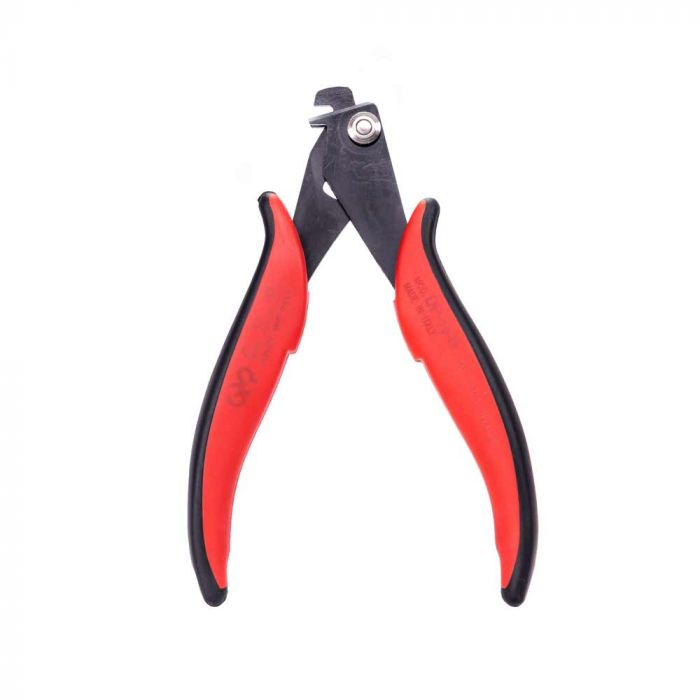

# Interesting Tools

Here I want to collect a bunch of interesting tools that are out there
that might be interesting if you have a use for them. Sometimes, the
hard part is just knowing that something _exists_.

## Depaneling Tools

{: width=200 align=right }

If you're having a large number of PCBs manufactured, you typically will
have them placed into a [panelized
configuration](https://resources.pcb.cadence.com/blog/what-is-pcb-panelization-and-why-is-it-important-2).
This reduces manufacturing costs substantially at scale. But, now you
have a bunch of PCBs that are still attached to one another. If you've
used V-grooves for these, then you can break them by hand quite easily
(although you have to be cautious of the fiberglass fibers as they are
quite sharp). But if you've put tabs, these are much larger and either
need to be routed by the manufacturer, or you can break them yourself
with [one of these hand
tools](https://hakkousa.com/products/chp-tools/chp-hand-tools/depaneling.html).