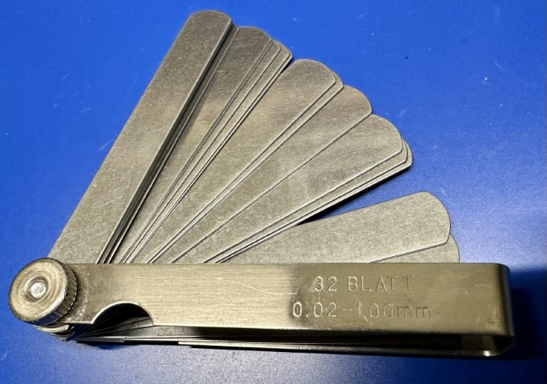
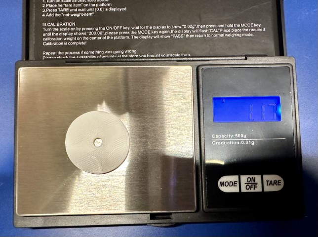

# Test & Measurement

## Multimeter

TODO: Discuss the various types (handheld and bench), what to look for
in shopping, and their purpose. 
## Oscilloscope

TODO: Discuss the various types, what to look for in shopping, and their
purpose.

## Signal Generator

TODO: Discuss the various types, what to look for in shopping, and their
purpose.

## Bench Power Supplies

TODO: Discuss the various types, what to look for in shopping, and their
purpose.

## Microscope

TODO: Discuss the various types, what to look for in shopping, and their
purpose.

## Physical Measurement

INFO: **Choose Your Own Path** You may have to make a choice in your
life as a maker. Do you go down the path of metric, or do you stay in
the darkness and continue to measure things with some of the most absurd
units imaginable. Alas, you can't completely eliminate the [customary
system](https://en.wikipedia.org/wiki/United_States_customary_units),
but you can choose not to propagate more of it. But that's just _my
opinion_, [man](https://www.youtube.com/watch?v=pWdd6_ZxX8c).

### Rulers

I know it sounds super obvious, but I very highly recommend you own a
set of decent quality stainless steel rulers. [McMaster-Carr has a great
selection](https://www.mcmaster.com/products/metal-rulers/corrosion-resistant-stainless-steel-rulers-9/),
and I would recommend _at least_ having them in 150mm (6") and 300mm
(12"), but depending on what you're working on, it may be helpful to
keep a larger one around. These will all be marked in at least 1mm and
1/16th (but preferably 1/32nd) of an inch. And yes, in spite of my shot
at customary measures, you should get one with both, unless you're
lucky enough to live somewhere where metric is exclusively what you use.
Even then, there are certain industries (PCB manufacturing) where
everything is talked about in thou (thousandths of an inch).

### Tape Measure

Separate from a ruler, sometimes you need to measure something longer
than 300mm. At that point, a tape measure is the thing you want. I'm a
big fan of the [Stanley tape
measures](https://www.stanleytools.com/products/hand-tools/layout-tools/tape-measures),
either the PowerLock or the FatMax models. Both can reach quite far
without support, are accurate, well made, and relatively cheap.
Typically, I would recommend a 16 or 25 ft model (yes, I know). Stanley
makes a nice PowerLock that is marked in metric and customary, the
[33-158](https://www.stanleytools.com/product/33-158/powerlock-5-m-16-ft-x-19-mm-tape).

### Calipers

{: width=400 align=right }

Calipers are perhaps the single most indispensible tool you can have for
measuring things. They allow you to very accurately determine the size
(and therefore exact shape) of something you're looking to model, or
model against. They allow you to verify prints. They allow you to check
parts to ensure they're the dimensions you _thought_ they were. They
come in a dizzying array of styles as well as read-out mechanisms
(vernier, dial, and digital). Quite honestly, I just recommend getting
the digital models unless you know you need or want the others.

As for manufacturer, well, there's always Mitutoyo, who is, perhaps, at
the very top of the [metrology](https://en.wikipedia.org/wiki/Metrology)
game here. Or [Starrett](https://www.starrett.com/). If you're rolling
in money, buy one. They're beautifully made and supremely accurate. You
can go spend [[usd("700.00")]] [on a single pair of
calipers](https://www.tequipment.net/Mitutoyo/Digimatic-Caliper-I-M/Digital-Calipers/)
on a single 300mm pair. But what, realistically, should you get? I have
been using a 150mm (6") model from Clockwise, the
[DCLR-0605](https://clockwisetools.com/collections/clockwise-tools/products/clockwise-tools-dclr-0605-ip54-rs232-digital-caliper-6-inch?variant=18459596718176).
It is likely available easily at your favorite mega retailer, and costs
around [[usd("25.00", as_of="2023-06")]]. There are 200mm and 300mm
models as well, but I don't feel like I typically need that level of
exacting dimension across that wide a space.

See [elsewhere for how to use them](using-calipers.md).

<!--
### Micrometer

{: width=400 align=left }

[types of
micrometers](https://www.mitutoyo.com/products/small-tool-instruments-and-data-management/micrometers/mechanical-micrometers/).
For this, we're going to exclusively talk about an typical outside
micrometer. In my case, it is delineated in inches, but they do make
metric ones.
-->
### Feeler Gauge

{: width=400 align=right }

Mechanical creations are built up from a series of parts. Those parts
have to be put together, which is termed "mating". For that to work
correctly, they have to be designed within a specific [fit and
tolerance](../mechanical/fit.md). Too tight and things won't go
together, but too loose and they'll rattle or fall apart. To check the
gaps and clearances are what you expect, you can use a feeler gauge.

A feeler gauge is, basically, just a series of plates of metal
(typically stainless or carbon steel) that are precision machined to
specific thicknesses. These can also be called a straight blade gauge.
This is what's in the photo. They come in various sizes, and obviously
come in either metric or imperial/customary. The ones pictured were
inexpensive (< $10 USD) and range from 0.02-1.0mm, which is more than
enough for my purposes. I suppose you could be super fancy and buy a set from
[Mitutoyo](https://www.mitutoyo.com/products/small-tool-instruments-and-data-management/instruments-and-reference-gages/reference-gages/thickness-feeler-gages/)
for 5-10x as much. What I do just isn't that exacting.

To use a feeler gauge, I would recommend you watch [this
video](https://www.youtube.com/watch?v=L61KAX2-KpA), which, in spite of
using customary units, is an excellent introduction to how to use a
feeler gauge, and more importantly how to actually understand the "feel"
it's referring to.

### Thread Gauge

{: width=400 align=right }

We use a lot of screws (and bolts) when making things. It's one of the
best, and most durable, ways of putting things together. Sometimes,
though, when you're working on a project, you find yourself with a screw
or screw hole that you're just not sure about. Is it the right size?
What size is it?

This is where a thread gauge comes in. These are, like feeler gauges,
made from either carbon or stainless steel, and are ground to have exact
cuts for the threads. You simply can go through them, until, as shown in
the photo, they match up perfectly. In this case to a stainless steel
1/4-20x1" socket head cap screw.

While there are very expensive ones available, I feel like a generic
inexpensive one with both customary and metric threads on it would be
helpful occasionally.

### Jeweler's Scale

{: width=400 align=left}

Working with electronics, and most maker hobbies, you're not typically 
dealing with very heavy things, but sometimes it's important to know how 
much something weights. The best thing I've found is an inexpensive 
jeweler's scale. These are typically accurate below 0.1g and can display 
weights in grams (correct), ounces (what is this even?), and often a bunch 
of jeweler specific things, like grains and carets. 