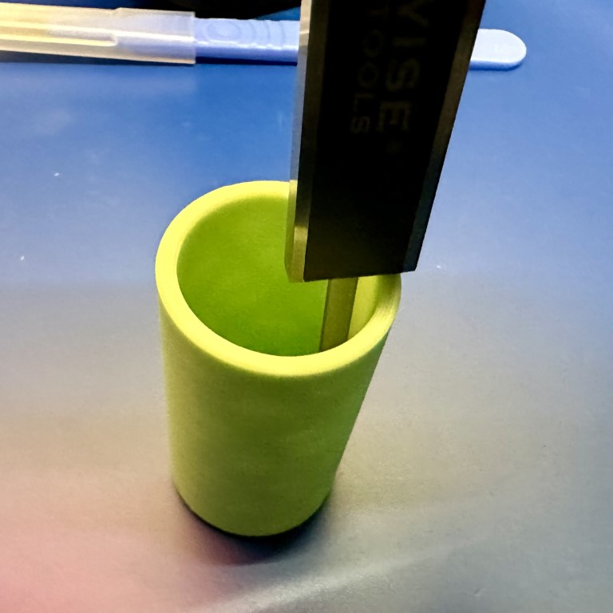

---
tags:
  - calipers
  - measurement
  - micrometers
---
# Using Calipers and Micrometers

> WARNING: **Storage of Calipers and Micrometers** {: width=400 align=right }
> One thing I want to emphasize here from the start is that these are
> precision tools, even the inexpensive ones, and care for them is
> critical. I strongly recommend only storing them in the case they came
> in, and ensuring that when you close them to put them away, you leave
> a tiny little gap so that the anvils (faces) of the measuring surfaces
> _are not touching_. It doesn't have to be much, but it should be at
> least 0.1mm. When they're slightly apart, twist the locking screw to
> keep them in place. In the photo, you can see that they are _almost_
> but not quite touching.
>
> Why does this matter, you might wonder? Because the environment,
> primarily. All materials expand or contract with their temperature and
> other conditions. If the face of the measuring surfaces are in full
> contact, and then you tighten the locking screw, there are forces at
> work when the two sides expand and contract differently, which can
> lead to damage, minute warming, or other things that will reduce the
> accuracy of the device. It really doesn't take much.

## Using Calipers

Calipers are the workhorse of the measurement world. More than anything,
they will give you a reasonably accurance understanding of what you're
dealing with, quickly, and with minimal fuss. For the purposes of this
discussion, I'm going to be talking purely about digital calipers as
that's what most entry-level calipers are. They also have the advantage of
being able to read out in both metric and customary units, which is not
the case with dial and vernier calipers.

### Parts of a Caliper

Let's dig into the various parts of a set of calipers and how to use
them. We will start with a diagram of all the pieces on the Clockwise
digital caliper that I use most of the time. Others will be slightly
different, but will generally follow the same design.

_Beam_
: The _beam_ is the main material piece of the caliper upon which
everything else rides. The precision and accuracy by which this is
manufactured will determine the overall accuracy and precision you can 
achieve with the tool. More expensive tools are simply manufactuered to 
much higher standards, and sometimes with much more expensive (and 
reliable) materials. When a caliper is said to be 150mm, it means that
the beam is designed for up to 150mm measurements. Everything else is on
the beam in some fashion.

: On the beam, you will find printed the _main scale_. This is the overall 
dimensions of the caliper. In addition, along the sides you will find a 
_reference surface_. This is used during the calibration of the caliper 
and is, in better calipers, has a [lapped finish](https://en.wikipedia.
org/wiki/Lapping) to mirror levels to achieve near perfect flatness.

_Slider_
: The _slider_ is the component that is moving along the _beam_, and 
contains the measurement display as well as a few other things. First, it 
contains a _locking screw_, which is used to hold the slider in place, 
especially during storage (see headnote). It also contains the 
_power/zero_ button which can be used to zero the caliper or set the 
origin (see below). Finally, for most digital calipers, there is a _units_ 
button of some sort that allows it to change from millimeters to 
decimal inches, and potentially fractional inches. If you want to take a 
measurement in both, I strongly recommend tightening the locking screw 
before pressing any button to ensure that you get an accurate and 
consistent measurement.

_Thumb Roller_
: The _thumb roller_ is used to bring a caliper into contact with the 
surface you are attempting to measure. You should never slam the jaws into 
the surface, but instead bring them close, then slowly ease into the 
surface using the thumb roller. This will ensure that you do not apply too 
much pressure, and typically will get a much more consistent measurement.

_Jaws_
: The _jaws_ are hold the measuring faces (below), and are what moves to 
allow for different measurements.

_Measuring faces_
: There are two different measuring faces on a set of calipers, 
depending on what you are attempting to measure. If you are measuring the 
outside of something (think outside diameter of a pipe), you would use the 
_outside measuring faces_. For measuring the inside of things (again, 
think inside diameter of a pipe), you use the _inside measuring faces_. In 
the section below on use, I'll talk a bit more about how exactly to use them.

_Depth bar and measuring surface_
: Sometimes, you want to measure the depth of something; a hole, for 
example. To do this, you can use the little bit at the end that extends 
called the _depth bar_, and the _depth measuring surface_. By sticking 
this in a hole, you can identify the real depth of the hole. For the longest 
time, I didn't understand the odd shape of the depth bar, but [this 
question and answer on Stack Overflow](https://diy.stackexchange.com/questions/244578/what-is-the-purpose-of-the-notch-at-the-end-of-the-depth-probe-on-callipers) 
provides a clear explanation with diagrams, and it's worth a read.

### Setting the Origin

Before using your calipers, you need to ensure the origin is correct. To 
do this, clean the blades with a soft cloth to make sure they're 
clean (even small amounts of dust can imapct measurement accuracy). Then 
you can close the jaws (carefully, don't slam them) using the thumb roller.
It _should_ read 0.0mm, but if it doesn't make sure they're clean, and 
then you can press the zero/origin button to set the origin. 

NOTE: **More Expensive Calipers** On higher-end calipers, the origin is 
set at the factory, and there should never be a need to set it. It may 
only need to be set when the battery is changed on the calipers, but 
otherwise it will stay in correct alignment. This is one way the pricier 
models differ. It's a couple seconds, but it can add up.

> TIP: **Relative Measurement** There are occasions, especially in machining,
> where you are attepting to understand the difference between where you are 
> and where you want to be. For example, if you are turning a piece of metal 
> on a lathe, and you want it to be 17mm exactly, you can set the calipers
> to 17mm (ideally using [gauge blocks](https://en.wikipedia.org/wiki/Gauge_block)), 
> and then zeroing them on this point. On more expensive calipers, there's 
> typically a "relative" button that you use for this. Then, as you measure 
> something, it will tell you _exactly_ the delta between where you want to 
> be and where you are. You can easily see that you need to take X amount 
> off and ease into the correct dimensions. 
> 
> The zero function is also useful when trying to decide two things will 
> fit together. What if you want to know if a shaft will fit 
> into a hole? You could measure one, then the other and do a bit of 
> math to get the clearance (or lack thereof). With calipers? Measure the 
> shaft, click zero, then measure the hole. The value on the screen is the 
> clearance (or not).     

### Taking Measurements

So, after doing all of that, you are ready to take some measurements. I 
know it seems like a lot, but following a habit of cleaning and zeroing 
your calipers _every time_ you use them will result in a more reproducible 
measurement. Let's say we want to take the outer, inner, and depth 
measurements of a cylinder. 

#### Outer Diameter

If we look at this photo, we can see the cylinder is placed within the 
main part of the measurement surface, and not only at the tips. While 
there are occasionally reasons to use the tips, typically you want to use 
the main part of the surface if at all possible. From this we can read the 
measurement: 29.97mm

Now, since this was a 3d printed part, and we know that accuracy and 
consistency are not the halmarks of FFF printing, let's take a second one:

Ah, see, the second measurement is 30.08mm, or 0.11mm different. Not 
gigantic, but when working with tolerances and fitting things together, 
this can be a big deal. I _strong recommend_ taking several measurements 
along the length of a surface. For what it's worth, this was printed from 
a model where it was 30mm exactly.

#### Inner Diameter

Now, let's take a look at the inside diameter of the cylinder:

Here we can see that the inside diameter is 24.67mm, which is a little off 
since the wall thickness was _supposed_ to be 5mm, and therfore it should 
have been 25mm. Still, it's kinda close? There's a lot to talk about with 
getting accurate prints, and I hope to address that sometime soon over in 
the section on [3D techniques](/3D/).

#### Depth Measurement

Finally, let's see just how deep this cylinder is. This is often done for 
screw holes, and similar things. For this, we will use the depth bar, and 
rest the face of the beam on the top of the cylinder, like so:

As mentioned above, there's some technique that you can read about 
[here](https://diy.stackexchange.com/questions/244578/what-is-the-purpose-of-the-notch-at-the-end-of-the-depth-probe-on-callipers). 
This isn't a super intuitive way to hold an object, so you'll want to 
practice it a few times so that you can get smooth movement without 
needing 7 hands. 
### Battery Life

Like all electronic things, a digital capiler requires power to function.
You should, however, expect a battery in the calipers to last at least a
few years, even when being used regularly. Mine, for example, are
approximately 5 years old, and still have the original battery in them.
When it comes time to replace, most calipers use either a LR44/SR44 or
CR2032 for power.

### Other Features

One thing you might find in higher-end calipers (or even the Clocwise ones
I use) is a digital output that provides readings to a computer. There's a
few formats for this, and you should look into what your caliper uses, but
the main use for this is in a metrology situation where you are taking
repeated measurements, and you need to record all the results automatically.

### Tips on Measuring Specific Things

TODO: **More to Come** I'm hoping to do some pictures and examples of how 
to measure a few things that can be trick. Connectors, 
## Using Micrometers

TODO: **More to Come** This will be filled in in the future.

## 3rd Party Resources

* [Video dive into the insides of a digital caliper](https://www.youtube.com/watch?v=u84BDCo22U4)